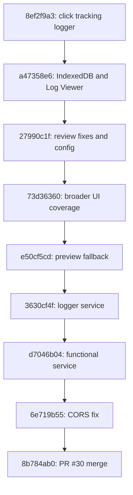
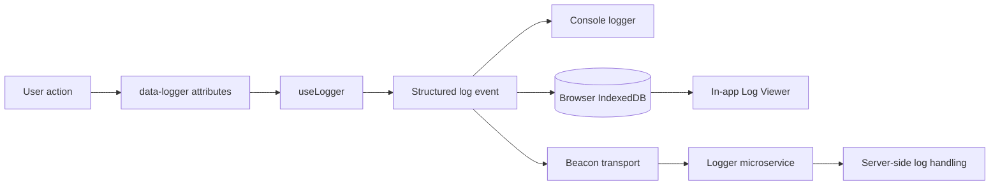
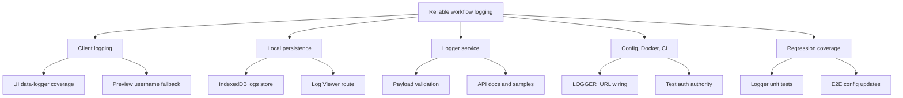

# PR Mission: Reliable Workflow Logging for DTaaS

## The Simple Version

This PR makes DTaaS able to remember what users do across the client in a
structured, recoverable way.

Before this work, workflow logs were mainly temporary browser-side traces. They
could be lost on refresh, split across tabs, or skipped entirely on preview
routes where the user state was not ready yet. This PR turns that into a more
complete logging path: user actions are tagged in the UI, captured by the
client logger, saved locally, and optionally sent to a logger service.

## PR #30 Scope

Reference PR: [prasadtalasila/DTaaS-Public#30](https://github.com/prasadtalasila/DTaaS-Public/pull/30)

In this checkout, PR #30 is represented by merge commit `8b784ab0`
(`Merge PR #30 (dtaas-client-logger) into distributed-demo-pr30-logger`).
The PR branch it merged was `prasad/dtaas-client-logger`.

The short storyline is:

## Specific Commits

| Commit | Role in the PR | Main contribution |
| --- | --- | --- |
| `8ef2f9a3` | Client logger foundation | Adds process workflow click tracking and the first structured logger pieces. |
| `a47358e6` | Persistent local logs | Adds IndexedDB storage plus the in-app Log Viewer route and tests. |
| `27990c1f` | Review hardening | Fixes logger initialization timing, IndexedDB upgrade handling, MIME type usage, config naming, and blob cleanup. |
| `d801958a` | Tooling cleanup | Resolves qlty, markdownlint, and prettier blockers so the docs and generated prompt files pass checks. |
| `94822a51` | PR support material | Adds the logger prompt material used to document and review the logging work. |
| `73d36360` | UI coverage pass | Adds `data-logger-*` attributes across interactive elements so the logger receives meaningful UI context. |
| `e50cf5cd` | Preview reliability | Captures preview page interactions and falls back to `sessionStorage.username` when Redux user state is empty. |
| `a02f5935` | Example data | Adds a sample workflow log file for inspection and documentation. |
| `3630cf4f` | Backend start | Adds the logger microservice scaffold under `servers/logger/`. |
| `d7046b04` | Backend behavior | Makes the logger microservice functional, with request handling, validation, and service logic. |
| `6e719b55` | Integration fix | Fixes CORS request errors so the client can talk to the logger microservice. |
| `8b784ab0` | Merge point | Merges PR #30 into `distributed-demo-pr30-logger`. |

There is also a follow-up branch commit, `4e79bfae`, which fixes tests and the
LogViewer component after the PR #30 merge.

## What Problem Are We Solving?

DTaaS opens several user flows across pages, dialogs, previews, and workbench
tabs. For research, debugging, and workflow analysis, those interactions need
to be visible after the fact.

The main goals are:

| Goal | Plain meaning |
| --- | --- |
| Capture meaningful actions | Buttons, tabs, file actions, dialogs, and search controls should produce useful log events. |
| Keep logs across tabs | Opening a workbench or preview tab should not scatter or lose the workflow history. |
| Let users inspect logs | There should be an in-app place to view, refresh, download, and clear collected logs. |
| Support backend collection | Environments can send log events to a dedicated logger microservice. |
| Make test/demo auth realistic | Test config should point at the expected DTaaS GitLab authority instead of public GitLab. |

## End-to-End Shape

## What This PR Adds

### 1. Client-Side Workflow Logger

The client now has a structured logger under `client/src/util/logger/`.
It creates consistent log events with session information, page context,
hashed user identity, event labels, and optional metadata.

The logger is wired into UI elements through `data-logger-*` attributes, so the
logged events describe the thing the user interacted with instead of only
recording a raw browser click.

Key files:

- `client/src/util/logger/logEvent.ts`
- `client/src/util/logger/logger.ts`
- `client/src/util/logger/useLogger.ts`
- `client/src/util/logger/sessionManager.ts`
- `client/src/util/logger/hashUtils.ts`
- `client/src/util/logger/consoleLogger.ts`
- `client/src/util/logger/beaconLogger.ts`

### 2. Persistent Browser Storage

The PR adds IndexedDB persistence for workflow logs. This matters because
IndexedDB is shared across tabs for the same origin, so a user can start in the
library, open a preview or workbench tab, and still build one coherent local log
history.

The new `/insights/log` route provides a Log Viewer where authenticated users
can inspect, refresh, download, and clear the collected logs.

Key files:

- `client/src/util/logger/indexedDBLogger.ts`
- `client/src/page/LogViewer.tsx`
- `client/src/routes.tsx`
- `client/src/database/types.ts`

### 3. Preview Route Reliability

Preview pages can open before Redux has hydrated the username. The logger now
falls back to `sessionStorage.username`, which prevents preview interactions
from being silently skipped.

Additional logger attributes were added to preview and digital twin flows,
including file actions, dialogs, search controls, tree items, and related
buttons.

### 4. Logger Microservice

The PR introduces `servers/logger/`, a dedicated backend service for receiving
log events. It includes:

- Request validation for log event payloads.
- Configuration and certificate helpers.
- Unit and e2e tests.
- API examples for valid and invalid payloads.
- Docker and workflow wiring for deployment.

Key files:

- `servers/logger/src/main.ts`
- `servers/logger/src/app.controller.ts`
- `servers/logger/src/logs/logs.service.ts`
- `servers/logger/src/dto/log-event.dto.ts`
- `servers/logger/src/validation.pipe.ts`
- `servers/logger/src/config/config.service.ts`

### 5. Environment and Deployment Wiring

The branch adds or updates logger-related configuration in client config files,
deployment examples, Docker Compose files, and CI workflows. The client uses
`LOGGER_URL` to decide where Beacon API events should be sent.

The latest local config change also points `client/config/test.js` at the DTaaS
GitLab test authority instead of `https://gitlab.com`.

Key files:

- `.github/workflows/logger-ms.yml`
- `developer/logger.dockerfile`
- `deploy/dtaas/docker/*/docker-compose.yml`
- `client/config/dev.js`
- `client/config/test.js`
- `client/config/prod.js`
- `client/config/local.js`

## Present Changes in This Working Tree

These are the currently uncommitted finishing changes on top of the branch:

| File | Change | Why it helps the PR mission |
| --- | --- | --- |
| `client/config/test.js` | Updates the test OIDC client id and authority to the DTaaS GitLab test server. | Makes the logging and auth test setup match the intended DTaaS environment. |
| `client/PLAN.md` | Renames repeated headings to phase-specific headings. | Keeps the implementation plan readable and avoids markdown tooling conflicts. |
| `client/CHANGELOG-phase2.md` | Renames repeated headings to phase-specific headings. | Makes the changelog easier to scan and friendlier to markdown linting. |

## Branch-Wide Change Map

## Reviewer Reading Guide

Start with these files to understand the intent:

| Area | Files |
| --- | --- |
| Client plan and history | `client/PLAN.md`, `client/CHANGELOG-phase2.md` |
| Logger API contract | `client/LOGGER_API.md`, `servers/logger/API.md` |
| Client logger implementation | `client/src/util/logger/*` |
| Local log viewing | `client/src/page/LogViewer.tsx`, `client/src/routes.tsx` |
| Backend service | `servers/logger/src/*` |
| Deployment wiring | `developer/logger.dockerfile`, `deploy/dtaas/docker/*`, `.github/workflows/logger-ms.yml` |

## Expected Outcome

After this PR, DTaaS should have a much clearer workflow trail:

- UI interactions produce structured events.
- Logs survive refreshes and cross-tab navigation through IndexedDB.
- Preview interactions are captured even when Redux auth state is not ready.
- A local authenticated Log Viewer exposes the collected browser logs.
- A logger microservice can receive events for centralized collection.
- Test and deployment configuration knows how to route logger traffic.

In short: this PR turns logging from a temporary debugging aid into a real
workflow observability feature for DTaaS.
