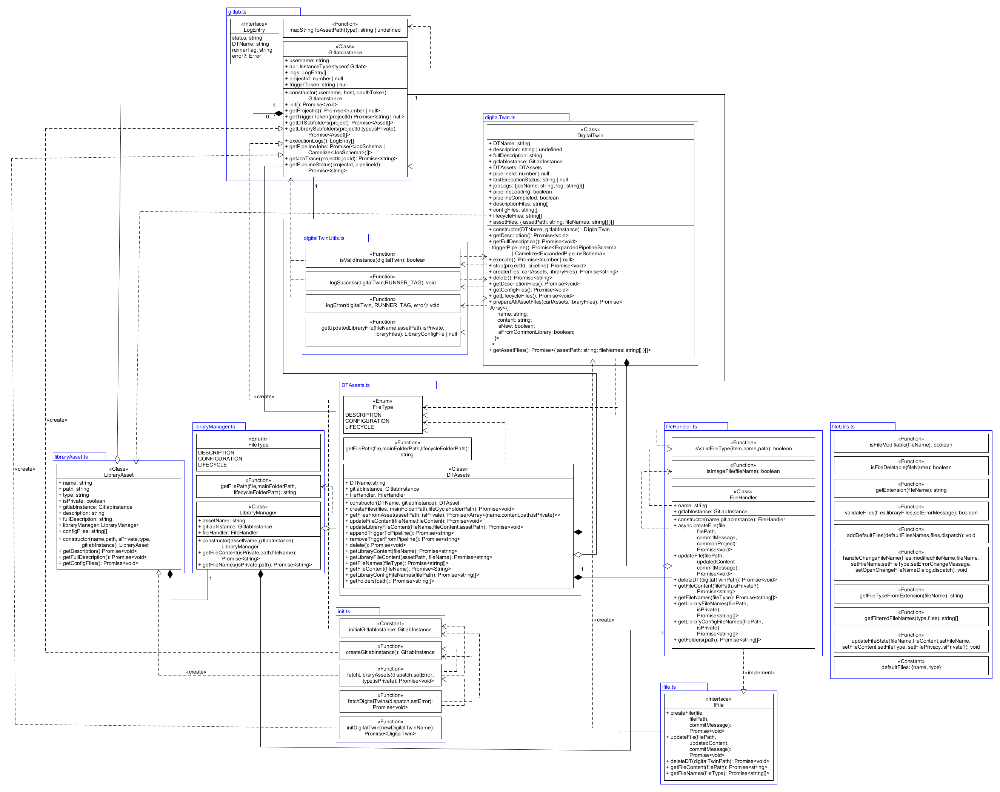

# Backend Architecture Documentation

## Overview
This architecture permits using a set of common backends for execution and storage of Digital Twins that may be mixed and matched as desired. Hence, the main goal is to have a high degree of flexibility.

## Core Architecture Pattern
We use Interfaces and dependency injection to accomplish this abstraction. So each `DigitalTwinAsset`, `DigitalTwin`, etc. each have a backend and its associated backend API (for e.g. REST interactions with GitLab) that is chosen upon initialization. This allows us to use any backend/backend API interchangably and even change it on the fly, such that DTaaS is compatible with most large execution and storage backends. This will ultimately lead to a plug and play backend agnostic system, making it easier for developers and broaden the service's applicability.
```typescript
  // Constructor
  constructor(name: string, backend: BackendInterface) {
    this.name = name;
    this.backend = backend;
  }
  ...
  // Calling backend for project info
    const projectToUse = commonProject
        ? this.backend.getCommonProjectId()
        : this.backend.getProjectId();
    // Calling backend's api for creating a file in project
    await this.backend.api.createRepositoryFile(
        projectToUse,
        `${filePath}/${file.name}`,
        'main',
        file.content,
        commitMessage,
    );
```
## Key Components
**Backend**

This component is responsable for linking the DTaaS application with the chosen backend. This entails keeping track of logs, project ids and initializing and keeping an associated backend API instance for further operations described below. The interface is described in `./UtilInterfaces.ts` with a concrete implementation being `./gitlab.ts`. This is either created on an instance basis or passed from instance to instance when creating other instances. These then, as the example above showcases, uses the enriched project information to execute API commands. Detailed Logs are kept for any Digital Twin executions, describing the success and job processing.

**BackendAPI**

Communicates directly with the backend server for pipeline execution, log obtainment and file management. The interface is described in `./UtilInterfaces.ts` with a concrete implementation being `./gitlabAPI.ts`. It is created before the Backend instance to be injected and initialized there. After this, it may be called through this backend instance directly. May contain a client field from a library such as GitBeaker to manage communication with REST-API.

### 1. Interface Layer
#### What interfaces exist and their purpose
1. **`BackendAPI`**: Communicates with server
1. **`BackendInterface`**: Maintains data received from server
1. **`DigitalTwinInterface`**: Defines DigitalTwin behaviour
1. **`DTAssetsInterface`**: Defines DigitalTwinAssets behaviour
1. **`FileHandlerInterface`**: Defines FileHandler behaviour
1. **`LibraryAssetInterface`**: Defines LibraryAsset behaviour
1. **`LibraryManagerInterface`**: Defines LibraryManager behaviour

#### What types are defined

The system defines several categories of types to support the backend-agnostic architecture:

**Core API Response Types**
These types represent the standardized data structures returned by different backend APIs:

- **`TriggerToken`**: Contains authentication token for pipeline triggers

- **`JobSummary`**: Represents pipeline job information with execution details

- **`Pipeline`**: Represents pipeline execution state

- **`RepositoryFile`**: Contains file content from repository operations

- **`RepositoryTreeItem`**: Represents file system entries in repository structure

- **`ProjectSummary`**: Basic project information for listings and references

- **`ProjectId`**: Flexible project identifier supporting different backend ID formats

**Logging and Execution Types**
These types support execution tracking and debugging:

- **`LogEntry`**: Comprehensive execution log entry with error handling

**Digital Twin State Management Types**
These types manage the complex state of digital twin instances:

- **`DigitalTwinDetails`**: Core identifying information for digital twins

- **`DigitalTwinPipelineState`**: Pipeline execution state and job tracking

- **`DigitalTwinFiles`**: File organization structure for digital twin components

**File Management Types**
These types handle file operations and state tracking:

- **`FileState`**: Comprehensive file state tracking with modification flags

- **`LibraryConfigFile`**: Library asset file with privacy and modification tracking

**Library Asset Types**
These types manage reusable asset components:

- **`LibraryAssetDetails`**: Basic asset identification and documentation

- **`LibraryAssetFiles`**: Asset file organization with privacy controls

- **`LibraryManagerDetails`**: Manager identification for asset operations

#### Why these particular abstractions were chosen

The type system is designed around these principles:

1. **Backend Agnosticism**: Types like `ProjectId` support both numeric and string identifiers, allowing compatibility with different backend systems (GitLab uses numbers, GitHub uses strings).

1. **SOLID principle adherence**: Complex state types like `DigitalTwinPipelineState` expose all necessary execution information while maintaining clear boundaries between different concerns.

#### How they ensure platform independence

The type system achieves platform independence through:

- **Flexible Identifiers**: Using union types like `ProjectId = number | string` to accommodate different backend ID schemes
- **Standardized Interfaces**: All backend-specific implementations must conform to the same interface contracts
- **Abstract Data Structures**: Types focus on logical concepts rather than platform-specific formats

### 2. Implementation Layer
Currently, Gitlab is the sole backend that has been implemented, but implementation should not differ drastically between common backends (GitHub, Azure). You must, however, use a solution that offers both storage and execution.

### 3. Factory Layer
To enable use of a different backend, all Gitlab dependency injections must simply be changed into the chosen backend interface implementation. This process is expansive, so sticking with GitLab is recommended.

## Data Flow
The below class diagram shows how a backend (Gitlab) is used.


## Extension Points
To expand on the backend support, you must create a file for both the API and the data holding backend implementing their respective interfaces. With this, it is a matter of inserting it into the data flow.

### Adding a New Backend Provider
1. Implement Backend and BackendAPI interfaces
1. Create 2 individual files for them
1. Modify the backend builder to use the new backend.
1. Add tests unit and integration tests for these files.
1. Create and place new backends inside `src/model/backend/[YOUR BACKEND'S NAME]` folder.
1. Name as [`backend name`] and [`backend name`]API respectively.

### Extending Existing Functionality
If you wish to expand the general capabilities of the backends, it must be done within the `./UtiliyInterfaces.ts` file. Otherwise, just implement it on a class level. Consider SOLID principles in this process.

## Architecture Design Decisions
The advantage of using this architecture is that you avoid vendor lock-in and have greater flexibility in case you wish to use either a different backend or 2 different backends for execution and storage. It solves the problem of being forced to use the singularly supported backend, namely Gitlab. The trade-off is that a bit of added complexity given an additional interface is required. Using 2 backends, however, may lower performance slightly, as the execution requires temporary storage which must be transplaced.