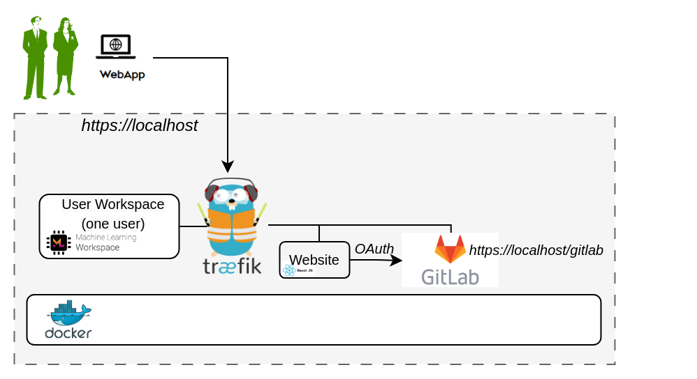

# Install DTaaS on localhost

The installation instructions provided in this README are
ideal for running the **DTaaS on both localhost served over HTTPS connection**.

This installation is ideal for single users intending to use
DTaaS on their own computers.

## Design

An illustration of the docker containers used and the authorization
setup is shown here.



## Requirements

The installation requirements to run this docker version of the DTaaS are:

- docker desktop / docker CLI with compose plugin
- [mkcert](https://github.com/FiloSottile/mkcert)
- User account on <https://gitlab.com>

### OAuth2 Application Registration

The multi-user installation setup requires dedicated authorization
setup for both frontend website and backend services.
Both these authorization requirements are satisfied
using OAuth2 protocol.

- The frontend website is a React single page application (SPA).
- The details of Oauth2 app for the frontend website are in
  [client docs](../../docs/admin/client/auth.md).
- The Oauth2 authorization for backend services is managed
  by [Traefik forward-auth](https://github.com/thomseddon/traefik-forward-auth).
  The details of this authorization setup are in
  [server docs](../../docs/admin/servers/auth.md).

It is possible to use <https://gitlab.com> or a local installation
of Gitlab can be used for this purpose.
Based on your selection of gitlab instance, it is necessary
to register these two OAuth2 applications and link them
to your intended DTaaS installation.

Please see
[gitlab oauth provider](https://docs.gitlab.com/ee/integration/oauth_provider.html)
documentation for further help with creating these two OAuth applications.

## Clone Codebase

```bash
git clone https://github.com/INTO-CPS-Association/DTaaS.git
cd DTaaS
```

:clipboard: file pathnames

1. The filepaths shown here follow POSIX convention.
   The installation procedures also work with Windows
   paths.
1. The description below refers to filenames. All the file
   paths mentioned below are relatively to the top-level
   **DTaaS** directory.

## Configuration

### Docker Compose

The docker compose configuration is in `deploy/docker/.env.local.secure`;
it is a sample file.
It contains environment variables
that are used by the docker compose files.
It can be updated to suit your local installation scenario.
It contains the following environment variables.

Edit all the fields according to your specific case.

  | URL Path | Example Value | Explanation |
  |:------------|:---------------|:---------------|
  | DTAAS_DIR | '/home/Desktop/DTaaS' | Full path to the DTaaS directory. This is an absolute path with no trailing slash. |
  | OAUTH_URL | <http>_gitlab.foo.com_<http/> | The URL of your Gitlab instance. It can be <http>_gitlab.com_<http/> if you are planning to use it for authorization. |
  | CLIENT_ID | 'xx' | The ID of your server OAuth application |
  | CLIENT_SECRET | 'xx' | The Secret of your server OAuth application |
  | OAUTH_SECRET | 'random-secret-string' | Any private random string. This is a password you choose for local installation. |
  | username1 | 'user1' | The gitlab instance username of a user of DTaaS |
  | CLIENT_CONFIG | '/home/Desktop/DTaaS/deploy/config/client/env.local.js' | Full path to env.js file for client |

:clipboard: The path examples given here are for Linux OS.
These paths can be Windows OS compatible paths as well.

### Create User Workspace

The existing filesystem for installation is setup for `user1`.
A new filesystem directory needs to be created for the selected user.

Please execute the following commands from the top-level directory
of the DTaaS project.

```bash
cp -R files/user1 files/username
```

where _username_ is the selected username registered on <https://gitlab.com>.

### Obtain TLS / HTTPS Certificate

Use [mkcert](https://github.com/FiloSottile/mkcert) to generate
TLS certificates using
[this guide](https://kifarunix.com/create-locally-trusted-ssl-certificates-with-mkcert-on-ubuntu-20-04/).
The certificates need to be generated for `localhost`.

The names of the certificates must be `fullchain.pem` and `privkey.pem`.
The `fullchain.pem` corresponds to public certificate and
the `privkey.pem` corresponds to private key.

### Add TLS Certificates to Traefik

Copy the two certificate files into:

- `certs/localhost/fullchain.pem`
- `certs/localhost/privkey.pem`

Traefik will run with self-issued certificates if the above two certificates
are either not found or found invalid.

### Run

The commands to start and stop the appliation are:

```bash
docker compose -f compose.local.secure.yml --env-file .env.server up -d
docker compose -f compose.local.secure.yml --env-file .env.server down
```

To restart only a specific container, for example `client``

```bash
docker compose -f compose.server.secure.yml --env-file .env.server up -d --force-recreate client
```

## Use

The application will be accessible at:
<https://localhost> from web browser.
Sign in using your <https://gitlab.com> account.

All the functionality of DTaaS should be available to you
through the single page client now.

## Limitations

The [library microservice](../../docs/admin/servers/lib/docker.md) is not
included in the localhost installation scenario.

## References

Image sources:
[Traefik logo](https://www.laub-home.de/wiki/Traefik_SSL_Reverse_Proxy_f%C3%BCr_Docker_Container),
[ml-workspace](https://github.com/ml-tooling/ml-workspace),
[reactjs](https://krify.co/about-reactjs/),
[gitlab](https://gitlab.com)
