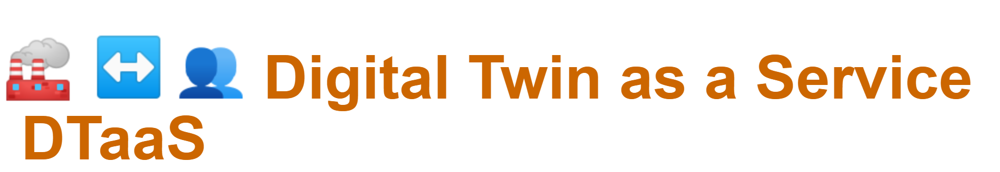
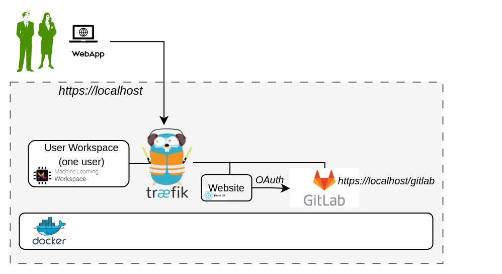

# DTaaS - Secure Localhost with Integrated GitHub



Thank you for downloading **Digital Twin as a Service**.

This README provides a quick-start installation guide. For detailed
configuration reference, see [CONFIG.md](CONFIG.md).

> [!IMPORTANT]
> The hostname `localhost` is used for illustration throughout
> this guide. Replace it with your actual host if needed.

## :globe_with_meridians: Overview

This package installs DTaaS over HTTPS for a single-user localhost
deployment with an integrated GitHub workflow.



The `docker-compose.yml` starts the following services:

| Service | Purpose |
| :--- | :--- |
| **traefik** | Reverse proxy with TLS termination |
| **client** | DTaaS React frontend |
| **user** | Single user workspace |

## :clipboard: Prerequisites

| Requirement | Details |
| :--- | :--- |
| **Docker Engine** | v28 or later with Compose plugin |
| **TLS certificate** | `fullchain.pem` and `privkey.pem` for `localhost` |
| **GitHub OAuth app** | OAuth client credentials for DTaaS sign-in |

For non-HTTPS localhost setup, use `deploy/dtaas/docker/localhost`.
For secure multi-user deployment with integrated GitLab, use
`deploy/dtaas/docker/secure-server_with_integrated-gitlab`.

## :rocket: Quick Start

### 1. Create Configuration Files

```bash
cp config/.env.example config/.env
cp config/client.js.example config/client.js
```

Edit `config/.env` and set `SERVER_DNS` and `USERNAME`.

### 2. Create User Workspace Directory

```bash
cp -R files/template files/<USERNAME>
sudo chown -R 1000:100 files/*
```

### 3. Add TLS Certificates

```bash
cp /path/to/fullchain.pem certs/fullchain.pem
cp /path/to/privkey.pem certs/privkey.pem
```

Traefik falls back to self-signed certificates if files are missing
or invalid.

### 4. Start Services

```bash
docker compose --env-file config/.env up -d
```

### 5. Configure GitHub OAuth :octocat:

Create an OAuth application in GitHub and configure callback URLs:

- **Homepage URL**: `https://localhost`
- **Authorization callback URL**: `https://localhost/Library`

Update `config/client.js` with OAuth values:

- `REACT_APP_CLIENT_ID`
- `REACT_APP_AUTH_AUTHORITY`
- `REACT_APP_REDIRECT_URI`
- `REACT_APP_LOGOUT_REDIRECT_URI`

### 6. Reload Client After OAuth Update

```bash
docker compose --env-file config/.env up -d --force-recreate client
```

### 7. Verify :white_check_mark:

| URL | Expected result |
| :--- | :--- |
| `https://localhost` | DTaaS web interface |
| `https://localhost/<USERNAME>` | User workspace route |

## :stop_sign: Stop

```bash
docker compose --env-file config/.env down
```

## :file_folder: Directory Layout

```text
.
|- certs/                 # TLS certificates
|- config/
|  |- .env                # Compose environment variables
|  |- client.js           # DTaaS React client configuration
|  \- tls.yml             # Traefik TLS provider configuration
|- files/
|  |- common/             # Shared files mounted to workspace/common
|  \- template/           # Template files for new workspaces
|- docker-compose.yml     # Service definitions
|- CONFIG.md              # Detailed configuration reference
\- README.md              # This file - quick-start guide
```

## :link: Documentation

Please see
<https://into-cps-association.github.io/DTaaS/development/index.html>
for complete documentation.

## :framed_picture: References

Image sources:
[Traefik logo](https://www.laub-home.de/wiki/Traefik_SSL_Reverse_Proxy_f%C3%BCr_Docker_Container),
[GitHub](https://github.com)
