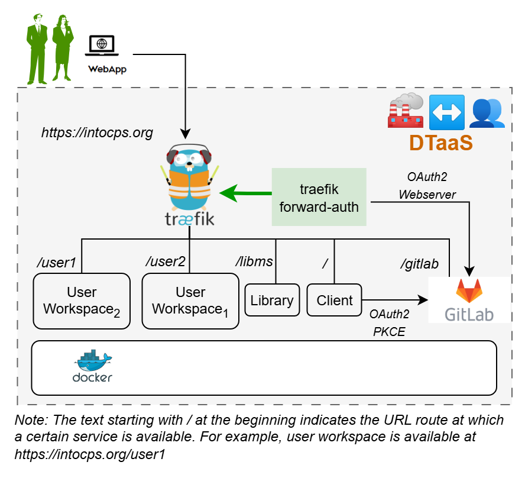

Thank you for downloading **Digital Twin as a Service v1.0-alpha**.

## Install

This guide covers hosting the DTaaS as a web application for multiple users,
with an integrated local GitLab CE instance that serves as

- the OAuth2 authorization provider
- Backend for DevOps features

> [!IMPORTANT]
> The `intocps.org` hostname is used for illustration. Replace
> it with an appropriate server hostname of the installation.

## Design

An illustration of the docker containers used and the authorization
setup is shown here.



The `docker-compose.yml` brings up the following services:

- **traefik** – reverse proxy with TLS termination
- **client** – DTaaS React frontend
- **user1 / user2** – JupyterLab user workspaces
- **libms** – library management service
- **traefik-forward-auth** – OAuth2 authorization middleware
- **gitlab** – integrated GitLab CE instance (OAuth2 provider)

GitLab stores its persistent state in the following host directories:

- `config/gitlab/` – GitLab configuration (`/etc/gitlab` inside the container)
- `logs/` – GitLab logs (`/var/log/gitlab` inside the container)
- `data/` – GitLab data (`/var/opt/gitlab` inside the container)

## Requirements

### Domain name

The DTaaS software is a web application and must be hosted at a domain name
like `intocps.org` or an IP address.

### TLS / HTTPS Certificate

Obtain a TLS certificate for `foo.com` or `*.foo.com` via
[certbot](https://certbot.eff.org/) or an online certificate provider.
Name the files `fullchain.pem` (public certificate) and `privkey.pem`
(private key).

### User Accounts

Create user accounts in the integrated GitLab instance for all users.

The default docker compose configuration contains two users –
_user1_ and _user2_. Change these names to the actual usernames.

### OAuth2 Application Registration

The multi-user installation requires OAuth2 authorization for both the
frontend website and the backend services.

- The frontend website is a React single page application (SPA). See the
  [client auth docs](https://into-cps-association.github.io/DTaaS/version0.8/admin/client/auth.html)
  for details.
- Backend authorization is managed by
  [Traefik forward-auth](https://github.com/thomseddon/traefik-forward-auth).
  See the
  [server auth docs](https://into-cps-association.github.io/DTaaS/version0.8/admin/servers/auth.html)
  for details.

Register both OAuth2 applications in the integrated GitLab instance.
See [Post-Install GitLab Configuration](#post-install-gitlab-configuration)
and [INTEGRATION.md](INTEGRATION.md) for details.

## Configuration

Copy and customize the three configuration files in the `config/` directory:

```bash
cp config/.env.example config/.env
cp config/conf.server.example config/conf.server
cp config/env.js.example config/env.js
```

### Docker Compose (`config/.env`)

The `config/.env` file contains environment variables used by docker compose.
Update it to match your installation:

| Variable | Example value | Description |
| :--- | :--- | :--- |
| `OAUTH_URL` | `https://foo.com/gitlab` | GitLab instance URL (no trailing slash) |
| `OAUTH_CLIENT_ID` | _from GitLab application_ | OAuth application client ID |
| `OAUTH_CLIENT_SECRET` | _from GitLab application_ | OAuth application client secret |
| `OAUTH_SECRET` | _random string_ | Session encryption key (`openssl rand -base64 32`) |
| `SERVER_DNS` | `foo.com` | Server domain name |
| `USERNAME1` | `user1` | First user's workspace path prefix |
| `USERNAME2` | `user2` | Second user's workspace path prefix |

### Website Client (`config/env.js`)

Update `config/env.js` with your domain name and the OAuth application
credentials created in the integrated GitLab instance.

### Create User Workspace

The existing filesystem is set up for `files/user1`.
Create a workspace directory for each additional user:

```bash
cp -R files/user1 files/username
```

where _username_ is the actual username. Repeat for each user.

Set the file permissions for all user workspaces:

```bash
sudo chown -R 1000:100 files/*
```

### Configure Authorization Rules for Traefik Forward-Auth

`config/conf.server` configures per-path authorization rules.
Update the email addresses to match the GitLab accounts:

```text
rule.libms.action=auth
rule.libms.rule=PathPrefix(`/lib`)

rule.onlyu1.action=auth
rule.onlyu1.rule=PathPrefix(`/user1`)
rule.onlyu1.whitelist=user1@foo.com

rule.onlyu2.action=auth
rule.onlyu2.rule=PathPrefix(`/user2`)
rule.onlyu2.whitelist=user2@foo.com
```

> [!NOTE]
> The usernames in `config/.env` must match those in `config/conf.server`.
> Traefik routes are controlled by `config/.env`. Authorization for those
> routes is controlled by `config/conf.server`. A route present in
> `config/.env` but absent from `config/conf.server` defaults to allowing any
> signed-in user. A route present in `config/conf.server` but absent from
> `config/.env` returns a **404** response.

## Run

### Add TLS Certificates to Traefik

Copy the two certificate files to:

- `certs/fullchain.pem`
- `certs/privkey.pem`

Traefik falls back to self-signed certificates if these files are absent
or invalid.

### Start

```bash
docker compose --env-file config/.env up -d
docker compose --env-file config/.env down
```

After starting, wait a few minutes for the GitLab container to become healthy.
Monitor progress with:

```bash
watch docker ps
```

## Post-Install GitLab Configuration

The administrator username is `root`. The initial password is stored in
`/etc/gitlab/initial_root_password` inside the container.

> [!WARNING]
> The initial root password file is **deleted 24 hours** after the first start.
> Save the password immediately.

### Create Users in GitLab

The new GitLab instance contains only the `root` user. Create additional
user accounts for DTaaS. See the
[GitLab docs](https://docs.gitlab.com/ee/user/profile/account/create_accounts.html)
for instructions.

## Use

The DTaaS application is accessible at `https://foo.com`.
The integrated GitLab instance is available at `https://foo.com/gitlab`.

Sign in to DTaaS using a GitLab account from the integrated instance.

## Next Steps

OAuth2 integration between the integrated GitLab instance and DTaaS requires
additional configuration after the initial installation. Follow the
[integration guide](INTEGRATION.md) to complete the OAuth2 setup.

## Documentation

Please see
<https://into-cps-association.github.io/DTaaS/development/index.html>
for complete documentation.

## References

Image sources:
[Traefik logo](https://www.laub-home.de/wiki/Traefik_SSL_Reverse_Proxy_f%C3%BCr_Docker_Container),
[gitlab](https://gitlab.com)
