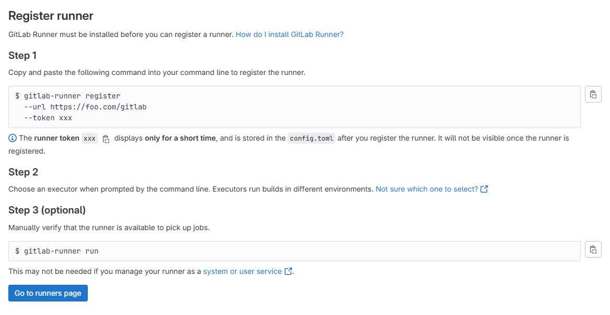
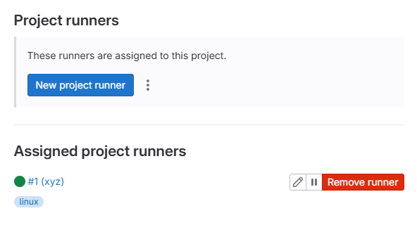

# GitLab Runners

GitLab Runners are agents that execute the tasks defined in GitLab CI/CD
pipelines. A runner is connected to a GitLab instance (may be
`https://gitlab.com` or a local instance such as `https://foo.com/gitlab`),
and executes jobs for a single project, or any project within a GitLab group.

This document outlines the steps needed to create a Docker container named
`gitlab-runner` which will contain a single runner that will be responsible for
the execution of Digital Twins. We will assume the GitLab instance is hosted
at `https://foo.com/gitlab`.

The relevant files in this directory are:

1. `compose.runner.yml` - Creates the GitLab runner container
1. `runner-config.toml` - Contains the configuration settings for each runner
   generated by the `gitlab-runner` container (by default, only one).

## Obtaining A Registration Token

First, we will obtain the token necessary to register the runner for the GitLab
instance.

1. Navigate to the _DTaaS_ group in your instance and select the project
   named after your GitLab username.
1. In the project menu, go to `Settings` and select `CI/CD`.
1. Expand the **Runners** section and click on _New project runner_.
1. Under **Platforms**, select the Linux operating system.
1. Under **Tags**, add a `linux` tag.
1. Click on _Create runner_. A runner authentication token will be generated,
   be sure to save it somewhere.

You should see the following screen:



## Configuring the Runner

We need to register the runner with the GitLab instance so that they may
communicate with each other.

In this directory, the file `runner-config.toml` has the following
template:

```toml
[[runners]]
  name = "dtaas-runner-0"
  url = "https://foo.com/gitlab/"
  token = "xxx"
  executor = "docker"
  [runners.docker]
    tls_verify = false
    image = "ruby:2.7"
    privileged = false
    disable_entrypoint_overwrite = false
    oom_kill_disable = false
    volumes = ["/cache"]
    network_mode = "host"
```

1. Set the `url` variable to the URL of your GitLab instance.
1. Set the `token` variable to the runner registration token you obtained earlier.

## Start the GitLab Runner

You may use the following commands to start and stop the `gitlab-runner`
container respectively:

```bash
# (cd deploy/services/gitlab)
docker compose -f compose.runner.yml --env-file .env up -d
docker compose -f compose.runner.yml --env-file .env down
```

Once the container starts, the runner within it will run automatically. You can
tell if the runner is correctly configured by opening your project on the
GitLab instance, and navigating to `Settings > CI/CD > Runners` to see
something like this:



You will now have a GitLab runner ready to accept jobs for the **DTaaS** group.

## Resource Allocation

By default, the runner executor will pick up as many jobs as it can (limited
by the number of threads on the machine). To limit the number of jobs that may
be run concurrently, you can set the `limit` variable in `config.toml`.

A list of advanced configuration options is provided on the
[GitLab documentation page](https://docs.gitlab.com/runner/configuration/advanced-configuration.html).
