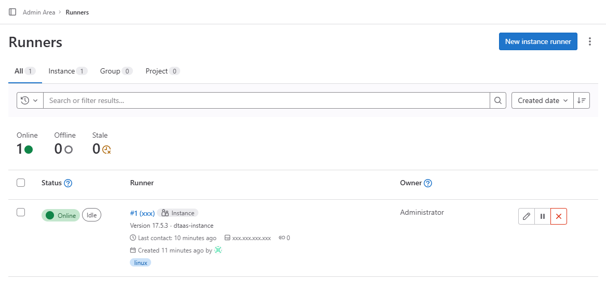

# GitLab Runner Integration

This document outlines the steps needed to create a Docker container named
`gitlab-runner` which will contain a single runner that will be responsible for
the execution of Digital Twins. There are two installation scenarios:

1. __Localhost Installation__ - You are using the integrated runner locally with
   a GitLab instance hosted at `https://localhost/gitlab`.
1. __Server Installation__ - You are using the integrated runner with a GitLab
   instance hosted on a production server. This server may be a remote server
   and not necessarily your own, and may have TLS enabled with a self-signed
   certificate.

Following the steps below sets up the integrated runner which can be used to
execute digital twins from the Digital Twins Preview Page.

## Prerequisites

A GitLab Runner picks up CI/CD jobs by communicating with a GitLab instance.
For an explanation of how to set up a GitLab instance that integrates with a
DTaaS application, refer to [our GitLab instance document](../gitlab/README.md)
and [our GitLab integration guide](../gitlab/INTEGRATION.md).

The rest of this document assumes you have a running DTaaS application with a
GitLab instance running.

## Runner Scopes

A GitLab Runner can be configured for three different scopes:

| Runner Scope    | Description |
|-----------------|-------------|
| Instance Runner | Available to all groups and projects in a GitLab instance. |
| Group Runner    | Available to all projects and subgroups in a group. |
| Project Runner  | Associated with one specific project. |

We suggest creating __instance runners__ as they are the most straightforward, but
any type will work. More about these three types can be found on
[the official GitLab documentation page](https://docs.gitlab.com/ee/ci/runners/runners_scope.html).

## Obtaining A Registration Token

First, we will obtain the token necessary to register the runner for the GitLab
instance. Open your GitLab instance (remote or local) and depending on your
choice of runner scope, follow the steps given below:

| Runner Scope    | Steps |
|-----------------|-------|
| Instance Runner |1. On the __Admin__ dashboard, navigate to __CI/CD > Runners__.<br>2. Select __New instance runner__.|
| Group Runner    |1. On the __DTaaS__ group page, navigate to __Settings > CI/CD > Runners__.<br>2. Ensure the __Enable shared runners for this group__ option is enabled.<br>3. On the __DTaaS__ group page, navigate to __Build > Runners__.<br>4. Select __New group runner__.|
| Project Runner  |1. On the __DTaaS__ group page, select the project named after your GitLab username.<br>2. Navigate to __Settings > CI/CD > Runners__.<br>3. Select __New project runner__.|

For any scope you have chosen, you will be directed to a page to create a
runner:

1. Under __Platform__, select the Linux operating system.
1. Under __Tags__, add a `linux` tag.
1. Select __Create runner__.

You should then see the following screen:


Be sure to save the generated runner authentication token.

## Configuring the Runner

Depending on your installation scenario, the runner setup reads certain
configurations settings:

1. __Localhost Installation__ - uses `deploy/docker/.env.local`
1. __Server Installation__ - uses `deploy/docker/.env.server`

These files are integral to running the DTaaS application, so it will be
assumed that you have already configured these.

We need to register the runner with the GitLab instance so that they may
communicate with each other. `deploy/services/runner/runner-config.toml`
has the following template:

```toml
[[runners]]
  name = "dtaas-runner-1"
  url = "https://foo.com/gitlab/" # Edit this
  token = "xxx" # Edit this
  executor = "docker"
  [runners.docker]
    tls_verify = false
    image = "ruby:2.7"
    privileged = false
    disable_entrypoint_overwrite = false
    oom_kill_disable = false
    volumes = ["/cache"]
    network_mode = "host" # Disable this in secure contexts
```

1. Set the `url` variable to the URL of your GitLab instance.
1. Set the `token` variable to the runner registration token you obtained earlier.
1. If you are following the server installation scenario, remove the line
   `network_mode = "host"`.

A list of advanced configuration options is provided on the
[GitLab documentation page](https://docs.gitlab.com/runner/configuration/advanced-configuration.html).

## Start the GitLab Runner

You may use the following commands to start and stop the `gitlab-runner`
container respectively, depending on your installation scenario:

1. Localhost Installation

    ```bash
    docker compose -f deploy/services/runner/compose.runner.local.yml --env-file deploy/docker/.env.local up -d
    docker compose -f deploy/services/runner/compose.runner.local.yml --env-file deploy/docker/.env.local down
    ```

1. Server Installation

    ```bash
    docker compose -f deploy/services/runner/compose.runner.server.yml --env-file deploy/docker/.env.server up -d
    docker compose -f deploy/services/runner/compose.runner.server.yml --env-file deploy/docker/.env.server down
    ```

Once the container starts, the runner within it will run automatically. You can
tell if the runner is up and running by navigating to the page where
you created the runner. For example, an Instance Runner would look like this:



You will now have a GitLab runner ready to accept jobs for the GitLab instance.

## Advanced: Runner Executor

The term `runner` could refer one of two things:

1. The `gitlab-runner` Container
   This is the Docker container that is created when you execute the commands
   given above. It is based on the `gitlab/gitlab-runner:alpine` image, and is
   used to spawn one or more _executors_ that actually execute the CI/CD jobs.

   These executors are spawned using a packaged version of Docker within the
   `gitlab-runner` image.
1. The Runner Executor
   These are agents spawned by the `gitlab-runner` container, not as children
   but as __siblings__ of the container. These runner executors will not show up
   on running commands such as `docker ps`, but you can check their status by
   running `gitlab-runner status` inside the `gitlab-runner` container.

Keeping this distinction in mind is important, as the GitLab documentation
sometimes uses them interchangeably.
