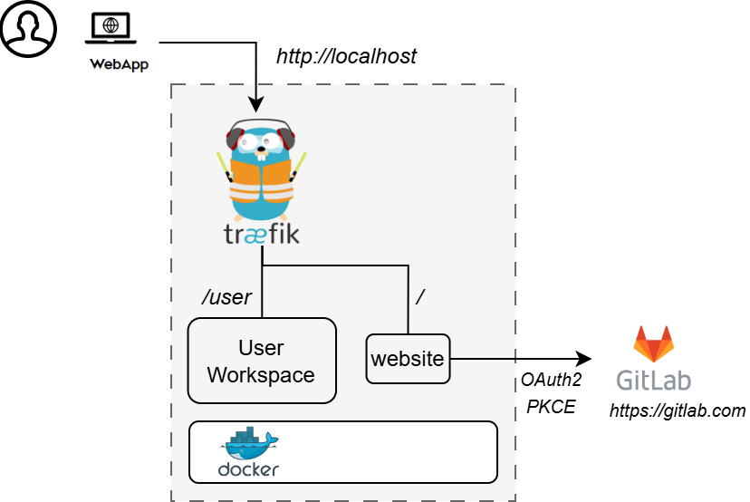

Thank you for downloading **Digital Twin as a Service v1.0-alpha**.

## Install

The installation instructions provided in this README are
ideal for running the **DTaaS on localhost served over HTTP connection**.

This installation is ideal for single users intending to use
DTaaS on their own computers.

## Design

An illustration of the docker containers used and the authorization
setup is shown here.



## Requirements

The installation requirements to run this docker version of the DTaaS are:

- docker desktop / docker CLI with compose plugin
- local instance of [Dex IDP](https://dexidp.io/)

The description below refers to filenames. All the file
paths mentioned below are relatively to the top-level
**DTaaS** directory.

## Configuration

### Docker Compose

Copy example configuration files first:

```bash
cp .env.example .env
cp config/dex-config.yaml.example config/dex-config.yaml
cp config/dex-config-gitlab.yaml.example config/dex-config-gitlab.yaml
```

Then edit the copied files according to your setup.

  | URL Path | Example Value | Explanation |
  | :------------ | :--------------- | :--------------- |
  | username | 'user1' | Your gitlab username |

Dex configuration details are documented in:

- [`config/DEX.md`](config/DEX.md)

Important alignment for local/passwordDB mode:

- In `.env`, choose `username=<your-user>`.
- In `config/dex-config.yaml`, set static user `username` and `preferredUsername` to the same value.

This keeps DTaaS user-scoped routes aligned with OIDC identity claims.

For local/passwordDB credentials, update these fields in `config/dex-config.yaml`:

- `email`
- `hash` (bcrypt hash of your chosen password)
- `username`, `name`, `preferredUsername`

## Run

### Option A: Local Dex passwordDB (self-contained)

Start Dex with companion:

```bash
docker compose -f docker-compose.dex.yml up -d
```

Do not run a separate standalone Dex container on port `5556` at the same time.
Use only this compose command for Dex in this setup.

The companion proxies all Dex endpoints and injects a `profile` claim into
`/dex/userinfo` when `preferred_username` is present. This keeps the setup
self-contained (no GitLab connector) while matching the DTaaS client
expectation for username extraction.

To stop Dex + companion:

```bash
docker compose -f docker-compose.dex.yml down
```

Start/stop the DTaaS services:

```bash
docker compose up -d
docker compose down
```

Login using credentials configured in `config/dex-config.yaml`.

Scope note for local/passwordDB mode:

- Supported: `openid profile email groups offline_access`
- Not supported by Dex local passwordDB: `read_user read_repository api`

Default sample credentials in local example config:

**user email:** `user@foo.com`
**password:** `user`

### Option B: Dex with GitLab connector

Update `config/dex-config-gitlab.yaml` with your GitLab values:

- `baseURL`
- `clientID`
- `clientSecret`

Start Dex with GitLab connector:

```bash
docker compose -f docker-compose.dex.gitlab.yml up -d
```

Stop Dex (GitLab mode):

```bash
docker compose -f docker-compose.dex.gitlab.yml down
```

Then start/stop DTaaS services as usual:

```bash
docker compose up -d
docker compose down
```

Do not run both `docker-compose.dex.yml` and `docker-compose.dex.gitlab.yml` at the same time.

## Use

The application will be accessible at:
<http://localhost> from web browser.
Sign in using either local Dex credentials (Option A) or GitLab via Dex connector (Option B).

All the functionality of DTaaS should be available to you
through the single page client now.

## Documentation

Please see
<https://into-cps-association.github.io/DTaaS/development/index.html>
for complete documentation.

## References

Image sources:
[Traefik logo](https://www.laub-home.de/wiki/Traefik_SSL_Reverse_Proxy_f%C3%BCr_Docker_Container),
[gitlab](https://gitlab.com)
