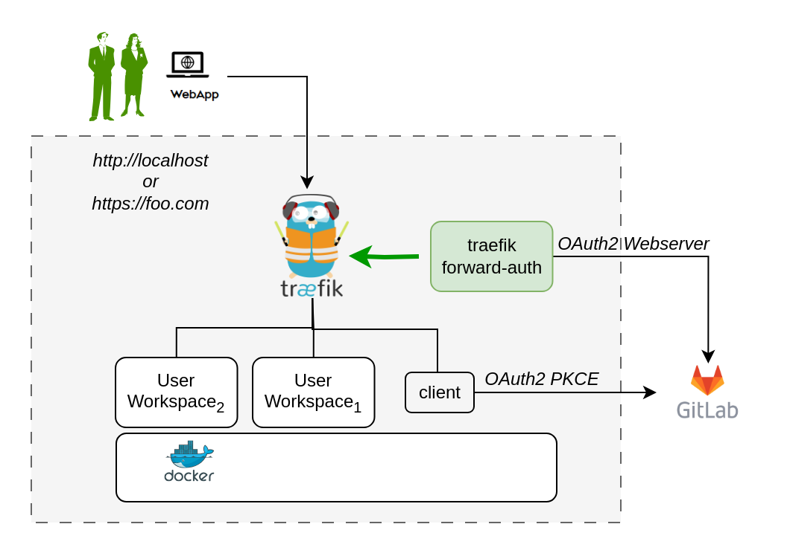

# Docker Compose for DTaaS with Backend Authorization

This directory contains docker compose files for running the DTaaS with
backend authorization. The authorization happens at traefik using
[Traefik forward-auth](https://github.com/thomseddon/traefik-forward-auth).
The Traefik forward-auth uses OAuth2 for protecting all routes to user workspaces.

## Design

An illustration of the docker containers used and the authorization
setup is shown here.



In the new application configuration, there are two OAuth2 applications.

- The React single page application (SPA). The details of
  this Oauth2 app are in
  [client docs](../../docs/admin/client/auth.md).
- The Oauth2 server-side or web application for traefik forward-auth container.
  The details are in [server docs](../../docs/admin/servers/auth.md).

## Requirements

The installation requirements to run this docker version of the DTaaS are:

- docker with compose plugin
- [gitlab oauth provider](https://docs.gitlab.com/ee/integration/oauth_provider.html#create-an-instance-wide-application)
- DNS name (optional, required only when the DTaaS is to be deployed on a web server)
- User accounts

### Create User Accounts

Create user accounts in gitlab for all the usernames mentioned in
`.env` and `conf` files.
The _trial_ installation script comes with two default
usernames - _user1_ and _user2_. For all other installation scenarios,
accounts with specific usernames need to be created on gitlab.

## Configuration

### Traefik forward-auth

The first step is to finish the configuration for
the traefik forward-auth container.
The details are in [server docs](../../docs/admin/servers/auth.md).

### Docker Compose

The docker compose configuration is in `.env`; it is a sample file.
It contains environment variables
that are used by the docker compose files.

Edit all the fields according to your specific case.

  | URL Path | Access Granted to |Access Granted to |
  |:------------|:---------------|:---------------|
  | DTAAS_DIR | '/home/Desktop/DTaaS' | Full path to the DTaaS directory. This is an absolute path with no trailing slash. |
  | SERVER_DNS | <http>_foo.com_</http> or <http>_localhost_</http> | The server DNS, if you are deploying with a dedicated server. Remember not use  <http:>http(s)</http:> at the beginning of the DNS string |
  | BASE_URL | <http>_gitlab.foo.com_<http/> | The URL of your Gitlab instance |
  | CLIENT_ID | 'xx' | The ID of your OAuth application |
  | CLIENT_SECRET | 'xx' | The Secret of your OAuth application |
  | OAUTH_SECRET | 'random-secret-string' | Any private random string |
  | username1 | 'user1' | The gitlab instance username of a user of DTaaS |
  | username2 | 'user2' | The gitlab instance username of a user of DTaaS |
  | CLIENT_CONFIG | '/home/Desktop/DTaaS/deploy/config/client/env.js' | Full path to env.js file for client |

- Assign the correct client config file to `CLIENT_CONFIG and
  update the values.

  | Deployment Scenario | client env file |
  |:-------|:------|
  | localhost | deploy/config/client/env.local.js |
  | trial | deploy/config/client/env.trial.js |

  Further explanation on the client configuration is available in
  [client config page](../../docs/admin/client/CLIENT.md).

### Caveat

The usernames in the `.env` file need to match those in the conf file.

Traefik routes are controlled by the `.env` file
Authentication on these routes is controlled by the `conf` file.
If a route is not specified in `conf` file but an authorisation is
requested by traefik for this unknown route, the default behavior of
traefik forward-auth kicks in. This default behavior is to enable
endpoint being available to any signed in user.

If there are extra routes in `conf` file but these are not in `.env` file,
such routes are not served by traefik; it will give **404 server response**.

## Run

There are two usage scenarios, namely **localhost** and **trial** installation.

Both the installation scenarios use the images already built and
deployed on docker hub, for the ML-workspace, client, and LibMS.
Both incorporate traefik forward-auth microservice for backend authorization.

### Localhost

The commands to start and stop the appliation are:

```bash
docker compose -f compose.local.yml --env-file .env up -d
docker compose -f compose.local.yml --env-file .env down
```

To restart only a specific container, for example `client``

```bash
docker compose -f compose.local.yml --env-file .env up -d --force-recreate client
```

## Trial Server Installation

The commands to start and stop the appliation are:

```bash
docker compose -f compose.server.yml --env-file .env up -d
docker compose -f compose.server.yml --env-file .env down
```

To restart only a specific container, for example `client``

```bash
docker compose -f compose.server.yml --env-file .env up -d --force-recreate client
```

## Use

| Deployment Scenario | URL |
|:----|:----|
| localhost | <http>_localhost_</http> |
| trial server | <http>_foo.com_</http> |

Sign in to gitlab instance with the your account.

All the functionality of DTaaS should be available to you
through the single page client now.

You may have to click Sign in to Gitlab on the Client page
and authorize access to the shown application.
