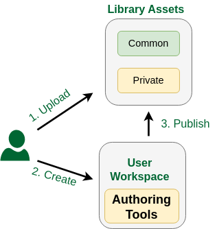

# Frequently Asked Questions

## Abreviations

| Term | Full Form |
|:---|:---|
| DT | Digital Twin |
| DTaaS | Digital Twin as a Service |
| PT | Physical Twin |

## General Questions

<!-- markdownlint-disable-file MD046 -->

??? Question "What is DTaaS?"

    DTaaS is software platform on which you can create and run digital twins.
    Please see the [features](user/features.md) page
    to get a sense of the things you can do in DaaS.

??? Question "Are there any Key Performance / Capability Indicators for DTaaS?"

    | Key Performance Indicator | Value |
    |:---|:---|
    | Processor | Two AMD EPYC 7443 24-Core Processors |
    | Maximum Storage Capacity | 4TB SSD, RAID 0 configuration |
    | Storage Type | File System |
    | Maximum file size | 10 GB |
    | Data transfer speed | 100 Mbps |
    | Data Security | Yes |
    | Data Privacy | Yes |
    | Redundancy | None |
    | Availability | It is a matter of human resources. If you have human
    resources to maintain DTaaS round the clock,
    upwards 95% is easily possible. |

??? Question "Do you provide licensed software like Matlab?"

    The licensed software are not available on the software platform.
    But users have private workspaces which are based
    on Linux-based xfce Desktop environment.
    Users can install software in their workspaces. The licensed software
    installed by one user is not available to another user.

## Digital Twin Models

??? Question "Can DTaaS create new DT models?"

    DTaaS is not a model creation  tool. You can put model creation tool
    inside DTaaS and create new models.
    The DTaaS itself does not create digital twin models but it can help
    users create digital twin models. You can run
    Linux desktop / terminal tools  inside the DTaaS. So you can create
    models inside DTaaS and run them using tools that can run in Linux.
    The Windows only tools can not run in DTaaS.

??? Question "How can DTaaS help to design geometric model? Does it support 3D modeling and simulation?"

    Well, DTaaS by itself does not produce any models. DTaaS only provides
    a platform and an ecosystem of services to facilitate digital twins to
    be run as services. Since each user has a Linux OS at their disposal,
    they can also run digital twins that have graphical interface.
    In summary, DTaaS is neither a modeling nor simulation tool. If you need
    these kinds of tools, you need to bring them onto the platform.
    For example, if you need Matlab for your work, you need to bring
    he licensed Matlab software.

??? Question "Commercial DT platforms in market provide modelling and simulation alongside integration and UI. DTaas is not able to do any modelling or simulation on its own like other commercial platforms. Is this a correct understanding?"

    Yes, you are right

??? Question "Can DTaaS support only the information models (or behavioral models) or some other kind of models?"

    The DTaaS as such is agnostic to the kind of models you use. DTaaS can
    run all kinds of models. This includes behavioral and data models.
    As long as you have models and the matching solvers that can run in
    Linux OS, you are good to go in DTaaS.
    In some cases, models and solvers (tools) are bundled together
    to form monolithic DTs. The DTaaS does not limit you from running
    such DTs as well.
    DTaaS does not provide dedicated solvers. But if you can install
    a solver in your workspace, then you don't need the platform
    to provide one.

??? Question "Does it support XML-based representation and ontology representation?"

    Currently No. **We are looking for users needing this capability.**
    **If you have concrete requirements and an example, we can discuss a way**
    **of realizing it in DTaaS**.

## Communication Between Physical Twin and Digital Twin

??? Question "How would you measure a physical entity like shape, size, weight, structure, chemical attributes etc. using DTaaS? Any specific technology used in this case?"

    The real measurements are done at physical twin which are then
    communicated to the digital twin. Any digital twin platform like
    DTaaS can only facilitate this communication of these measurements
    from physical twin. The DTaaS provides InfluxDB, RabbitMQ and Mosquitto
    services for this purpose. These three are probably most widely used
    services for digital twin communication.
    Having said that, DTaaS allows you to utilize other communication
    technologies and services hosted elsewhere on the Internet.

??? Question "How a real-time data can be differed from static data and what is the procedure to identify dynamic data? Is there any UI or specific tool used here?"

    DTaaS can not understand the static or dynamic nature of data.
    It can facilitate storing names, units and any other text description
    of interesting quantities (weight of batter, voltage output etc).
    It can also store the data being sent by the physical twin.
    The distinction between static and dynamic data needs to be made by
    the user.
    Only metadata of the data can reveal such more information about
    the nature of data. A tool can probably help in very specific cases,
    but you need metadata. If there is a human being making this distinction,
    then the need for metadata goes down but does not completely go away.
    In some of the DT platforms supported by manufacturers, there is a tight
    integration between data and model. In this case, the tool itself is
    taking care of the metadata. The DTaaS is a generic platform which can
    support execution of digital twins. If a tool can be executed on
    a Linux desktop / commandline, the tool can be supported within DTaaS.
    The tool (ex. Matlab) itself can take care of the metadata requirements.

??? Question "How can DTaaS control the physical entity? Which technologies it uses for controlling the physical world?"

    At a very abstract level, there is a communication from physical entity
    to digital entity and back to physical entity. How this communication
    should happen is decided by the person designing the digital entity.
    The DTaaS can provide communication services that can help you do this
    communication with relative ease.
    You can use InfluxDB, RabbitMQ and Mosquitto services hosted on DTaaS for
    two communication between digital and physical entities.

## Data Management

??? Question "Does DTaaS support data collection from different sources like hardware, software and network? Is there any user interface or any tracking instruments used for data collection?"

    The DTaaS provids InfluxDB, RabbitMQ, MQTT  services. Both the physical twin
    and digital twin can utilize these protocols for communication.
    The IoT (time-series) data can be collected using InfluxDB and MQTT
    broker services. There is a user interface for InfluxDB which can be
    used to analyze the data collected.
    Users can also manually upload their data files into DTaaS.

??? Question "Which transmission protocol does DTaaS allow?"

    InfluxDB, RabbitMQ, MQTT and anything else that can be used from
    Cloud service providers.

??? Question "Does DTaaS support multisource information and combined multi sensor input data? Can it provide analysis and decision-supporting inferences?"

    You can store information from multiple sources. The existing InfluxDB
    services hosted on DTaaS already has a dedicated Influx / Flux query
    language for doing sensor fusion, analysis and inferences.

??? Question "Which kinds of visualization technologies DTaaS can support (e.g. graphical, geometry, image, VR/AR representation)?"

    Graphical, geometric and images. If you need specific licensed software
    for the visualization, you will have to bring the license for it.
    DTaaS does not support AR/VR.

??? Question "Can DTaaS collect data directly from sensors?"

    Yes

??? Question "Is DTaaS able to transmit data to cloud in real time?"

    Yes

## Platform Native Services on DTaaS Platform

??? Question "Is DTaaS able to detect the anomalies about-to-fail components and prescribe solutions?"

    This is the job of a digital twin. If you have a ready to use digital twin
    that does the job, DTaaS allows others to use your solution.

## Comparison with other DT Platforms

??? Question "All the DT platforms seem to provide different features. Is there a comparison chart?"

    Here is a qualitative comparison of different DT integration platforms:

    Legend: high performance (**H**), mid performance (**M**)
    and low performance (**L**)

    | DT Platforms | License | DT Development Process | Connectivity | Security | Processing power, performance and Scalability | Data Storage | Visualization | Modeling and Simulation |
    |:---|:---|:---|:---|:---|:---|:---|:---|:---|
    | Microsoft Azure DT | Commercial Cloud | H | H | H | M | H | H | H |
    | AWS IOT Greengrass | Open source commercial | H | H | H | M | H | H | H |
    | Eclipse Ditto | Open source | M | H | M | H | H | L | L |
    | Asset Administration Shell | Open source | H | H | L | H | M | L | M |
    | PTC Thingworx | Commercial | H | H | H | H | H | M | M |
    | GE Predix | Commercial | M | H | H | M | L | M | L |
    | AU's DTaaS | Open source | H | H | L | L | M | M | M |

    Adopted by Tanusree Roy from Table 4 and 5 of the following paper.

    Ref: Naseri, F., Gil, S., Barbu, C., Cetkin, E., Yarimca, G., Jensen, A. C.,
    ... & Gomes, C. (2023). Digital twin of electric vehicle battery systems:
    Comprehensive review of the use cases, requirements, and platforms.
    Renewable and Sustainable Energy Reviews, 179, 113280.

??? Question "All the comparisons between DT platforms seems so confusing. Why?"

    The fundamental confusion comes from the fact that different DT platforms
    (Azure DT, GE Predix) provide different kind of DT capabilities. You can
    run all kinds of models natively in GE Predix. In fact you can run models
    even next to (on) PTs using GE Predix. But you cannot natively do that in
    Azure DT service. You have to do the leg work of integrating with other
    Azure services or third-party services to get the kind of capabilities
    that GE Predix natively provides in one interface.
    The takeaway is that we pick horses for the courses.

## Create Assets

??? Question "Can DTaaS be used to create new DT assets?"

    The core feature of DTaaS software is to help users
    create DTs from assets already available in the library.
    
    However, it is possible for users to take advantage of services
    available in their workspace to install asset authoring tools
    in their own workspace.
    These authoring tools can then be used to create and publish new assets.
    User workspaces are private and are not shared with other users.
    Thus any licensed software tools installed in their workspace is
    only available to them.

## GDPR Concerns

??? Question "Does your platform adhere to GDPR compliance standards? If so, how?"

    The DTaaS software platform does not store any personal information
    of users. It only stores username to identify users and these
    usernames do not contain enough information to deduce the true
    identify of users.

??? Question "Which security measures are deployed? How is data encrypted (if exists)?"

    The default installation requires a HTTPS terminating reverse proxy server
    from user to the DTaaS software installation. The administrators of DTaaS
    software can also install HTTPS certificates into the application.
    The codebase can generate HTTPS application and the users also have
    the option of installing their own certificates obtained from
    certification agencies such as LetsEncrypt.

??? Question "What security measures does your cloud provider offer?"

    The current installation of DTaaS software runs on Aarhus University
    servers. The university network offers firewall access control to servers
    so that only permitted user groups have access to the network and
    physical access to the server.

??? Question "How is user access controlled and authenticated?"

    There is a two-level authentication mechanism in place in each default
    installation of DTaaS. The first-level is HTTP basic authentication
    over secure HTTPS connection. The second-level is the OAuth PKCE
    authentication flow for each user. The OAuth authentication is provider
    by a Gitlab instance. The DTaaS does not store the account and
    authentication information of users.

??? Question "Does you platform manage personal data? How is data classified and tagged based on the sensitivity? Who has access to the critical data?"

    The platform does not store personal data of users.

??? Question "How are identities and roles managed within the platform?"

    There are two roles for users on the platform. One is the administrator
    and the other one is user. The user roles are managed by the administrator.
