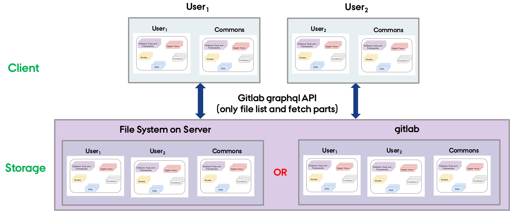

# DTaaS Library Microservice

This document provides an overview of the lib microservice and explains its file structure, usage, and setup. The lib microservice is designed to manage and serve files, functions, and models to users, allowing them to access and interact with various resources.

## Overview

The lib microservice is responsible for handling and serving the contents of library assets of the DTaaS platform. It provides API endpoints for clients to query, fetch, and interact with these assets.

## File Structure

The DTaaS software categorizes all the reusable library assets into four categories:

1. **Data** - data files on disk
2. **Models** - digital twin models that tools can evaluate
3. **Tools** - algorithms / software tools that evaluate **Models** with the help of **Data**.
4. **Functions** - data processing and visualization libraries
5. **Digital Twins** -- Ready to use digital twins

Each user has their assets put into five different directories named above. In addition, there will also be common library assets that all users have access to. A graphical representation is given below.



An simplified example of the structure is as follows:

```txt
lib/
  functions/
    function1/ (ex: graphs)
      filename (ex: graphs.py)
      README.md
    function2/ (ex: statistics)
      filename (ex: statistics.py)
      README.md
    ...
  models/
    model1/ (ex: spring)
      filename (ex: spring.fmu)
      README.md
    model2/ (ex: building)
      filename (ex: building.skp)
      README.md
    ...
```

### Functions

Functions are organized in individual folders within the functions directory. Each function folder should contain a Python script implementing the function and a README.md file describing the purpose, inputs, outputs, and usage of the function.

### Models

Models are organized in individual folders within the models directory. Each model folder should contain a file representing the model (e.g., FMU or SKP files) and a README.md file describing the model, its purpose, and its usage.

## Setup Microservice

To set up the lib microservice, follow these steps:

```bash
git clone https://github.com/INTO-CPS-Association/DTaaS.git
cd DTaaS/server/lib
yarn install   # Install the required dependencies
```

### Environment Variables

To set up the environment variables for the lib microservice, create a new file named _.env_ in the `servers/lib` folder. Then, add the following variables and their respective values. Below you can see and how, with included examples:

```env
PORT='4001'
MODE='local' or 'gitlab'
LOCAL_PATH ='/Users/<Username>/DTaaS/files'
GITLAB_GROUP ='dtaas'
GITLAB_URL='https://gitlab.com/api/graphql'
TOKEN='123-sample-token'
LOG_LEVEL='debug'
TEST_PATH='/Users/<Username>/DTaaS/servers/lib/test/data/test_assets'
APOLLO_PATH='/lib' or ''
GRAPHQL_PLAYGROUND='false' or 'true'
```

Replace the default values the appropriate values for your setup.

**NOTE**:

1. When \__MODE=local_, only _LOCAL_PATH_ is used. Other environment variables are unused.
1. When _MODE=gitlab_, _GITLAB_URL, TOKEN_, and _GITLAB_GROUP_ are used; _LOCAL_PATH_ is unused.

### Start Microservice

```bash
yarn install
yarn build
yarn start
```

The lib microservice is now running and ready to serve files, functions, and models.

You can access the server's endpoint by typing in the following URL: `http://localhost:<PORT>/lib`.
Futhermore, you are able to access the graphql playground when 
```
GRAPHQL_PLAYGROUND='true' 
```

### Lib request and response

Documentation of the lib query and responses.

```

HTTP Request:

.....

send the request to: http://foo.com:<PORT>/lib

 

POST /lib

Host: foo.com:<PORT>

Content-Type:application/json

User-Agent:Mozilla

Accept:*/*

 

{

"query": "{ getFiles(path: \"common\")}"

}

 

HTTP Response:

.....

200 OK

access-control-allow-origin: *

connection: keep-alive

content-length: 76

content-type: application/json; charset=utf-8

date: Mon, 15 May 2023 10:13:37 GMT

etag: ................

keep-alive: timeout=5

x-powered-by: Express

 

{'data':{'getFiles':['data','digital twins','functions','models','tools']}}

```

### GraphQL API queries

The only accepted query is:

```graphql
query directoryList($path: String!) {
  project(fullPath: $domain) {
    webUrl
    path
    repository {
      paginatedTree(path: $path, recursive: false) {
        nodes {
          trees {
            nodes {
              name
            }
          }
        }
      }
      diskPath
    }
  }
}
```

The _path_ refers to the file path to look at: For example, _user1_ looks at files of **user1**; _user1/functions_ looks at contents of _functions/_ directory.
