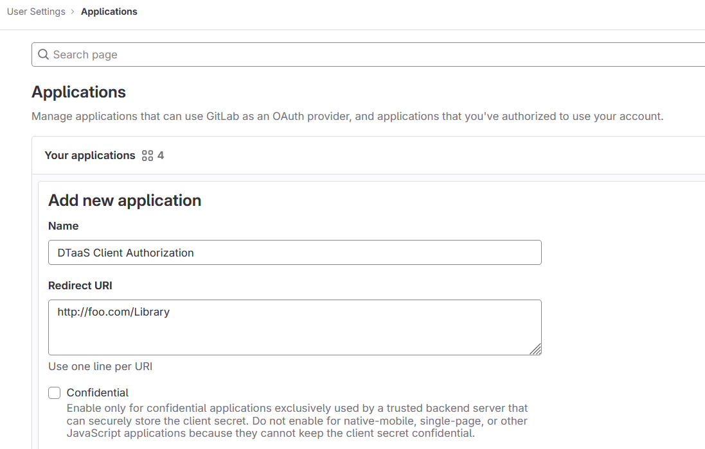
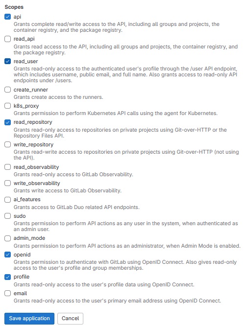
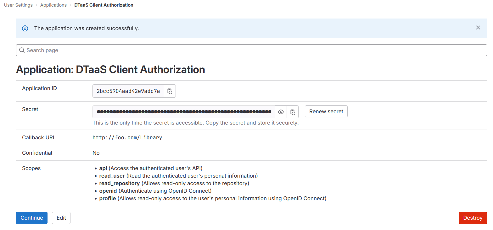

# OAuth for React Client

To enable user authorization on DTaaS React client website, you will use
the OAuth authorization protocol, specifically the PKCE authorization flow.
Here are the steps to get started:

**1. Choose Your GitLab Server:**

- You need to set up OAuth authorization on a GitLab server.
  The commercial gitlab.com is not suitable for multi-user authorization
  (DTaaS requires this), so you'll need an on-premise GitLab instance.
- You can use
  [GitLab Omnibus Docker for this purpose](https://docs.gitlab.com/ee/install/docker.html).
- Configure the OAuth application as
  an [instance-wide authorization type](https://docs.gitlab.com/ee/integration/oauth_provider.html#create-an-instance-wide-application).

**2. Determine Your Website's Hostname:**

- Before setting up OAuth on GitLab, decide on the hostname for your website.
  It's recommended to use a self-hosted GitLab instance, which you will use in
  other parts of the DTaaS application.

**3. Define Callback and Logout URLs:**

- For the PKCE authorization flow to function correctly, you need two URLs:
  a callback URL and a logout URL.
- The callback URL informs the OAuth provider of the page where
  signed-in users should be redirected. It's different from the landing
  homepage of the DTaaS application.
- The logout URL is where users will be directed after logging out.

**4. OAuth Application Creation:**  

- During the creation of the OAuth application on GitLab, you need to specify
  the scope. Choose openid, profile, read_user, read_repository, and api scopes.

  

**5. Application ID:**

- After successfully creating the OAuth application, GitLab generates
  an application ID. This is a long string of HEX values that you will need for
  your configuration files.

  

**6. Required Information from OAuth Application:**

- You will need the following information from the OAuth application
  registered on GitLab:

|GitLab Variable Name|Variable Name in Client env.js|Default Value|
|---|---|---|
|OAuth Provider|REACT_APP_AUTH_AUTHORITY|[https://gitlab.foo.com/](https://gitlab.foo.com/)|
|Application ID|REACT_APP_CLIENT_ID||
|Callback URL|REACT_APP_REDIRECT_URI|[https://foo.com/Library](https://foo.com/Library)|
|Scopes|REACT_APP_GITLAB_SCOPES|openid, profile, read_user, read_repository, api|

  

**7. Create User Accounts:**

Create user accounts in gitlab for all the usernames chosen during
installation. The _trial_ installation script comes with two default
usernames - _user1_ and _user2_. For all other installation scenarios,
accounts with specific usernames need to be created on gitlab.
