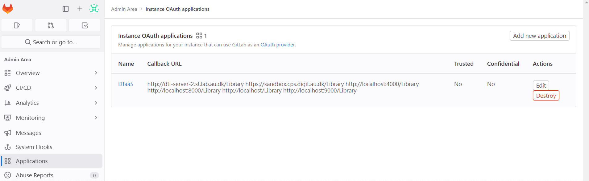
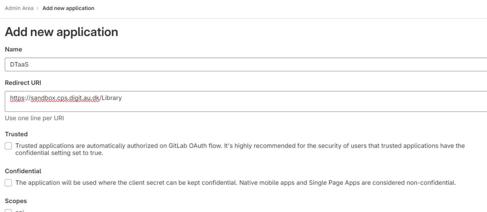

# Gitlab Applications Setup

## Gitlab Client Auth App

- Login to your Gitlab instance as an admin.
  Head over to the Admin area.

- Go to the Applications tab. Click on "Add
  a new application" on the top right.

  

- Write a suitable name for the application,
  and add _{server-dns}/Library_ to the Redirect URI section. Keep the Trusted & Confidential
  checkboxes unticked.
  
  

- Select the 5 required scopes: api, read_user,
  read_repository, openid, profile. Click on
  Save Application.

- Copy the Application ID displayed, and click
  on continue. Your application is now created.

## Gitlab Server Auth App

This step isn't required for a _localhost_ deploy which doesn't need user authentication.
Follow the steps if you require user authentication. 

- Follow similar steps as the previous section
  to create a new Gitlab application.

- Give this application a unique name, and add
  *{server_dns}/_oauth* to the Redirect URI section. Keep the Trusted & Confidential
  checkboxes unticked.

- Select the read_user scope. Click on Save
  Application. Note down both the Application ID,
  and Secret shown. Your application is now created.
