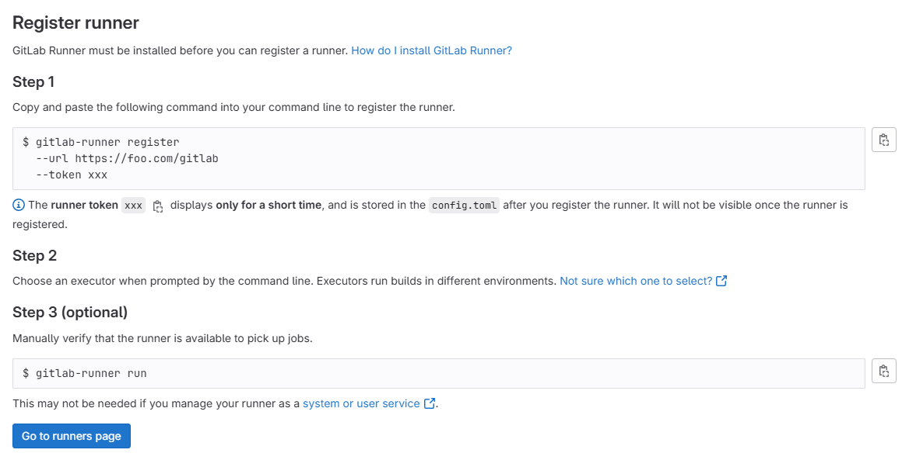

# GitLab Runner Integration

This document outlines the steps needed to create a Docker container named
`gitlab-runner` which will contain a single runner that will be responsible for
the execution of Digital Twins. There are two installation scenarios:

1. Localhost Installation - You are using the integrated runner locally with
   a GitLab server hosted at `https://localhost/gitlab`.
2. Server Installation - You are using the integrated runner with a GitLab
   instance hosted on a production server. This server may be a remote server
   and not necessarily your own, and may have TLS enabled with a self-signed
   certificate.

In either case, follow the steps as outlined below.

## Obtaining A Registration Token

First, we will obtain the token necessary to register the runner for the GitLab
instance.

1. On the __Admin__ dashboard, navigate to __CI / CD > Runners__.
1. Select __New instance runner__.
1. Under __Platform__, select the Linux operating system.
1. Under __Tags__, add a `linux` tag.
1. Select __Create runner__. A runner authentication token will be generated,
   be sure to save it somewhere.

You should see the following screen:



## Configuring the Runner

Depending on your installation scenario, the runner setup reads certain
configurations settings:

1. Localhost Installation - uses `deploy/docker/.env.local`
1. Server Installation - uses `deploy/docker/.env.server`

Ensure these files are properly set up.

We need to register the runner with the GitLab instance so that they may
communicate with each other. `deploy/services/runner/runner-config.toml`
has the following template:

```toml
[[runners]]
  name = "dtaas-runner-1"
  url = "https://foo.com/gitlab/" # Edit this
  token = "xxx" # Edit this
  executor = "docker"
  [runners.docker]
    tls_verify = false
    image = "ruby:2.7"
    privileged = false
    disable_entrypoint_overwrite = false
    oom_kill_disable = false
    volumes = ["/cache"]
    network_mode = "host" # Disable this in secure contexts
```

1. Set the `url` variable to the URL of your GitLab instance.
1. Set the `token` variable to the runner registration token you obtained earlier.
1. If you are following the server installation scenario, remove the line
   `network_mode = "host"`.

## Start the GitLab Runner

You may use the following commands to start and stop the `gitlab-runner`
container respectively, depending on your installation scenario:

1. Localhost Installation

   ```bash
   docker compose -f deploy/services/runner/compose.runner.local.yml --env-file deploy/docker/.env.local up -d
   docker compose -f deploy/services/runner/compose.runner.local.yml --env-file deploy/docker/.env.local down
   ```

2. Server Installation

   ```bash
   docker compose -f deploy/services/runner/compose.runner.server.yml --env-file deploy/docker/.env.server up -d
   docker compose -f deploy/services/runner/compose.runner.server.yml --env-file deploy/docker/.env.server down
   ```

Once the container starts, the runner within it will run automatically. You can
tell if the runner is correctly configured by navigating to
`CI/CD > Runners` on your Admin dashboard and seeing something like this:


You will now have a GitLab runner ready to accept jobs for the GitLab instance.

## Pipeline Trigger Token

The Digital Twins Preview Page uses the GitLab API which requires a
[Pipeline Trigger Token](https://docs.gitlab.com/ee/api/pipeline_triggers.html).
On the GitLab instance, go to your project in the _DTaaS_ group and navigate
to __Settings > CI/CD > Pipeline trigger tokens__. Add a new token with any
description of your choice.


You can now use the Digital Twins Preview Page to manage and execute your
digital twins.

## Resource Allocation

By default, the runner executor will pick up as many jobs as it can (limited
by the number of threads on the machine). To limit the number of jobs that may
be run concurrently, you can set the `limit` variable in `config.toml`.

A list of advanced configuration options is provided on the
[GitLab documentation page](https://docs.gitlab.com/runner/configuration/advanced-configuration.html).
