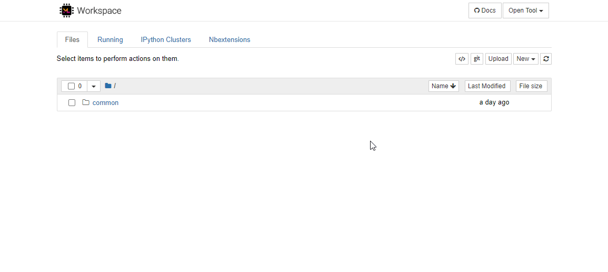

# Link services to local ports

To link a port from the service machine (server2) to the local port on the user workspace (server1). You can make a ssh link between these two.

#### 1. Step

Go to the user workspace, on which you want to map from localhost to the services machine

- e.g. `foo.com/user1`

#### 2. Step

Open a terminal in your user workspace.


#### 3. Step

Run the following command to map a port:

```sh
ssh -fNT -L <local_port>:<destination>:<destination_port> <user>@<ssh_server>

```

Here's an example mapping the service port 5672 to localhost port 5672.

```sh
ssh -fNT -L 5672:localhost:5672 vagrant@services.foo.com
```
