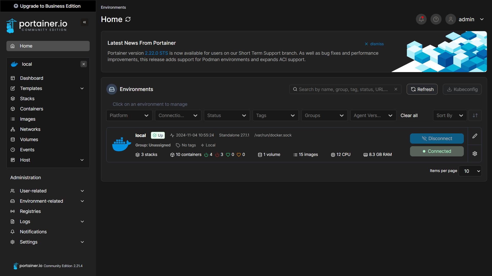
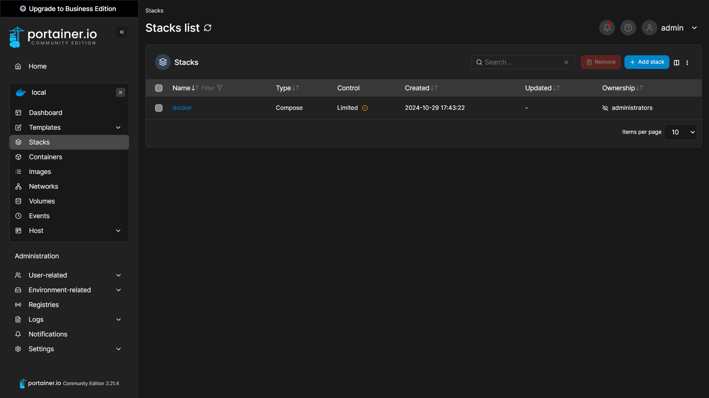
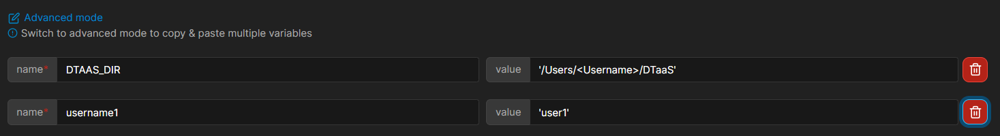

# Install DTaaS on localhost (GUI)

The installation instructions provided in this README are
ideal for running the DTaaS on localhost via a Graphical User
Interface (GUI).
This installation is ideal for single users intending to use
DTaaS on their own computers.

## Design

An illustration of the docker containers used and the authorization
setup is shown here.


## Requirements

The installation requirements to run this docker version of the DTaaS are:

- docker desktop / docker CLI with compose plugin
- User account on _gitlab.com_

<!-- markdownlint-disable MD046 -->
<!-- prettier-ignore -->
!!! tip
    The frontend website requires authorization.
    The default authorization configuration works for _gitlab.com_.
    If you desire to use locally hosted gitlab instance, please see
    the [client docs](../client/auth.md).
<!-- markdownlint-enable MD046 -->

## Clone Codebase

If you have not cloned the DTaaS git repository, cloning would be
the first step.
In case you already have the codebase, you can skip the cloning step.
To clone, do:

```bash
git clone https://github.com/into-cps-association/DTaaS.git
cd DTaaS/deploy/services/gitlab
```

In this guide we will assume the contents of the zip file have been extracted
to the directory: `/home/DTaaS`.

!!! tip
    The path given here is for Linux OS.
       It can be Windows compatible as well, for example: `C:\\DTaaS`. Make
       sure to use this path and format in place of `/home/DTaaS` in this
       guide.

## Starting Portainer

The GUI used to run the application and docker containers will be provided by
[Portainer Community Edition](https://portainer.io). It is itself a Docker
container that will create a website at `https://localhost:9443`, which will
present a graphical interface for starting and stopping the application.

You may follow
[the official documentation for setting up a Portainer CE Server](https://docs.portainer.io/start/install-ce/server/docker)
. Alternatively, open a terminal on your system (Terminal on Linux / MacOS,
Powershell on Windows, etc) and copy the following commands into it:

```bash
docker volume create portainer_data
docker run -d -p 8000:8000 -p 9443:9443 --name portainer --restart=always -v /var/run/docker.sock:/var/run/docker.sock -v portainer_data:/data portainer/portainer-ce:2.21.4
```

This will start the Portainer server on your system, which will host its
dashboard at `https://localhost:9443`. Follow the
[Initial Setup Guide](https://docs.portainer.io/start/install-ce/server/setup)
to set up an administrator account for Portainer on your system.

Portainer should now be set up on your system, and you can access the dashboard:



!!! tip
    The next time you wish to start the Portainer server, run
       `docker start portainer`.

## Configuration

### Create User Workspace

The existing filesystem for installation is setup for `user1`.
A new filesystem directory needs to be created for the selected user.

You may use your file explorer or an equivalent application to duplicate the
`files/user1` directory and rename it as `files/username` where _username_ is
the selected username registered on <https://gitlab.com>.

ALternatively, you may execute the following commands from the top-level
directory of the DTaaS project.

```bash
cp -R files/user1 files/username
```

### Creating the Portainer Stack



Portainer Stacks are equivalent to using `docker compose` commands to manage containers.

1. Navigate to the _Stacks_ tab on the side panel, and click on the _Add Stack_ button.
1. Name the Stack anything descriptive, for example: `dtaas-localhost`.
1. Select the _Upload_ build method.
1. Upload the compose file located at `deploy/docker/compose.local.yml`.
1. Select the option to load variables from a .env file, and upload the file `deploy/docker/.env.local`.

!!! tip
    Sometimes the `.env.local` file does not show up in the file explorer. You
    may fix this by selecting the option to show _All Files_ rather than those
    with the extension _.env_.



The `.env.local` file contains environment variables that are used by the
compose file. Portainer allows you to modify them as shown in the screenshot
above, here is a summary:

  | URL Path | Example Value | Explanation |
  |:------------|:---------------|:---------------|
  | DTAAS_DIR | '/home/Desktop/DTaaS' | Full path to the DTaaS directory. This is an absolute path with no trailing slash. |
  | username1 | 'user1' | Your gitlab username |

<!-- markdownlint-disable MD046 -->
<!-- prettier-ignore -->
!!! tip
    Important points to note:

    1. The path examples given here are for Linux OS.
       These paths can be Windows OS compatible paths as well.
    1. The client configuration file is located at `deploy/config/client/env.local.js`.
       If you are following the guide to use HTTPS on localhost, edit the URLs in this file by replacing `http` with `https`.
<!-- markdownlint-enable MD046 -->

Once you have configured the environment variables, click on the button
_Deploy the stack_.

## Use

The application will be accessible at:
<http://localhost> from web browser.
Sign in using your <https://gitlab.com> account.

All the functionality of DTaaS should be available to you
through the single page client now.

## Limitations

The [library microservice](../servers/lib/docker.md) is not
included in the localhost installation scenario.

## References

Image sources:
[Traefik logo](https://www.laub-home.de/wiki/Traefik_SSL_Reverse_Proxy_f%C3%BCr_Docker_Container),
[ml-workspace](https://github.com/ml-tooling/ml-workspace),
[reactjs](https://krify.co/about-reactjs/),
[gitlab](https://gitlab.com)
