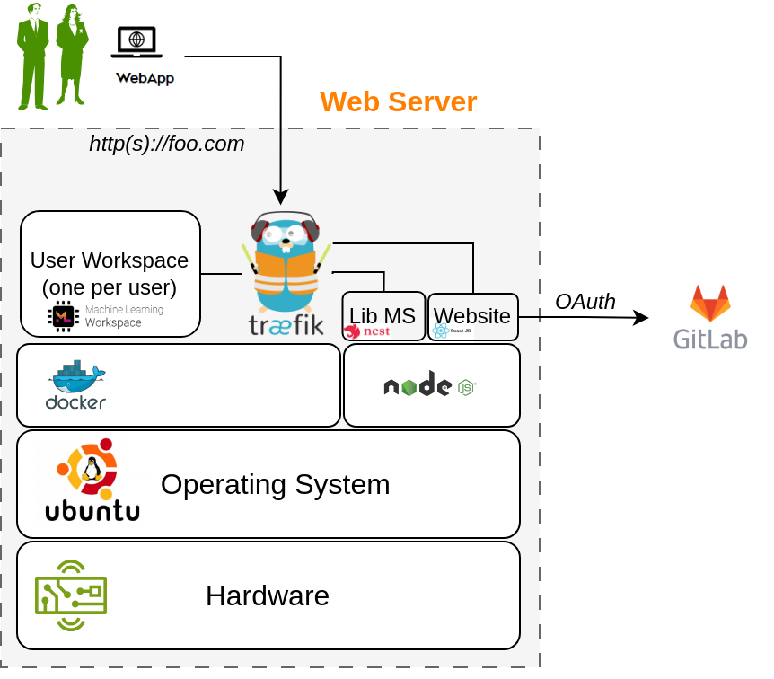

# DTaaS on Linux Operating System

These are installation instructions for running DTaaS application
on a Ubuntu Server 22.04 Operating System.
The setup requires a machine which can
spare 16GB RAM, 8 vCPUs and 50GB Hard Disk space.

A dummy **foo.com** URL has been used for illustration.
Please change this to your unique website URL.
It is assumed that you are going to serve the application in only HTTPS mode.

A successful installation will create a setup
similar to the one shown in the figure.



Please follow these steps to make this work in your local environment.
Download the **DTaaS.zip** from the
[releases page](https://github.com/INTO-CPS-Association/DTaaS/releases).
Unzip the same into a directory named **DTaaS**.
The rest of the instructions assume that your working directory is **DTaaS**.

<!-- markdownlint-disable MD046 -->
<!-- prettier-ignore -->
!!! note
    If you only want to test the application
    and are not setting up a production instance,
    you can follow the instructions of [trial installation](trial.md).

<!-- markdownlint-enable MD046 -->

## Configuration

You need to configure the Traefik gateway,
library microservice and react client website.

The first step is to decide on the number of users and their usenames.
The traefik gateway configuration has a template for two users.
You can modify the usernames in the template to the usernames chosen by you.

### Traefik gateway server

You can run the Traefik gateway server in both
HTTP and HTTPS mode to experience the DTaaS application.
The installation guide assumes that you can run the application in HTTPS mode.

The Traefik gateway configuration is
at _deploy/config/gateway/fileConfig.yml_.
Change `foo.com` to your local hostname and user1/user2 to
the usernames chosen by you.

<!-- markdownlint-disable MD046 -->
<!-- prettier-ignore -->
!!! tip
    Do not use `http://` or `https://`
    in _deploy/config/gateway/fileConfig.yml_.

<!-- markdownlint-enable MD046 -->

#### Authentication

This step requires `htpasswd` commandline utility. If
it is not available on your system, please install the same by using

```bash
sudo apt-get update
sudo apt-get install -y apache2-utils
```

You can now proceed with update of the gateway authentication setup.
The dummy username is `foo` and the password is `bar`.
Please change this before starting the gateway.

```bash
rm deploy/config/gateway/auth
touch deploy/config/gateway/auth
htpasswd deploy/config/gateway/auth <first_username>
password: <your password>
```

The user credentials added in _deploy/config/gateway/auth_ should
match the usernames in _deploy/config/gateway/fileConfig.yml_.

## Lib microservice

The library microservice requires configuration.
A template of this configuration file is given in _deploy/config/lib_ file.
Please modify this file as per your needs.

The first step in this configuration is to prepare the a filesystem for users.
An example file system in `files/` directory.
You can rename the top-level user1/user2 to the usernames chosen by you.

Add an environment file named `.env` in lib for the library microservice.
An example `.env` file is given below.
The simplest possibility is to use `local` mode with the following example.
The filepath is the absolute filepath to `files/` directory.
You can copy this configuration into _deploy/config/lib_ file to get started.

```env
PORT='4001'
MODE='local'
LOCAL_PATH ='filepath'
LOG_LEVEL='debug'
APOLLO_PATH='/lib'
GRAPHQL_PLAYGROUND='true'
```

## React Client Website

### Gitlab OAuth application

The DTaaS react website requires Gitlab OAuth provider.
If you need more help with this step, please see
the [Authentication page](client/auth.md).

You need the following information from the OAuth application registered on Gitlab:

| Gitlab Variable Name | Variable name in Client env.js | Default Value                                    |
| :------------------- | :----------------------------- | :----------------------------------------------- |
| OAuth Provider       | REACT_APP_AUTH_AUTHORITY       | <https://gitlab.foo.com/>                        |
| Application ID       | REACT_APP_CLIENT_ID            |
| Callback URL         | REACT_APP_REDIRECT_URI         | <https://foo.com/Library>                        |
| Scopes               | REACT_APP_GITLAB_SCOPES        | openid, profile, read_user, read_repository, api |

You can also see
[Gitlab help page](https://docs.gitlab.com/ee/integration/oauth_provider.html)
for getting the Gitlab OAuth application details.
Remember to Create gitlab accounts for usernames chosen by you.

### Update Client Config

Change the React website configuration in _deploy/config/client/env.js_.

```js
window.env = {
  REACT_APP_ENVIRONMENT: "prod",
  REACT_APP_URL: "https://foo.com/",
  REACT_APP_URL_BASENAME: "dtaas",
  REACT_APP_URL_DTLINK: "/lab",
  REACT_APP_URL_LIBLINK: "",
  REACT_APP_WORKBENCHLINK_TERMINAL: "/terminals/main",
  REACT_APP_WORKBENCHLINK_VNCDESKTOP: "/tools/vnc/?password=vncpassword",
  REACT_APP_WORKBENCHLINK_VSCODE: "/tools/vscode/",
  REACT_APP_WORKBENCHLINK_JUPYTERLAB: "/lab",
  REACT_APP_WORKBENCHLINK_JUPYTERNOTEBOOK: "",

  REACT_APP_CLIENT_ID:
    "934b98f03f1b6f743832b2840bf7cccaed93c3bfe579093dd0942a433691ccc0",
  REACT_APP_AUTH_AUTHORITY: "https://gitlab.foo.com/",
  REACT_APP_REDIRECT_URI: "https://foo.com/Library",
  REACT_APP_LOGOUT_REDIRECT_URI: "https://foo.com/",
  REACT_APP_GITLAB_SCOPES: "openid profile read_user read_repository api",
};
```

## Update the installation script

Open `deploy/install.sh` and update user1/user2 to usernames chosen by you.

## Perform the Installation

Go to the DTaaS directory and execute

```sh
source deploy/install.sh
```

You can run this script multiple times until the installation is successful.

<!-- prettier-ignore -->
!!! note
    While installing you might encounter multiple dialogs asking,
    which services should be restarted.
    Just click **OK** to all of those.

## Post-install Check

Now you should be able to access the DTaaS application at: <https://foo.com>

If you can following all the screenshots from [user website](../user/website/index.md).
Everything is correctly setup.

## References

Image sources: [Ubuntu logo](https://logodix.com/linux-ubuntu),
[Traefik logo](https://www.laub-home.de/wiki/Traefik_SSL_Reverse_Proxy_f%C3%BCr_Docker_Container),
[ml-workspace](https://github.com/ml-tooling/ml-workspace),
[nodejs](https://www.metachris.com/2017/01/how-to-install-nodejs-7-on-ubuntu-and-centos/),
[reactjs](https://krify.co/about-reactjs/),
[nestjs](https://camunda.com/blog/2019/10/nestjs-tx-email/)
