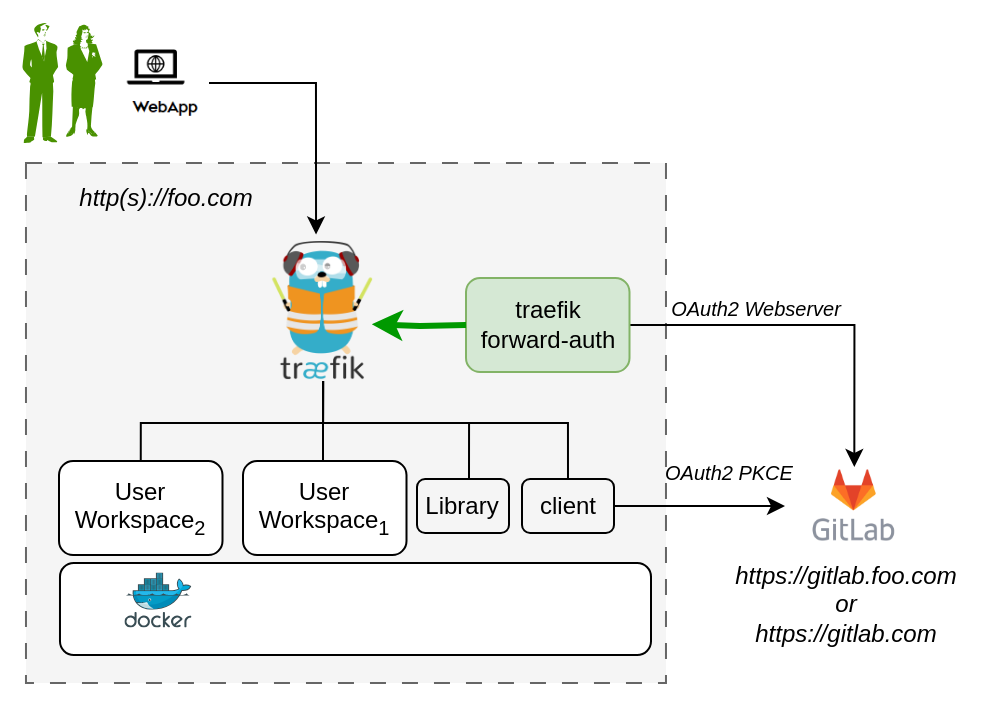

# DTaaS on a Production Server

The installation instructions provided in this README are
ideal for hosting the DTaaS as web application
for multiple users.

## Design

An illustration of the docker containers used and the authorization
setup is shown here.



In the new application configuration, there are two OAuth2 applications.

## Requirements

The installation requirements to run this docker version of the DTaaS are:

- DNS name for the server
- docker with compose plugin
- User accounts on a gitlab instance
- OAuth2 application registrations

### Create User Accounts

Create user accounts in a gitlab instance for all the users.

The default docker compose file contains two - _user1_ and _user2_.
These names need to be changed to suitable usernames.

It is possible to use _gitlab.com_ as well for OAuth2 authorization purposes.

### OAuth2 Application Registration

The multi-user installation setup requires dedicated authorization
setup for both frontend website and backend services.
Both these authorization requirements are satisfied
using OAuth2 protocol.

- The frontend website is a React single page application (SPA).
- The details of Oauth2 app for the frontend website are in
  [client docs](client/auth.md).
- The Oauth2 authorization for backend services is managed
  by [Traefik forward-auth](https://github.com/thomseddon/traefik-forward-auth).
  The details of this authorization setup are in
  [server docs](servers/auth.md).

Based on your selection of gitlab instance, it is necessary
to register these two OAuth2 applications and link them
to your intended DTaaS installation.

Please see
[gitlab oauth provider](https://docs.gitlab.com/ee/integration/oauth_provider.html)
documentation for further help with creating these two OAuth applications.

## Configuration

Three following configuration files need to be updated.

### Docker Compose

The docker compose configuration is in `.env.server` is
a configuration template. It can be updated to suit your local
installation scenario.

The `.env.local` contains the following environment variables.

Edit all the fields according to your specific case.

  | URL Path | Example Value | Explanation |
  |:------------|:---------------|:---------------|
  | DTAAS_DIR | '/home/dtaas/Desktop/DTaaS' | Full path to the DTaaS directory. This is an absolute path with no trailing slash. |
  | SERVER_DNS | <http>_foo.com_</http> | The server DNS, if you are deploying with a dedicated server. Remember not use  <http:>http(s)</http:> at the beginning of the DNS string |
  | OAUTH_URL | <http>_gitlab.foo.com_<http/> | The URL of your Gitlab instance. It can be <http>_gitlab.com_<http/> if you are planning to use it for authorization. |
  | CLIENT_ID | 'xx' | The ID of your server OAuth application |
  | CLIENT_SECRET | 'xx' | The Secret of your server OAuth application |
  | OAUTH_SECRET | 'random-secret-string' | Any private random string. This is a password you choose for local installation. |
  | username1 | 'user1' | The gitlab instance username of a user of DTaaS |
  | username2 | 'user2' | The gitlab instance username of a user of DTaaS |
  | CLIENT_CONFIG | '/home/dtaas/Desktop/DTaaS/deploy/config/client/env.js' | Full path to env.js file for client |

<!-- markdownlint-disable MD046 -->
<!-- prettier-ignore -->
!!! tip
    Important points to note:

    1. The path examples given here are for Linux OS.
       These paths can be Windows OS compatible paths as well.
    1. The Server DNS can also be an IP address.
       However, for proper working it is neccessary to use the
       same convention (IP/DNS) in the `CLIENT_CONFIG` file as well.
<!-- markdownlint-enable MD046 -->

### Website Client

The frontend React website requires configuration which is specified
via a filename provided in `CLIENT_CONFIG` variable of `.env.server` file.

The `CLIENT_CONFIG` file is in relative directory of
_deploy/config/client/env.trial.js_.

Further explanation on the client configuration is available in
[client config](client/docker.md).

### Create User Workspace

The existing filesystem for installation is setup for `user1`.
A new filesystem directory needs to be created for the selected user.

Please execute the following commands from the top-level directory
of the DTaaS project.

```bash
cp -R files/user1 files/username
```

where _username_ is one of the selected usernames. This command
needs to be repeated for all the selected users.

### Library Microservice

The library microservice (Lib MS) acts like as a standalone file server for
users. It does not interact directly with user workspaces and is not
needed for the regular use cases of the DTaaS.

In case you wish to use the Lib MS, please update
the `deploy/config/lib.docker` configuration file.

The config specified in INI format. The template configuration file is:

```ini
PORT='4001'
MODE='local'
LOCAL_PATH ='/home/dtaas/Desktop/DTaaS/files'
LOG_LEVEL='debug'
APOLLO_PATH='/lib'
GRAPHQL_PLAYGROUND='true'
```

The `LOCAL_PATH` variable is the absolute filepath to the
location of the local directory which will be served to users
by the Library microservice.
Replace the default values the appropriate values for your setup.

### Caveat

The usernames in the `.env.server` file need to match those in
the `conf.server` file.

Traefik routes are controlled by the `.env.server` file
Authorization on these routes is controlled by the `conf.server` file.
If a route is not specified in `conf` file but an authorisation is
requested by traefik for this unknown route, the default behavior of
traefik forward-auth kicks in. This default behavior is to enable
endpoint being available to any signed in user.

If there are extra routes in `conf.server` file but these are not
in `.env.server` file,
such routes are not served by traefik; it will give **404 server response**.

## Run

The commands to start and stop the appliation are:

```bash
docker compose -f compose.server.yml --env-file .env.server up -d
docker compose -f compose.server.yml --env-file .env.server down
```

To restart only a specific container, for example `client``

```bash
docker compose -f compose.server.yml --env-file .env.server up -d --force-recreate client
```

## Use

The application will be accessible at:
<http://foo.com> from web browser.
Sign in using your account linked to
either _gitlab.com_ or your local gitlab instance.

All the functionality of DTaaS should be available to your users
through the single page client now.

You may have to click Sign in to Gitlab on the Client page
and authorize access to the shown application.

## Adding a new user

To add a new user to your DTaaS instance, follow these steps:

- Use the [DTaaS CLI](cli.md) to bring up the ML workspaces for new users.
  This brings up the containers, without the authorization enforced by Traefik forward-auth.

- Now, Add two lines to the `conf.local` file

```txt
rule.onlyu4.action=allow
rule.onlyu4.rule=PathPrefix(`/user4`)
```

- Add three lines to the `conf.server` file

```txt
rule.onlyu3.action=auth
rule.onlyu3.rule=PathPrefix(`/user3`)
rule.onlyu3.whitelist = user3@emailservice.com
```

Run the appropritate command for a server/local installation:

```bash
docker compose -f compose.server.yml --env-file .env.server up -d --force-recreate traefik-forward-auth
```

The new users are now added to the DTaaS instance, with authorization enabled.

## References

Image sources:
[Traefik logo](https://www.laub-home.de/wiki/Traefik_SSL_Reverse_Proxy_f%C3%BCr_Docker_Container),
[ml-workspace](https://github.com/ml-tooling/ml-workspace),
[reactjs](https://krify.co/about-reactjs/),
[gitlab](https://gitlab.com)
