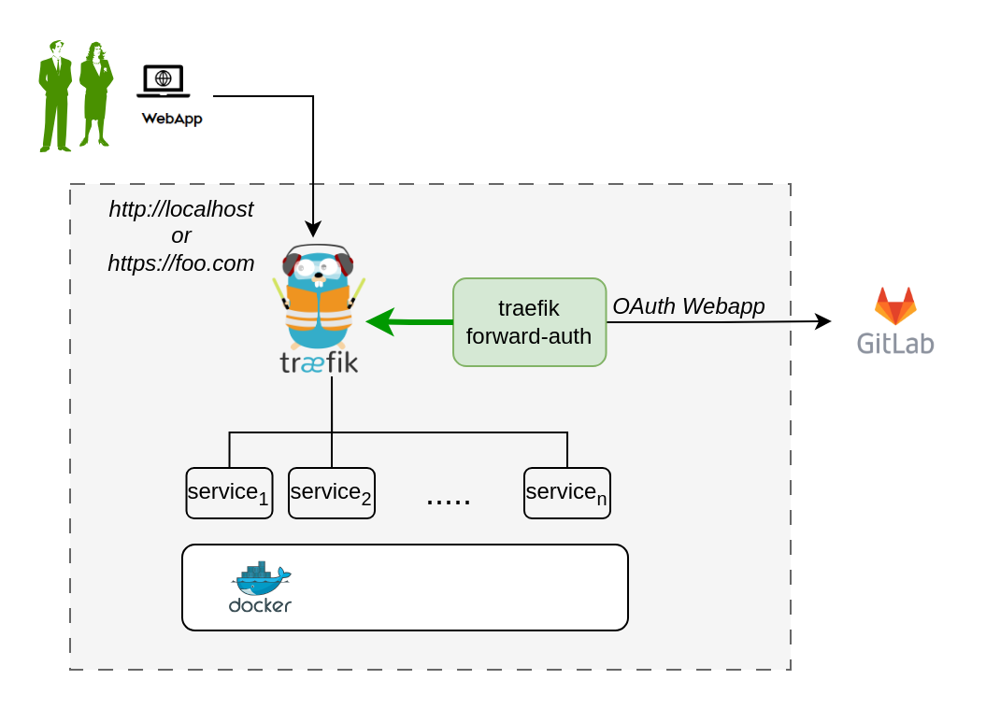

# OAuth for Traefik Gateway

The traefik gateway is used to serve the DTaaS. All the services
provided as part of the application are secured at the traefik gateway.
The security is based on [Traefik forward-auth](https://github.com/thomseddon/traefik-forward-auth).

An illustration of the docker containers used and the authorization
setup is shown here.



The **traefik forward-auth** can use any OAuth2 provider, but within the DTaaS
gitlab is used as authorization provider.
You will use
the OAuth the web / server application
authorization flow.

Here are the steps to get started:

**1. Choose Your GitLab Server:**

- You need to set up OAuth authorization on a GitLab server.
  The commercial gitlab.com is not suitable for multi-user authorization
  (DTaaS requires this), so you'll need an on-premise GitLab instance.
- You can use
  [GitLab Omnibus Docker for this purpose](https://docs.gitlab.com/ee/install/docker.html).
- Configure the OAuth application as an
  [instance-wide authorization type](https://docs.gitlab.com/ee/integration/oauth_provider.html#create-an-instance-wide-application).
  Select option to generate client secret and also selection option
  for trusted application.

**2. Determine Your Website's Hostname:**

- Before setting up OAuth on GitLab, decide on the hostname for your website.
  It's recommended to use a self-hosted GitLab instance, which you will use in
  other parts of the DTaaS application.

**3. Define Callback and Logout URLs:**

- For the web / server authorization flow to function correctly, you need two URLs:
  a callback URL and a logout URL.
  - The callback URL informs the OAuth provider of the
    page where
    signed-in users should be redirected. It is the landing
    homepage of the DTaaS applicati1on.
  (either <http://foo.com/Library/> or <http://localhost/Library/>)
  - The logout URL is the URL for signout of gitlab and clear authorization
  within traefik-forward auth.
  (either <http://foo.com/_oauth/> or <http://localhost/_oauth/>)

**4. OAuth Application Creation:**

- During the creation of the OAuth application on GitLab, you need to specify
  the scope. Choose read_user_ scope.

**5. Application Credentials:**

- After successfully creating the OAuth application, GitLab generates
  an _application ID_ and _client secret_.
  Both these values are long string of HEX values that you will need for
  your configuration files.

**6. Required Information from OAuth Application:**

- You will need the following information from the OAuth application
  registered on GitLab:

|GitLab Variable Name|Variable Name in .env of docker compose file |Default Value|
|---|---|---|
|OAuth Provider|OAUTH_URL|[https://gitlab.foo.com/](https://gitlab.foo.com/)|
|Application ID|CLIENT_ID| _xx_ |
|Application Secret|CLIENT_SECRET| _xx_ |
|Callback URL|(to be directly entered in Gitlab OAuth registration)||
|Forward-auth secret|OAUTH_SECRET|_random-secret-string_ (password for forward-auth, can be changed to your preferred string) |
|Scopes|email||

## Development Environment

The development environment does not required traefik forward-auth.

## Configure Authorization Rules for Traefik Forward-Auth

The Traefik forward-auth microservices requires configuration rules to manage
authorization for different URL paths.
The _conf_ file can be used to configure the specific rules.
There are broadly three kinds of URLs:

### Public Path Without Authorization

To setup a public page, an example is shown below.

```text
rule.noauth.action=allow
rule.noauth.rule=Path(`/public`)
```

Here, 'noauth' is the rule name, and should be changed to suit rule use.
Rule names should be unique for each rule.
The 'action' property is set to "allow" to make the resource public.
The 'rule' property defines the path/route to reach the resource.

### Common to All Users

To setup a common page that requires Gitlab OAuth,
but is available to all users of the Gitlab instance:

```text
rule.all.action=auth
rule.all.rule=Path(`/common`)
```

The 'action' property is set to "auth", to enable Gitlab
OAuth before the resource can be accessed.

### Selective Access

Selective Access refers to the scenario of allowing access to a URL path
for a few users. To setup selective access to a page:

```text
rule.onlyu1.action=auth
rule.onlyu1.rule=Path(`/user1`)
rule.onlyu1.whitelist = user1@localhost
```

The 'whitelist' property of a rule defines a comma separated list
of email IDs that are allowed to access the resource.
While signing in users can sign in with either their username or email ID
as usual, but the email ID corresponding to the
account should be included in the whitelist.

This restricts access of the resource,
allowing only users mentioned in the whitelist.

## Limitation

The rules in _conf_ file are not dynamically loaded into
the **traefik-forward-auth** microservice.
Any change in the _conf_ file requires
retart of **traefik-forward-auth** for the changes to take effect.
All the existing user sessions get invalidated when
the **traefik-forward-auth** restarts.

Use a simple command on the terminal.
