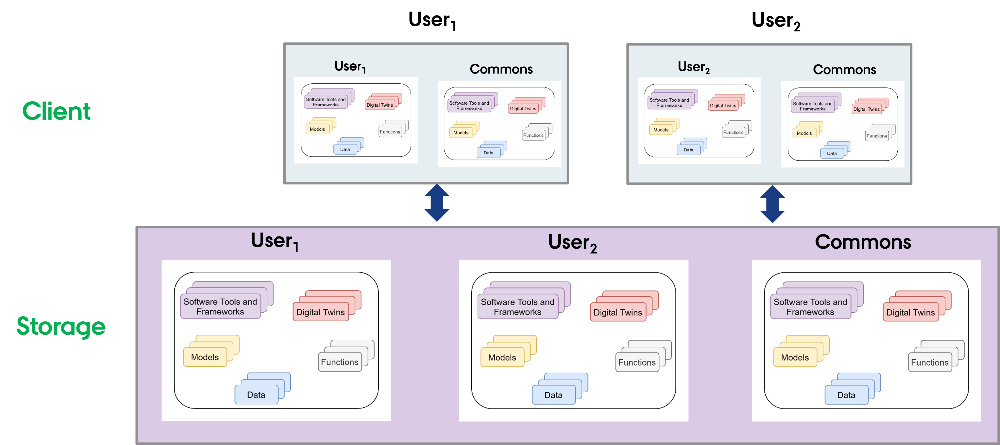

# Host Library Microservice

The **lib microservice** is a simplified file manager serving files
over graphQL and HTTP API.

It has two features:

* provide a listing of directory contents.
* transfer a file to user.

This document provides instructions for running docker container
to provide a stand alone library microservice.

## Setup the File System

### Outside DTaaS

The package can be used independently of DTaaS. If this is your use case,
you do not need any specific file structure. A valid file directory named
`files` is sufficient and it should be placed in the directory from
which the `compose.lib.yml` will be run.

### Inside DTaaS

The users of DTaaS expect the following file system structure for
their reusable assets.



There is a skeleton file structure in
[DTaaS codebase](https://github.com/INTO-CPS-Association/DTaaS/tree/feature/distributed-demo/files).
You can copy and create file system for your users. Remember to name
the directory containing the file structure as `files`
and place it in the directory from which the `compose.lib.yml` will be run.

## :rocket: Use

Use the [docker compose](compose.lib.yml) file to start the service.

```bash
# To bring up the container
docker compose -f compose.lib.yml up -d
# To bring down the container
docker compose -f compose.lib.yml down
```

## Service Endpoints

The GraphQL URL: `localhost:4001/lib`

The HTTP URL: `localhost:4001/lib/files`

The service API documentation is available on
[user page](../../../user/servers/lib/LIB-MS.md).
