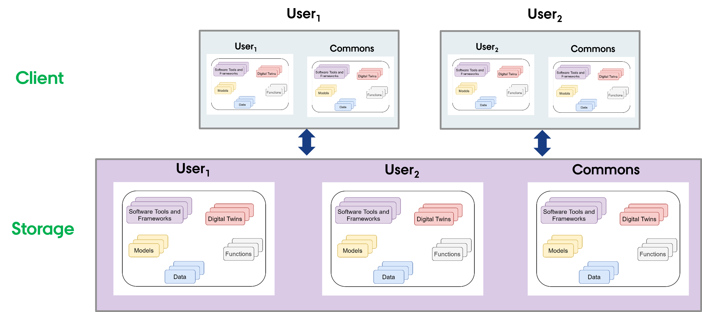

# Host Library Microservice

The **lib microservice** is a simplified file manager serving files
over graphQL and HTTP API.

It has two features:

* provide a listing of directory contents.
* upload and download files

This document provides instructions for installing npm package of
library microservice and running the same as a standalone service.

## Setup the File System

### Outside DTaaS

The package can be used independently of DTaaS. If this is your use case,
you do not need any specific file structure. Any valid file directory
is sufficient.

### Inside DTaaS

The users of DTaaS expect the following file system structure for
their reusable assets.



There is a skeleton file structure in
[DTaaS codebase](https://github.com/INTO-CPS-Association/DTaaS/tree/feature/distributed-demo/files).
You can copy and create file system for your users.

## :arrow_down: Install

The npm package is available in Github
[packages registry](https://github.com/orgs/INTO-CPS-Association/packages)
and on
[npmjs](https://www.npmjs.com/package/@into-cps-association/libms).
**Prefer the package on npmjs over Github**.

Set the registry and install the package with the one of
the two following commands

### npmjs

``` bash
sudo npm install -g @into-cps-association/libms  # requires no login
```

### Github

``` bash
# requires login
sudo npm config set @into-cps-association:registry https://npm.pkg.github.com
```

The _github package registry_ asks for username and password. The username is
your Github username and the password is your Github
[personal access token](https://docs.github.com/en/authentication/keeping-your-account-and-data-secure/managing-your-personal-access-tokens).
In order for the npm to download the package, your personal access token
needs to have _read:packages_ scope.

## :rocket: Use

Display help.

```bash
libms -h
```

Please see [configuration](config.md) for explanation of
configuration conventions.
To use `.env` as configuration file, run

```bash
libms
```

To run **libms** with a custom config file,

```bash
libms -c FILE-PATH
libms --config FILE-PATH
```

If the environment file is named something other than `.env`,
for example as `.env.libms`, you can run

```sh
libms -c ".env.libms"
```

You can press `Ctl+C` to halt the application.
If you wish to run the microservice in the background, use

```bash
nohup libms [-c FILE-PATH] & disown
```

The lib microservice is now running and ready to serve files.

This microservice can also serve files in a browser with files transferred
over HTTP protocol.

This option needs to be enabled with `-H http.json` flag.
A sample [http config](http.json) provided here can be used.

```bash
nohup libms [-H http.json] & disown
```

The regular file upload and download options become available.

## Service Endpoints

The GraphQL URL: `localhost:PORT/lib`

The HTTP URL: `localhost:PORT/lib/files`

The service API documentation is available on
[user page](../../../user/servers/lib/LIB-MS.md).
