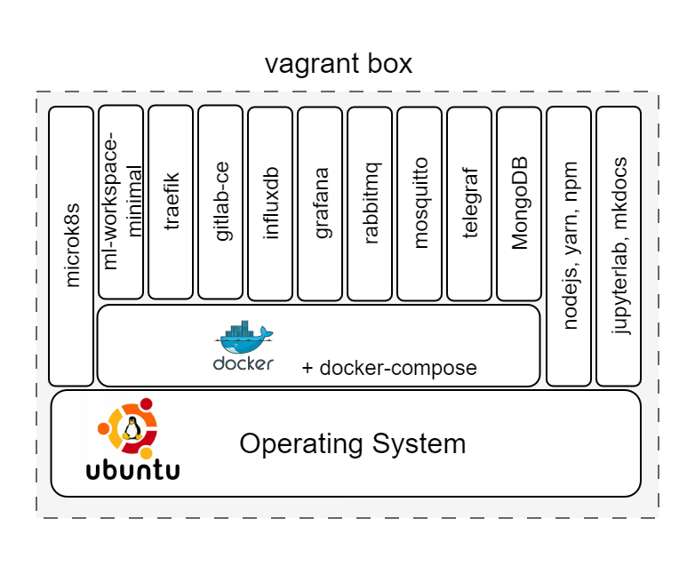

# DTaaS Vagrant Box

This README provides instructions on creating a custom Operating System
virtual disk for running the DTaaS software. The virtual disk is managed
by **vagrant**. The purpose is two fold:

* Provide cross-platform installation of the DTaaS application.
  Any operating system supporting use of vagrant software utility
  can support installation of the DTaaS software.
* Create a ready to use development environment for code contributors.

There are two scripts in this directory:

| Script name | Purpose | Default |
|:---|:---|:---|
| `user.sh` | user installation | :white_check_mark: |
| `developer.sh` | developer installation | :x: |

If you are installing the DTaaS for developers, the default installation
caters to your needs. You can skip the next step and continue with the
creation of vagrant box.

If you are a developer and would like additional software installed, you need
to modify `Vagrantfile`. The existing `Vagrantfile` has two lines:

```sh
    config.vm.provision "shell", path: "user.sh"
    #config.vm.provision "shell", path: "developer.sh"
```

Uncomment the second line to have more software components installed. If you
are not a developer, no changes are required to the `Vagrantfile`.

This vagrant box installed for users will have the following items:

1. docker v24.0
1. nodejs v18.8
1. yarn v1.22
1. npm v10.2
1. containers - ml-workspace-minimal v0.13, traefik v2.10, gitlab-ce v16.4,
   influxdb v2.7, grafana v10.1, rabbitmq v3-management,
   eclipse-mosquitto (mqtt) v2, mongodb v7.0

This vagrant box installed for developers will have
the following items additional items:

* docker-compose v2.20
* microk8s v1.27
* jupyterlab
* mkdocs
* container - telegraf v1.28

At the end of installation, the software stack created
in vagrant box can be visualised as shown in the following
figure.



The upcoming instructions will help with the creation of
base vagrant box.

```bash
#create a key pair
ssh-keygen -b 4096 -t rsa -f key -q -N ""
mv key vagrant
mv key.pub vagrant.pub

vagrant up

# let the provisioning be complete
# replace the vagrant ssh key-pair with personal one
vagrant ssh

# install the oh-my-zsh
sh -c "$(curl -fsSL https://raw.github.com/ohmyzsh/ohmyzsh/master/tools/install.sh)"
# install plugins: history, autosuggestions,
git clone https://github.com/zsh-users/zsh-autosuggestions ${ZSH_CUSTOM:-~/.oh-my-zsh/custom}/plugins/zsh-autosuggestions

# inside ~/.zshrc, modify the following line
plugins=(git zsh-autosuggestions history cp tmux)

# remove the vagrant default public key - first line of
# /home/vagrant/.ssh/authorized_keys

# exit vagrant guest machine and then
# copy own private key to vagrant private key location
cp vagrant .vagrant/machines/default/virtualbox/private_key

# check
vagrant ssh #should work

vagrant halt

vagrant package --base dtaas \
--info "info.json" --output dtaas.vagrant

# Add box to the vagrant cache in ~/.vagrant.d/boxes directory
vagrant box add --name dtaas ./dtaas.vagrant

# You can use this box in other vagrant boxes using
#config.vm.box = "dtaas"
```

## References

Image sources: [Ubuntu logo](https://logodix.com/linux-ubuntu)
