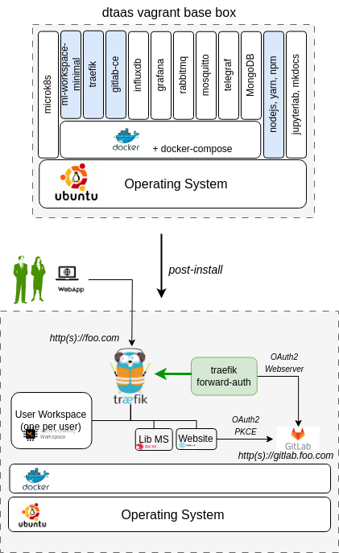

# DTaaS on Single Vagrant Machine

These are installation instructions for running DTaaS software
inside one vagrant Virtual Machine. The setup requires a
machine which can spare 16GB RAM, 8 vCPUs and 50GB Hard Disk
space to the vagrant box.

## Create Base Vagrant Box

Create [**dtaas** Vagrant box](base-box.md).
You would have created an SSH key pair - _vagrant_ and _vagrant.pub_.
The _vagrant_ is the private SSH key and is needed for the next steps.
Copy _vagrant_ SSH private key into the current directory
(`deploy/vagrant/single-machine`).
This shall be useful for logging into the vagrant
machines created for two-machine deployment.

## Target Installation Setup

The goal is to use the [**dtaas** Vagrant box](base-box.md)
to install the DTaaS software on one single vagrant machine.
A graphical illustration of a successful installation can be
seen here.



There are many unused software packages/docker containers within
the dtaas base box.
The used packages/docker containers are highlighed in blue color.

<!-- markdownlint-disable MD046 -->

!!! tip
    The illustration shows hosting of gitlab on the same
    vagrant machine with <http:>_http(s)://gitlab.foo.com_</http:>
    The gitlab setup is outside the scope this installation
    guide. Please refer to
    [gitlab docker install](https://docs.gitlab.com/ee/install/docker.html)
    for gitlab installation.

<!-- markdownlint-enable MD046 -->

## Configure Server Settings

A dummy **foo.com** URL has been used for illustration.
Please change this to your unique website URL.

Please follow the next steps to make this installation work
in your local environment.

Update the **Vagrantfile**. Fields to update are:

1. Hostname (`node.vm.hostname = "foo.com"`)
1. MAC address (`:mac => "xxxxxxxx"`).
   This change is required if you have a DHCP server assigning domain names
   based on MAC address. Otherwise, you can leave this field unchanged.
1. Other adjustments are optional.

## Installation Steps

Execute the following commands from terminal

```bash
vagrant up
vagrant ssh
```

Set a cronjob inside the vagrant virtual
machine to remote the conflicting default route.
Download the [route script](route.sh) and run
the following command.

```bash
sudo bash route.sh
```

Please follow the instructions of [regular server installation](../host.md)
setup to complete the installation.

## References

Image sources: [Ubuntu logo](https://logodix.com/linux-ubuntu),
[Traefik logo](https://www.laub-home.de/wiki/Traefik_SSL_Reverse_Proxy_f%C3%BCr_Docker_Container),
[ml-workspace](https://github.com/ml-tooling/ml-workspace),
[nodejs](https://www.metachris.com/2017/01/how-to-install-nodejs-7-on-ubuntu-and-centos/),
[reactjs](https://krify.co/about-reactjs/),
[nestjs](https://camunda.com/blog/2019/10/nestjs-tx-email/)
