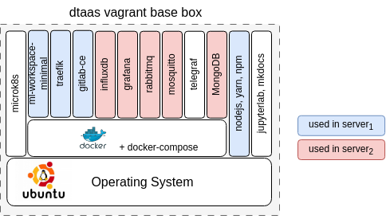
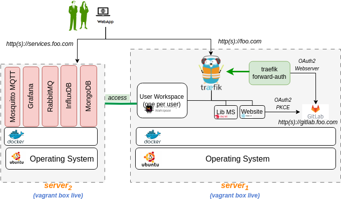

# DTaaS on Two Vagrant Machines

These are installation instructions for running DTaaS application
in two vagrant virtual machines (VMs). In this setup, all the user workspaces
shall be run on server1 while all the platform services will be run on server2.

The setup requires two server VMs with the following hardware configuration:

**server1**: 16GB RAM, 8 x64 vCPUs and 50GB Hard Disk space

**server2**: 6GB RAM, 3 x64 vCPUs and 50GB Hard Disk space

Under the default configuration, two user workspaces are provisioned on server1.
The default installation setup also installs
InfluxDB, Grafana, RabbitMQ and MQTT services on server2.
If you would like to install more services,
you can create shell scripts to install the same on server2.

## Create Base Vagrant Box

Create [**dtaas** Vagrant box](./base-box.md).
You would have created an SSH key pair - _vagrant_ and _vagrant.pub_.
The _vagrant_ is the private SSH key and is needed for the next steps.
Copy _vagrant_ SSH private key into the current directory (`deploy/vagrant/two-machine`).
This shall be useful for logging into the vagrant
machines created for two-machine deployment.

## Target Installation Setup

The goal is to use this [**dtaas** vagrant box](./base-box.md)
to install the DTaaS software on server1 and
the default platform services on server2. Both the servers
are vagrant machines.



There are many unused software packages/docker containers within
the dtaas base box.
The used packages/docker containers are highlighed in blue and red color.

A graphical illustration of a successful installation can be
seen here.



In this case, both the vagrant boxes are spawed on one server using
two vagrant configuration files, namely _boxes.json_ and _Vagrantfile_.

!!! tip
    The illustration shows hosting of gitlab on the same
    vagrant machine with <http:>_http(s)://gitlab.foo.com_</http:>
    The gitlab setup is outside the scope this installation
    guide. Please refer to
    [gitlab docker install](https://docs.gitlab.com/ee/install/docker.html)
    for gitlab installation.

## Configure Server Settings

**NOTE**: A dummy **foo.com** and **services.foo.com**  URLs
has been used for illustration.
Please change these to your unique website URLs.

The first step is to define the network identity of the two VMs.
For that, you need _server name_, _hostname_ and _MAC address_.
The hostname is the network URL at which the server can be accessed on the web.
Please follow these steps to make this work in your local environment.

Update the **boxes.json**. There are entries one for each server.
The fields to update are:

  1. `name` - name of server1 (`"name" = "dtaas"`)
  1. `hostname` - hostname of server1 (`"name" = "foo.com"`)
  1. MAC address (`:mac => "xxxxxxxx"`).
  This change is required if you have a DHCP server assigning domain names
  based on MAC address. Otherwise, you can leave this field unchanged.
  1. `name` - name of server2 (`"name" = "services"`)
  1. `hostname` - hostname of server2 (`"name" = "services.foo.com"`)
  1. MAC address (`:mac => "xxxxxxxx"`).
     This change is required if you have a DHCP server assigning domain
     names based on MAC address. Otherwise, you can leave this field unchanged.
  1. Other adjustments are optional.

## Installation Steps

The installation instructions are given separately for each vagrant machine.

### Launch DTaaS Platform Default Services

Follow the installation guide for [services](../services.md)
to install the DTaaS platform services.

After the services are up and running,
you can see the following services active within server2 (_services.foo.com_).

| service | external url |
|:---|:---|
| InfluxDB and visualization service | services.foo.com |
| Grafana visualization service | services.foo.com:3000 |
| MQTT communication service | services.foo.com:1883 |
| RabbitMQ communication service | services.foo.com:5672 |
| RabbitMQ management service | services.foo.com:15672 |
||

### Install DTaaS Application

Execute the following commands from terminal

```bash
vagrant up --provision dtaas
vagrant ssh dtaas
wget https://raw.githubusercontent.com/INTO-CPS-Association/DTaaS/feature/distributed-demo/deploy/vagrant/route.sh
sudo bash route.sh
```

If you only want to test the application and are
not setting up a production instance, you can
follow the instructions of [single script install](../trial.md).

If you are not in a hurry and would rather have a production instance,
follow the instructions of [regular server installation](../host.md)
setup to complete the installation.

## References

Image sources: [Ubuntu logo](https://logodix.com/linux-ubuntu),
[Traefik logo](https://www.laub-home.de/wiki/Traefik_SSL_Reverse_Proxy_f%C3%BCr_Docker_Container),
[ml-workspace](https://github.com/ml-tooling/ml-workspace),
[nodejs](https://www.metachris.com/2017/01/how-to-install-nodejs-7-on-ubuntu-and-centos/),
[reactjs](https://krify.co/about-reactjs/),
[nestjs](https://camunda.com/blog/2019/10/nestjs-tx-email/)
