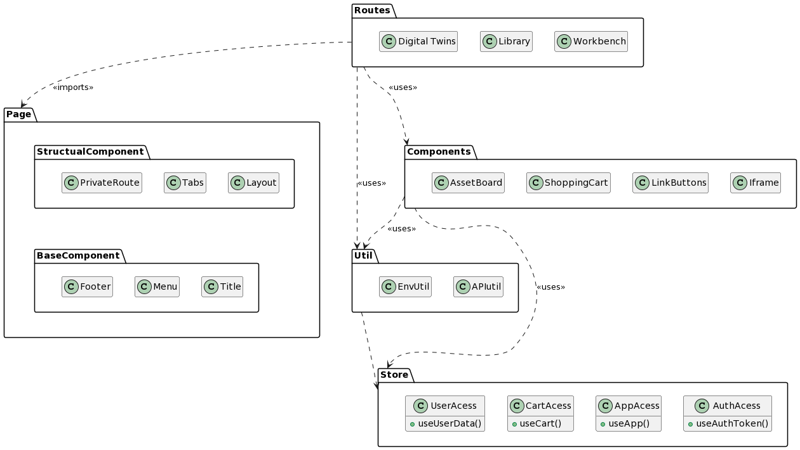

# Website

The [Website](https://github.com/INTO-CPS-Association/DTaaS/tree/feature/distributed-demo/client#readme) is how the end-users interact with the software platform. 

This is the Client side (frontend) for Digital Twin as a Service (DTaaS) software. The software provides a React single page web application for the Digital Twin support platform.

## Client Architecture

