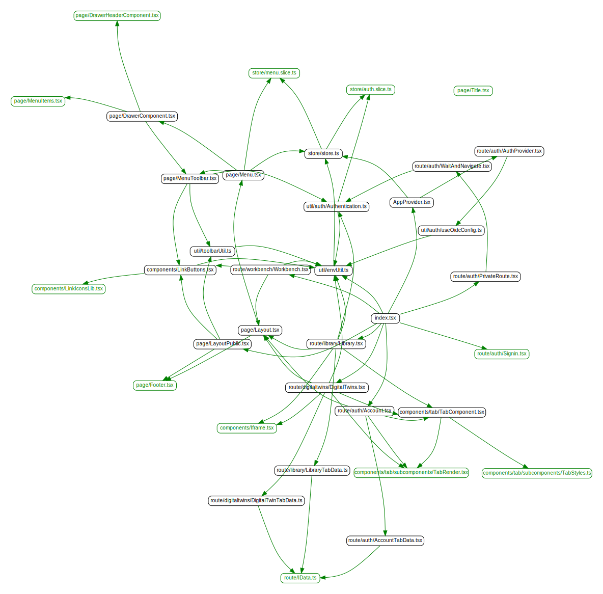
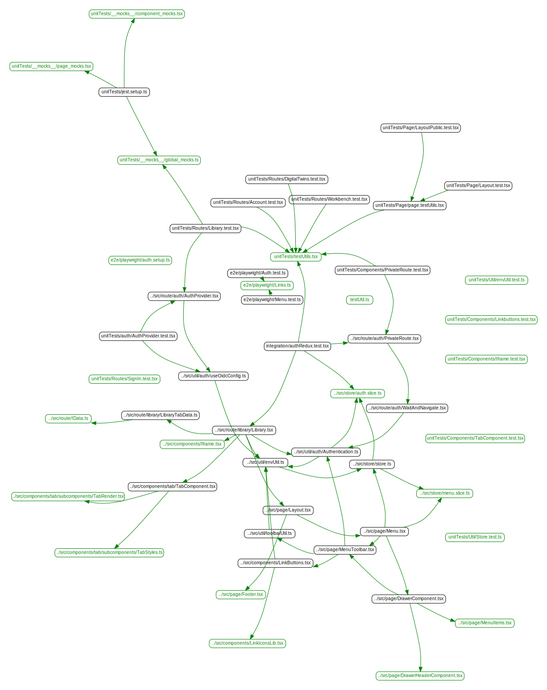

# React Website

The [Website](https://github.com/INTO-CPS-Association/DTaaS/tree/feature/distributed-demo/client#readme)
is how the end-users interact with the software platform. The website is
being developed as a React single page web application.

A dependency graph for the entire codebase of the react application is:

## Dependency Graphs

The figures are the dependency graphs generated from the code.

### src directory

### test directory

