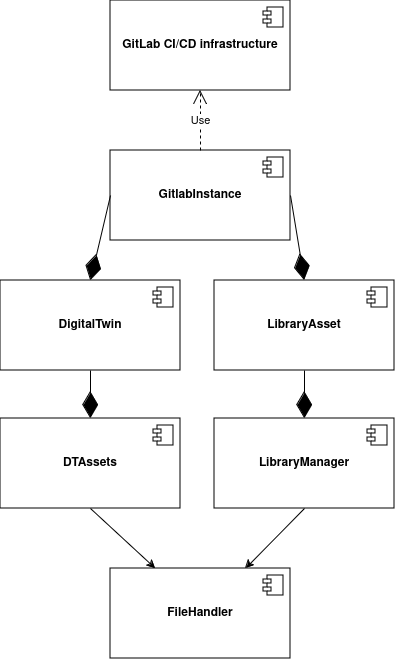

# Overview

## Expectations From a DevOps Framework

The functional requirements of the system include the automation of pipelines
and the management of Digital Twins (DTs) via Application Programming Interface
(API). Consequently, the framework was designed to facilitate the comprehensive
automation of the DT lifecycle, minimizing the necessity for manual
intervention. The system must be capable of managing the dynamic configuration
of pipelines, utilizing variables that permit the customization of pipeline
behavior according to the data provided by the user, such as the designation of
the DT.

Integration with GitLab is another fundamental requirement. The framework must
be able to interact with GitLab to execute CI/CD pipelines via API calls using
Gitbeaker as a wrapper. Users must authenticate via GitLab's OAuth mechanism,
and the system must automatically manage the authentication tokens and trigger
tokens needed to start pipelines. Additionally, the system must automatically
retrieve key information from the user's GitLab repository, such as the list of
available DTs.

## High Level Architecture

We use a DevOps framework to enable interaction with the DTs via APIs calls, so
that users can start, monitor and manage their DTs via the web
application.

The architectural design of the DevOps framework was intended to facilitate the
management of DTs. It is based on two key elements:

- __The GitLab CI/CD infrastructure__, which employs a parent-child pipeline
  hierarchy. The objective of this infrastructure is to enable the triggering
  of a pipeline of a specific DT by simply passing the necessary data as
  parameters, such as the name of the DT and the tag of the runner that will
  execute the pipeline.

- __Classes implemented in the code__, which utilize Gitbeaker to realize the
  APIs required for interaction with DTs.

The component diagram below illustrates how the infrastructure consists of three
main classes: `DigitalTwin`, `LibraryAsset`, and `GitlabInstance`.

The distinction between the `DigitalTwin` and `LibraryAsset` classes was
necessary to separate the full management of a DT from an asset visualized
through the library. The `LibraryAsset` class provides a significantly reduced
set of functionality compared to the `DigitalTwin`, focusing only on asset
visualization.

Intermediate classes were introduced to ensure a clear separation of file
management responsibilities: `DTAssets` and `LibraryManager`. These classes
implement the necessary logic to mediate between a `DigitalTwin` or
`LibraryAsset` and the `FileHandler` class. The `FileHandler` class has a
single responsibility: to make API calls to files via GitBeaker. This design
allows for the separation of high-level logic from low-level file operations.

The infrastructure requires that the `DigitalTwin` class and the `LibraryAsset`
class include an instance of `GitlabInstance`. This composition relationship
emphasizes the dependency between these classes, where a `DigitalTwin` or a
`LibraryAsset` instance cannot function independently without a `GitlabInstance`.
The `GitlabInstance` class provides the essential services required for
interacting with GitLab, including API integrations and pipeline management.

The `GitlabInstance` class serves as the interface to the realized CI/CD
infrastructure. By utilizing the GitLab class imported from GitBeaker and
initialized as its attribute, `GitlabInstance` facilitates the execution of
pipelines and other CI/CD-related tasks. This architecture ensures that the
infrastructure remains modular and adheres to the principles of single
responsibility and clear dependency management.

## Gitbeaker

[GitBeaker is a client library for Node.js](https://github.com/jdalrymple/gitbeaker)
that enables users to interact with the GitLab API. In particular,
`gitbeaker/rest` is a specific version of the Gitbeaker package that allows
users to submit requests to GitLab's REST API.

One of the most significant features of Gitbeaker is the provision of support
for a range of authentication methods, including the use of personal tokens
and OAuth keys. Gitbeaker provides a range of predefined methods for
requesting data from the various GitLab APIs, eliminating the need for users
to manually construct HTTP requests, thus greatly simplifying the integration
process with GitLab.

It automatically handles errors in HTTP requests (and provides meaningful error
messages that help diagnose and resolve problems) and is fully compatible with
all of GitLab's REST APIs.

---

Ref: Vanessa Scherma, Design and implementation of an integrated DevOps
framework for Digital Twins as a Service software platform,
Master's Degree Thesis, Politecnico Di Torino, 2024.
