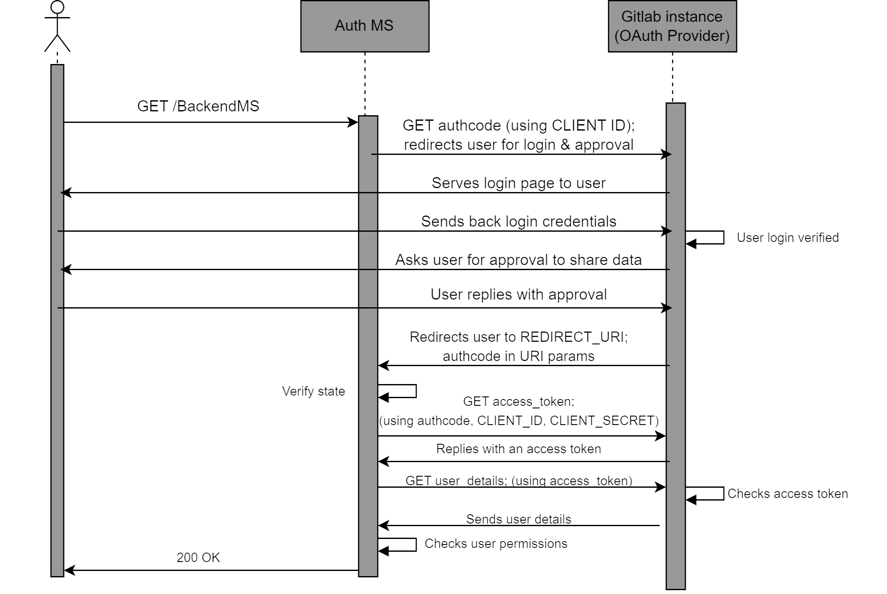

# Auth Microservice

This document details the workflow and implementation
of the DTaaS Auth Microservice. Please go through
the [System Design](DESIGN.md) and the summary of
the [OAuth2.0 technology](OAUTH2.0.md) to be able to
understand the content here better.

## Workflow

### User Identity using OAuth2.0

We define some constants that will help with the following discussion:

- CLIENT ID: The OAuth2 Client ID of the Auth MS
- CLIENT SECRET: The OAuth2 Client Secret of Auth MS
- REDIRECT URI: The URI where the user is redirected to after the
  user has approved sharing of information with the client.
- STATE: A random string used as an identifier for the specific "GET
  authcode" request (Figure 3.3)
- AUTHCODE: The one-use-only Authorization code returned by the
  OAuth2 provider (GitLab instance) in response to "GET authcode"
  after user approval.

Additionally, let's say DTaaS uses a dedicated
gitlab instance hosted at the URL
”gitlab.foo.com” (instead of ”gitlab.com”)



A successful OAuth2 workflow (Figure 3.3) has the following steps:

- The user requests a resource, say _GET/BackendMS_
- The Auth MS intercepts this request, and starts the OAuth2 process.
- The Auth MS sends a authorization request to the Gitlab instance.

This is written in shorthand as _GET/authcode_. The
actual request (a user redirect) looks like:

```json
https://gitlab.foo.com/oauth/
authorize ?
response_type = code &
client_id = CLIENT_ID &
redirect_uri = REDIRECT_URI &
scope = read_user & state = STATE
```

Here the gitlab.foo.com/oauth/authorize
is the specific
endpoint of the Gitlab instance that handles
authorisation code requests.

The query parameters in the request include
the expected response
type, which is fixed as ”code”,
meaning that we expect an Authorization code.
Other query parameters are the client id, the redirect uri,
the scope which is set to read user
for our purpose, and the state (the
random string to identify the specific request).

- The OAuth2 provider redirects the user to the login page. Here the
  user logs into their protected account with their username/email ID
  and password.

- The OAuth2 provider then asks the user to approve/deny sharing the
  requested information with the Auth MS. The user should approve this
  for successful authentication.

- After approval, the user is redirected by the GitLab instance to the
  REDIRECT URI. This URI has the following form:

```json
REDIRECT_URI ? code = AUTHCODE & state = STATE
```

  The REDIRECT URI is as defined previously, during the OAuth2
  Client initialisation, i.e. the same as the one provided in the ”GET
  authcode” request by the Auth MS.
  The query parameters are provided by the Gitlab instance.
  These include the AUTHCODE which is
  the authoriation code that the Auth MS had requested, and the STATE
  which is the same random string in the ”GET authcode” request.

- The Auth MS retrieves these query parameters. It verifies that the
  STATE is the same as the random string it provided during the "GET
  authcode" request. This confirms that the AUTHCODE it has received
  is in response to the specific request it had made.

- The Auth MS uses this one-use-only AUTHCODE to exchange it for
  a general access token. This access token wouldn’t be one-use-only,
  although it would expire after a specified duration of time. To perform
  this exchange, the Auth MS makes another request to the GitLab instance.
  This request is written in shorthand as _GET/access\_token_ in
  the sequence diagram. The true form of the request is:

```json
POST https://gitlab.foo.com/oauth/token,
parameters = 'client_id=CLIENT_ID&
client_secret=CLIENT_SECRET&
code=AUTHCODE&
grant_type=authorization_code&
redirect_uri=REDIRECT_URI'
```

The request to get a token by exchanging an authorization code,
is actually a POST request (for most OAuth2 providers).
The <http:>https://gitlab.foo.com/oauth/token</http:> API endpoint handles
the token exchange requests. The parameters sent with the
POST request are the client ID, the client secret, the AUTHCODE and the
redirect uri. The grant type parameter is always set to the string
”authorization code”, which conveys that we will be exchanging an
authentication code for an access token.

- The Gitlab instance exchanges a valid AUTHCODE for an Access Token.
  This is sent as a response to the Auth MS. An example response
  is of the following form:

```json
{
" access_token ": " d8aed28aa506f9dd350e54
" ,
" token_type ": " bearer " ,
" expires_in ": 7200 ,
" refresh_token ":"825 f3bffb2544b976633a1
" ,
" created_at ": 1607635748
}
```

  The access token field provides the string that can be used as an access
  token in the headers of requests tryng to access user information.
  The token type field is usually ”bearer”, the expires in field specifies
  the time in seconds for which the access token will be valid, and the

  created at field is the Epoch timestamp at which the token was created.
  The refresh token field has a string that can be used to refresh the
  access token, increasing it’s lifetime. However we do not make use of
  the refresh token field. If an access token expires, the Auth MS simply
  asks for a new one.
  TOKEN is the access token string returned in
  the response.

- The Auth MS has finally obtained an access token that it can use to
  retrieve the user’s information. Note that if the Auth MS already had
  an existing valid access token for information about this user, the steps
  above wouldn’t be necessary, and thus wouldn’t be performed by the
  Auth MS. The steps till now in the sequence diagram are simply to get
  a valid access token for the user information.

- The Auth MS makes a final request to the Gitlab instance, shorthanded
  as _GET user\_details_ in the sequence diagram. The actual request is
  of the form:

```json
GET https://gitlab.foo.com/api/v4/user
- - header " Authorization : Bearer TOKEN "
```

  Here, <http:>https://gitlab.foo.com/api/v4/user</http:> is the API endpoint
  that responds with user information.
  An authorization header is required on the request,
  with a valid access token. The required header
  is added here, and TOKEN is the access token that the Auth MS holds.

- The Gitlab instance verifies the access token, and if it is valid, responds
  with the required user information. This includes username, email ID,
  etc. An example response looks like:

```json
{" id ":8 ," username ":" UserX " ,
" name ":" XX " ," state ":" active " ,
" web_url ":" https://gitlab.foo.com/
UserX " ,
" created_at ":"2023 -12 -03 T10 :47:21.970 Z " ," bio
":"" ,
" location ":"" ,
" public_email ": null ," skype ":"" ,
" linkedin ":"" ," twitter ":"" ,
" organization ":"" ," job_title ":"" ,
" work_information ": null ,
" followers ":0 ," following ":0 ,
" is_followed ": false ," local_time ": null ,
" last_sign_in_at ":"2023 -12 -13 T12 :46:21.223 Z
" ,
" confirmed_at ":"2023 -12 -03 T10 :47:21.542 Z " ,
" last_activity_on ":"2023 -12 -13" ,
" email ":" UserX@localhost " ,
" projects_limit ":100000 ,
....}
```

  The important fields from this response are the ”email”, ”username”
  keys. These keys are unique to a user, and thus provide an identity to
  the user.

- The Auth MS retrieves the values of candidate key fields like ”email”,
  ”username” from the response. Thus, the Auth MS now knows the
  identity of the user.

### Checking User permissions - Authorization

An important feature of the Auth MS is to
implement access policies for
DTaaS resources. We may have requirements
that certain resources and/or
microservices in DTaaS should only be accessible
to certain users.
For example, we may want that /BackendMS/user1
should only be accessible to the user who
has username user1. Another example may be
that we may want /BackendMS/group3 to only
be available to users who have an
email ID in the domain @gmail.com.
The Auth MS should be able to impose these
restrictions and make certain
services selectively available to certain users.
There are two steps to doing
this:

- Firstly, the user’s identity should be
  known and trusted. The Auth MS
  should know the identity of a user and
  believe that the user is who they
  claim to be. This has been achieved
  in the previous section

- Secondly, this identity should be analysed
  against certain rules or against
  a database of allowed users, to determine
  whether this user should be
  allowed to access the requested resource.

The second step requires, for every service,
either a set of rules that define
which users should be allowed access to the service,
or a database of user
identities that are allowed to access the service.
This database and/or set of
rules should use the user identities, in our case
the email ID or username, to
decide whether the user should be allowed or not.
This means that the rules
should be built based on the kind of username/ email
ID the user has, say
maybe using some RegEx. In the case of a database,
the database should
have the user identity as a key. For any service,
we can simply look up if the
key exists in the database or not and allow/deny
the user access based on that.

In the sequence diagram, the Auth MS has a self-request
marked as ”Checks user permissions” after receiving
the user identity from
the Gitlab instance. This is when the Auth MS
compares the identity of the
user to the rules and/or database it has for
the requested service. Based on
this, if the given identity has access to the
requested resource, the Auth MS
responds with a 200 OK. This finally marks a
succcessful authentication, and
the user can now access the requested resource.
Note: Again, the Auth MS and user do
not communicate directly. All
requests/responses of the Auth MS are
with the Traefik gateway, not the User
directly. Infact, the Auth MS is the
external server used by the ForwardAuth
middleware of the specific route, and
communicates with this middleware.
If the authentication is successful,
The gateway forwards the request to the
specific resource when the 200 OK is recieved,
else it drops the request and
returns the error code to the user.

## Implementation

### Traefik-forward-auth

The implementation approach is
setting up and configuring the open source
[thomseddon/traefik-forward-auth](https://github.com/thomseddon/traefik-forward-auth)
for our specific use case.
This would work as our Auth microservice.

The traefik-forward-auth software is available
as a docker.io image. This
works as a docker container. Thus there are
no dependency management
issues. Additionally, it can be added as a
middleware server to traefik routers.
Thus, it needs atleast Traefik to work along
with it properly. It also needs
active services that it will be controlling access to.
Traefik, the traefikforward-auth service and any
services are thus, treated as a stack of docker
containers. The main setup needed for this system
is configuring the compose.yml file.

There are three main steps of configuring the Auth MS properly.

- The traefik-forward-auth service needs to be configured carefully.
  Firstly,
  we set the environment variables for our specific case.
  Since, we are using Gitlab, we use the
  generic-oauth provider configuration.
  Some important variables that are required are
  the OAuth2 Client ID, Client Secret, Scope.
  The API endpoints
  for getting an AUTHCODE, exchanging the code for an access token and
  getting user information are also necessary

  Additionally, it is necessary to create a router
  that handles the REDIRECT URI path.
  This router should have a middleware which is set to
  traefik-forward-auth itself. This is so that after
  approval, when the user is
  taken to REDIRECT URI, this can be handled by
  the gateway and passed
  to the Auth service for token exchange.
  We add the ForwardAuth middleware here,
  which is a necessary part of
  our design as discussed before. We also
  add a load balancer for the service.
  We also need to add a conf file as a volume, for
  selective authorization rules (discussed later).
  This is according to the suggested configuration.
  Thus, we add the following
  to our docker services:

```yaml
traefik−forward−auth:
image: thomseddon/traefik−forward−auth:latest
volumes:
- <filepath>/conf:/conf
environment:
- DEFAULT_PROVIDER = generic - oauth
- PROVIDERS_GENERIC_OAUTH_AUTH_URL=https://gitlab.foo.com/oauth/authorize
- PROVIDERS_GENERIC_OAUTH_TOKEN_URL=https://gitlab.foo.com/oauth/token
- PROVIDERS_GENERIC_OAUTH_USER_URL=https://gitlab.foo.com/api/v4/user
- PROVIDERS_GENERIC_OAUTH_CLIENT_ID=CLIENT_ID
- PROVIDERS_GENERIC_OAUTH_CLIENT_SECRET=CLIENT_SECRET
- PROVIDERS_GENERIC_OAUTH_SCOPE = read_user
- SECRET = a - random - string
# INSECURE_COOKIE is required if
# not using a https entrypoint
- INSECURE_COOKIE = true
labels:
- "traefik.enable=true"
- "traefik.http.routers.redirect.entryPoints=web"
- "traefik.http.routers.redirect.rule=PathPrefix(/_oauth)"
- "traefik.http.routers.redirect.middlewares=traefik-forward-auth"
- "traefik.http.middlewares.traefik-forward-auth.forwardauth.address=http://traefik-forward-auth:4181"
- "traefik.http.middlewares.traefik-forward-auth.forwardauth.authResponseHeaders=X-Forwarded-User"
- "traefik.http.services.traefik-forward-auth.loadbalancer.server.port=4181"
```

- The traefik-forward-auth service should be
  added to the backend services
  as a middleware.

  To do this, the docker-compose configurations
  of the services need to be updated
  by adding the following lines:

```yaml
    - "traefik.http.routers.<service-router>.rule=Path(/<path>)"
    - "traefik.http.routers.<service-router>.middlewares=traefik-forward-auth"
```

  This creates a router that maps to the required route,
  and adds the auth middleware to
  the required route.

- Finally, we need to set user permissions on
  user identities by creating rules in the conf file.
  Each rule has a name (an identifier for the rule),
  and an associated
  route for which the rule will be invoked.
  The rule also has an action property,
  which can be either ”auth” or ”allow”.
  If action is set to ”allow”, any requests
  on this route are allowed to bypass even
  the OAuth2 identification. If the
  action is set to ”auth”, requests on this
  route will require User identity
  OAuth2 and the system will follow the sequence diagram.
  For rules with action=”auth”, the user information
  is retrieved. The
  identity we use for a user is the user’s email ID.
  For ”auth” rules, we can
  configure two types of User
  restrictions/permissions on this identity:

- Whitelist - This would be a list of user
  identities (email IDs in our case)
  that are allowed to access the
  corresponding route.
- Domain - This would be a domain
  (example: gmail.com), and only
  email IDs (user identities) of that
  domain (example: johndoe@gmail.com)
  would be allowed access to the corresponding route.

Configuring any of these two properties of
an ”auth” rule allows us to
selectively permit access to certain users
for certain resources.
Not configuring any of these properties for an ”auth” rule means
that the OAuth2 process is carried out
and the user identity is retrieved, but all
known user identities (i.e. all users
that successfully complete the OAuth) are
allowed to access the resource.

DTaaS currently uses only the whitelist type of rules.

These rules can be used in 3 different ways
described below. The exact format of
lines to be added to the conf file are also shown.

- No Auth - Serves the Path(‘/public‘) route.
  A rule with action=”allow”
  should be imposed on this.

```ini
rule.noauth.action=allow
rule.noauth.rule=Path(`/public`)

```

- User specific: Serves the Path(‘/user1‘) route.
  A rule that only allows ”user1@localhost”
  identity should be imposed on this

```ini
rule.onlyu1.action=auth
rule.onlyu1.rule=Path(`/user1`)
rule.onlyu1.whitelist=user1@localhost
```

- Common Auth - Serves the Path(‘/common‘) route.
  A rule that requires
  OAuth, i.e. with action=”allow”, but allows
  all valid and known user
  identities should be imposed on this.

```ini
rule.all.action = auth
rule.all.rule = Path(`/common`)
```