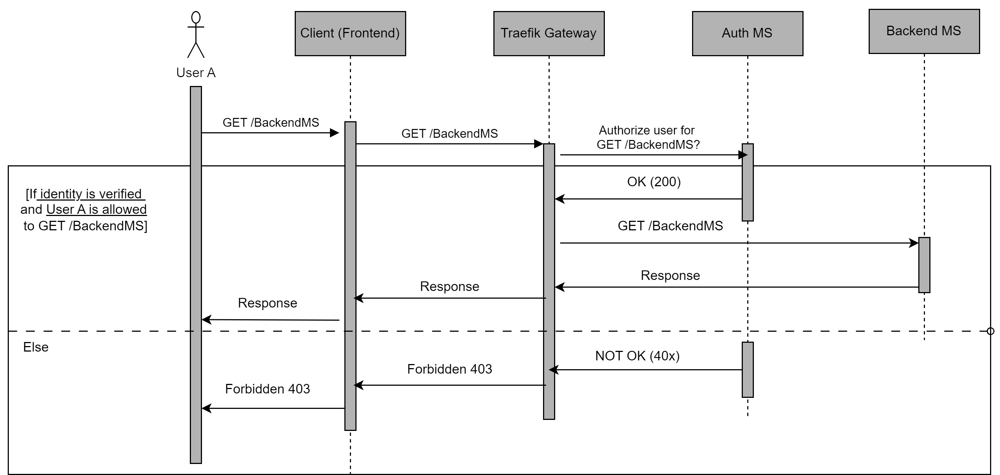

# System Design of DTaaS Authorization Microservice

DTaaS requires backend authorization to protect its
backend services and user workspaces. This document
details the system design of the
DTaaS Auth Microservice which
is responsible for the same. 

## Requirements

For our purpose, we require the Auth MS to be able to handle only
requests of the general form ”Is User X allowed to access /BackendMS/example?”.

If the user’s identity is correctly verified though the GitLab OAuth2
provider AND this user is allowed to access the requested microservice/action, then the Auth MS should respond with a 200 (OK) code and let the
request pass through the gateway to the required microservice/server.

If the
user’s identity verification through GitLab OAuth2 fails OR this user is not
permitted to access the request resource, then the Auth MS should respond
with a 40X (NOT OK) code, and restrict the request from going forward.

## Forward Auth Middleware in Traefik

Traefik
allows middlewares to be set for the routes configured into it. These middlewares intercept the route path requests, and perform analysis/modifications
before sending the requests ahead to the services. Traefik has a ForwardAuth
middleware that delegates authentication to an external service. If the external authentication server responds to the middleware with a 2XX response
codes, the middleware acts as a proxy, letting the request pass through to
the desired service. However, if the external server responds with any other
response code, the request is dropped, and the response code returned by the
external auth server is returned to the user

Thus, an Auth Microservice can be integrated into the existing gateway
and DTaaS system structure easily by adding it as the external authentication
server for ForwardAuth middlewares. These middlewares can be added on
whichever routes/requests require authentication. For our specific purpose,
this will be added to all routes since we impose atleast identity verification
of users for any request through the gateway

## Auth MS Design

The integrated Auth MS should thus work as described in the sequence
diagram.

- Any request made by the user is made on the React website, i.e. the
frontend of the DTaaS software.

- This request then goes through the Traefik gateway. Here it should be
interrupted by the respective ForwardAuth middleware.

- The middleware asks the Auth MS if this request for the given user
should be allowed.

- The Auth MS, i.e. the Auth server verifies the identity of the user
using OAuth2 with GitLab, and checks if this user should be allowed
to make this request.

- If the user is verified and allowed to make the request, the Auth server
responds with a 200 OK to Traefik Gateway (more specifically to the
middleware in Traefik)

- Traefik then forwards this request to the respective service. A response
by the service, if any, will be passed through the chain back to the user.

- However, If the user is not verified or not allowed to make this request,
the Auth server responds with a 40x to Traefik gateway.

- Traefik will then drop the request and respond to the Client informing
that the request was forbidden. It will also pass the Auth servers
response code
