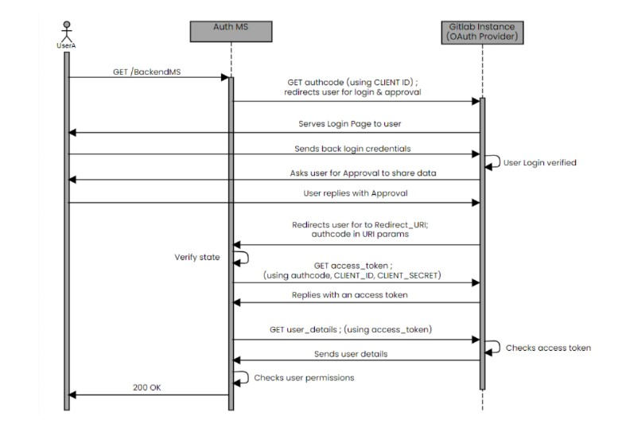

# OAuth 2.0 Summary

The Auth MS works on the OAuth 2.0 RFC. This document provides a brief summary of the working of the OAtuh 2.0 technology.

## Entities

OAuth2, as used for user identity verification,
has 3 main entities:

- The User: This is the entity whose identity we are trying to verify/know. In our case, this is the same as the user of the DTaaS software.
- The Client: This is the entity that wishes to know/verify the identity
of a user. In our case, this is the Auth MS (initialised with a Gitlab
application). This shouldn’t be confused with the frontend website of
DTaaS (referred to as Client in the previous section).
- The OAuth2 Identity Provider: This is the entity that allows the client
to know the identity of the user. In our case, this is GitLab. Most
commonly, users have an existing, protected account with this entity. The account is registered using a unique key, like an email ID or username and is usually password protected so that only that specific user
can login using that account. After the user has logged in, they will
be asked to approve sharing their profile information with the client.
If they approve, the client will have access to the user’s email id, username, and other profile information. This information can be used to
know/verify the identity of the user.

Note: In general, it is possible for the Authorization server (which asks
user for approval) and the Resource (User Identity) provider to be 2 different
servers. However, in our case the Gitlab instance itself handles both the
functions, through different API endpoints. The concepts remain the same.
Thus, we only discuss the 3 main entities, the User, the OAuth2 Client and
the Gitlab instance in our discussion.

### The OAuth2 Client

Many sites allow you to initialise
an OAuth2 client. For our purposes, we will use Gitlab itself, by making
an ”application” in Gitlab. However, it is not necessary to initialise a client
using the same website as the identity provider. These are separate things.
Our OAuth2 client is initialized by creating and configuring a Gitlab
instance-wide application. There are two main things in this configuration:

- Redirect URI - It is the URI where the users are redirected to after
they approve sharing information with the client.
- Scopes - These are the types and levels of access that the client can
have over the user’s profile. For our purposes, we only require the
read user scope, which allows us to access the user’s profile information
for knowing the identity.

After the GitLab application is successfully created, we are provided a
Client ID and Client Secret. This means our initialization is complete. This
Client ID and Client Secret can be used in any application, essentially making
that application the OAuth2 Client. This is why the Client secret should
never be shared. We will use this Client ID and Client secret in our Auth
MS, making it an OAuth2 Client application. It will now be able to follow
the OAuth2 workflow to verify the identity of users.

## OAuth 2.0 Workflow

The OAuth2 workflow is initiated by the Client (Auth MS) whenever it
requires knowing the identity of the user. Briefly, the flow starts when the
Auth MS sends an authorization request to Gitlab. The Auth MS tries to
obtain an access token, using which it can gather user information. Once it
has user information, it can know the identity of the user and check whether
the user has permission to access the requested resource.

The requests made by the Auth MS to the OAuth2 provider
are abbreviated. A detailed explanation of the workflow for
DTaaS specifically can be found in the [AuthMS implementation docs](AUTHMS.md)