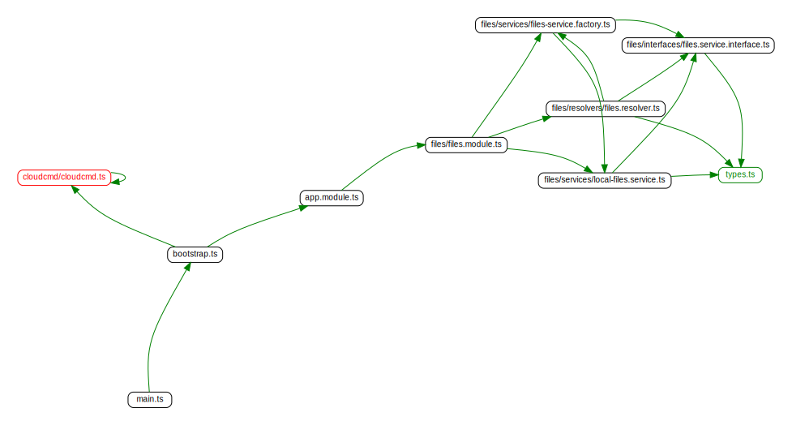
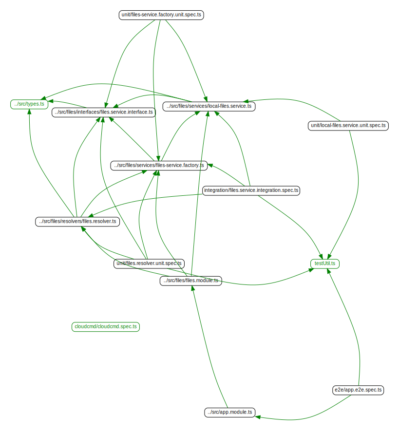

# Library Microservice

[The Library Microservices](https://github.com/INTO-CPS-Association/DTaaS/tree/feature/distributed-demo/servers/lib#readme)
provides users with access to files in user workspaces via API.
This microservice will interface with local file system and Gitlab
to provide uniform Gitlab-compliant API access to files.

!!! warning
    This microservice is still under heavy development. It is still not
    a good replacement for file server we are using now.

## Architecture and Design

The C4 level 2 diagram of this microservice is:

The GraphQL API provided by the library microservice shall be compliant
with the Gitlab GraphQL service.

## UML Diagrams

### Class Diagram

### Sequence Diagram

## Dependency Graphs

The figures are the dependency graphs generated from the code.

### src directory

### test directory

