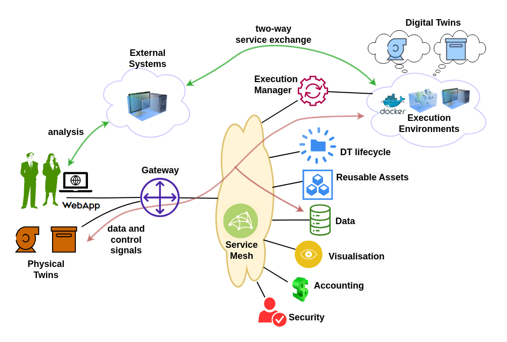

# :european_castle: System Overview

## User Requirements

The DTaaS software platform users expect a single platform
to support the complete DT lifecycle. To be more precise,
the platform users expect the following features:

1. **Author** – create different assets of the DT on the
   platform itself. This step requires use of some software
   frameworks and tools whose sole purpose is to author
   DT assets.
1. **Consolidate** – consolidate the list of available DT assets
   and authoring tools so that user can navigate the library
   of reusable assets. This functionality requires support
   for discovery of available assets.
1. **Configure** – support selection and configuration of
   DTs. This functionality also requires support for validation
   of a given configuration.
1. **Execute** – provision computing infrastructure on demand to
   support execution of a DT.
1. **Explore** – interact with a DT and explore the results
   stored both inside and outside the platform. Exploration
   may lead to analytical insights.
1. **Save** – save the state of a DT that’s already in the
   execution phase. This functionality is required for on
   demand saving and re-spawning of DTs.
1. **Services** – integrate DTs with on-platform or external
   services with which users can interact with.
1. **Share** – share a DT with other users of their organisation.

## System Architecture

The figure shows the system architecture of the the DTaaS software platform.

### System Components

The users interact with the software platform using a webapp.
The service router is a single point of entry for direct access to the platform
services. The service router is responsible for controlling user access to
the microservice components. The service mesh
enables discovery of microservices, load balancing and authorization
functionalities.

In addition, there are microservices for catering to managing
DT reusable assets, platform services, DT lifecycle manager,
DT execution manager, accouting and security.
The microservices are complementary and composable; they fulfil
core requirements of the system.

The microservices responsible for satisfying the user requirements are:

1. **The security microservice** implements
   role-based access control (RBAC) in the platform.
1. **The accounting microservice** is responsible for keeping track of the
   live status of platform, DT asset and infrastructure usage. Any licensing,
   usage restrictions need to be enforced by the accounting
   microservice. Accounting is a pre-requisite to commercialisation of
   the platform.
   Due to significant use of external
   infrastructure and resources via the platform, the accounting
   microservice needs to interface with accounting systems of
   the external services.
1. **User Workspaces** are virtual environments in which users can perform
   lifecycle operations on DTs. These virtual environments are either docker
   containers or virtual machines which provide desktop interface to users.
1. **Reusable Assets** are assets / parts from which DTs are created.
   Further explation is available on
   the [assets page](../../user/servers/lib/assets.md)
1. **Services** are dedicated services available to all the DTs and
   users of the DTaaS platform. Services build upon DTs and
   provide user interfaces to users.
1. **DT Execution Manager** provides virtual and isolated execution
   environments for DTs. The execution manager is also responsible
   for dynamic resource provisioning of cloud resources.
1. **DT Lifecycle Manager** manages the lifecycle operations on all DTs.
   It also directs _DT Execution Manager_ to perform execute, save and
   terminate operations on DTs.

If you are interested, please take a look at
the [C4 architectural diagram](C4-L2_diagram.png).

A mapping of the architectural components to the implementation
components is available in the table.

| System Component  | Doc Page(s)                                                                                                                             |
| :---------------- | :--------------------------------------------------------------------------------------------------------------------------------------- |
| Service Router           | [Traefik Gateway](https://doc.traefik.io/traefik/) |
| Web Application | [React Webapplication](https://github.com/INTO-CPS-Association/DTaaS/blob/feature/distributed-demo/client/README.md)                       |
| Reusable Assets   | [Library Microservice](https://github.com/INTO-CPS-Association/DTaaS/blob/feature/distributed-demo/servers/lib/README.md)                |
| Digital Twins and DevOps   | [Integrated Gitlab](../../admin/gitlab/index.md)                                                                                |
| Services              | [Third-party Services](./../../admin/services.md) (MQTT, InfluxDB, RabbitMQ, Grafana and MongoDB)                                    |
| DT Lifecycle      | Not available yet                                                                                                                        |
| Security          | Gitlab [client OAuth](../../admin/client/auth.md) and [server OAuth](../../admin/servers/auth.md)                                        |
| Digital Twins as Services | [DT Runner](https://github.com/INTO-CPS-Association/DTaaS/blob/feature/distributed-demo/servers/execution/runner/README.md)      |
| Accounting        | Not available yet                                                                                                                        |
| Execution Manager | Not available yet                                                                                                                        |

## References

Font sources: [fileformat](https://www.fileformat.info)
