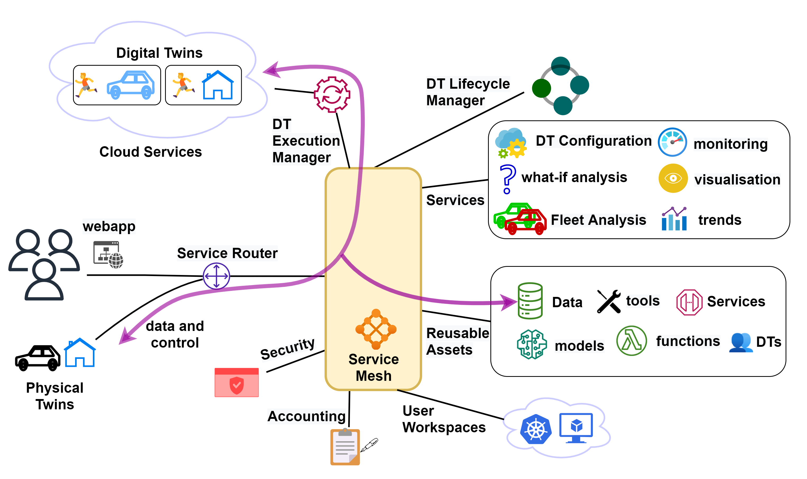

# :european_castle: System Overview

## User Requirements

The DTaaS software platform users expect a single platform
to support the complete DT lifecycle. To be more precise,
the platform users expect the following features:

1. **Author** – create different assets of the DT on the
   platform itself. This step requires use of some software
   frameworks and tools whose sole purpose is to author
   DT assets.
1. **Consolidate** – consolidate the list of available DT assets
   and authoring tools so that user can navigate the library
   of reusable assets. This functionality requires support
   for discovery of available assets.
1. **Configure** – support selection and configuration of
   DTs. This functionality also requires support for validation
   of a given configuration.
1. **Execute** – provision computing infrastructure on demand to
   support execution of a DT.
1. **Explore** – interact with a DT and explore the results
   stored both inside and outside the platform. Exploration
   may lead to analytical insights.
1. **Save** – save the state of a DT that’s already in the
   execution phase. This functionality is required for on
   demand saving and re-spawning of DTs.
1. **What-if analysis** – explore alternative scenarios to (i)
   plan for an optimal next step, (ii) recalibrate new DT
   assets, (iii) automated creation of new DTs or their
   assets; these newly created DT assets may be used to
   perform scientifically valid experiments.
1. **Share** – share a DT with other users of their organisation.

## System Architecture

The figure shows the system architecture of the the DTaaS software platform.

### System Components

The users interact with the software platform using a website.
The gateway is a single point of entry for direct access to the platform
services. The gateway is responsible for controlling user access to
the microservice components. The service mesh
enables discovery of microservices, load balancing and authorization
functionalities.

In addition, there are microservices for catering to author, store,
explore, configure, execute and scenario analysis requirements.
The microservices are complementary and composable; they fulfil
core requirements of the system.

The microservices responsible for satisfying the user requirements are:

1. **The security microservice** implements
   role-based access control (RBAC) in the platform.
1. **The accounting microservice** is responsible for keeping track of the
   platform, DT asset and infrastructure usage. Any licensing,
   usage restrictions need to be enforced by the accounting
   microservice. Accounting is a pre-requisite to commercialisation of
   the platform.
   Due to significant use of external
   infrastructure and resources via the platform, the accounting
   microservice needs to interface with accounting systems of
   the external services.

1. **The data microservice** is a frontend to all the databases
   integrated into the platform. A time-series database and a
   graph database are essential. These two databases store timeseries
   data from PT, events on PT/DT, commands sent by
   DT to PT. The PTs uses these databases even when their
   respective DTs are not in the execute phase.
1. **The visualisation microservice** is again a frontend to
   visualisation software that are natively supported inside the platform.
   Any visualisation software running either on external
   systems or on client browsers do not need to interact with
   this microservice. They can directly use the data provided by
   the data microservice.

## C4 Architectural Diagrams

The C4 architectural diagrams of the DTaaS software are presented here.

### Level 1

This Level 1 diagram only shows the users and the roles
they play in the DTaaS software.

### Level 2

This simplified version of Level 2 diagram shows
the software containers of the DTaaS software.

If you are interested, please take a look at
the [detailed diagram](C4-L2_diagram_detailed.png).

Please note that the given diagram only
covers DT Lifecycle, Reusable Assets and Execution Manager.

## Mapping

A mapping of the C4 level 2 containers to components
identified in the system architecture is also available in the table.

| System Component  | Container(s)                                                                                                                             |
| :---------------- | :--------------------------------------------------------------------------------------------------------------------------------------- |
| Gateway           | [Traefik Gateway](https://github.com/INTO-CPS-Association/DTaaS/tree/feature/distributed-demo/servers/config/gateway#the-gateway-server) |
| Unified Interface | [React Webapplication](../client/client.md)                                                                                              |
| Reusable Assets   | [Library Microservice](../servers/lib/lib-ms.md)                                                                                         |
| Data              | MQTT, InfluxDB, RabbitMQ, Grafana and MongoDB (not shown in the C4 Level 2 diagram)                                                      |
| Visualization     | InfluxDB (not shown in the C4 Level 2 diagram)                                                                                           |
| DT Lifecycle      | DT Lifecycle Manager and DT Configuration Validator                                                                                      |
| Security          | [Gitlab OAuth](../../admin/client/auth.md)                                                                                               |
| Accounting        | None                                                                                                                                     |
| Execution Manager | Execution Manager                                                                                                                        |
