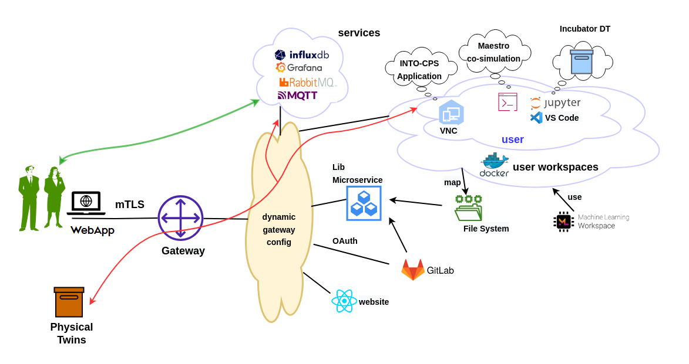

# :clipboard: Current Status

The DTaaS software platform is currently under development.
Crucial system components are in place with ongoing development work
focusing on increased automation and feature enhancement.
The figure below shows the current status of the development work.

## :lock: User Security

There is authentication mechanisms in place for the react website
and the Traefik gateway.

The react website component uses Gitlab for user authentication using
OAuth protocol.

### Gateway Authentication

The Traefik gateway has HTTP basic authentication enabled by default. This
authentication on top of HTTPS connection can provide a good protection
against unauthorized use.

!!! warning
    Please note that HTTP basic authentication over insecure non-TLS
    is insecure.

There is also a possibility of using self-signed mTLS certificates.
The current security functionality is based on signed
Transport Layer Security (TLS)
certificates issued to users. The TLS certificate based mutual TLS (mTLS)
authentication protocol provides better security than the usual
username and password combination. The mTLS authentication takes place between
the users browser and the platform gateway. The gateway federates all
the backend services. The service discovery, load balancing, and health checks
are carried by the gateway based on a dynamic reconfiguration mechanism.

!!! note
    The mTLS is not enabled in the default install.
    Please use the scripts in `ssl/` directory to generate
    the required certificates for users and Traefik gateway.

## :technologist: User Workspaces

All users have dedicated dockerized-workspaces. These docker-images are based on
container images published by
[mltooling group](https://github.com/ml-tooling/ml-workspace).

Thus DT experts can develop DTs from existing DT components and
share them with other users. A file server has been setup to act as
a DT asset repository. Each user gets space to store private DT assets and
also gets access to shared DT assets. Users can synchronize their
private DT assets with external git repositories. In addition,
the asset repository transparently gets mapped to user workspaces
within which users can perform DT lifecycle operations.
There is also a [library microservice](../servers/lib/lib-ms.md) which
in the long-run will replace the file server.

Users can run DTs in their workspaces and also permit remote access
to other users. There is already shared access to internal and
external services.
With these two provisions, users can treat live DTs as service components
in their own software systems.

## :electric_plug: Platform Services

There are four external services integrated with the DTaaS software platform.
They are:
[InfluxDB](https://github.com/influxdata/influxdb),
[Grafana](https://github.com/grafana/grafana),
[RabbitMQ](https://github.com/rabbitmq/rabbitmq-server)
and
[MQTT](https://mqtt.org/).

These services can be used by DTs and PTs for communication, storing and
visualization of data. There can also be monitoring services setup
based on these services.

## Development Priorities

The development priorities for the DTaaS software development team are:

* [DT Runner](https://github.com/INTO-CPS-Association/DTaaS/tree/feature/distributed-demo/servers/execution/runner)
  (API Interface to DT)
* Multi-user and microservice security
* Increased automation of installation procedures
* DT Configuration DSL ín the form of YAML schema
* UI for DT creation
* DT examples

Your contributions and collaboration are highly welcome.
