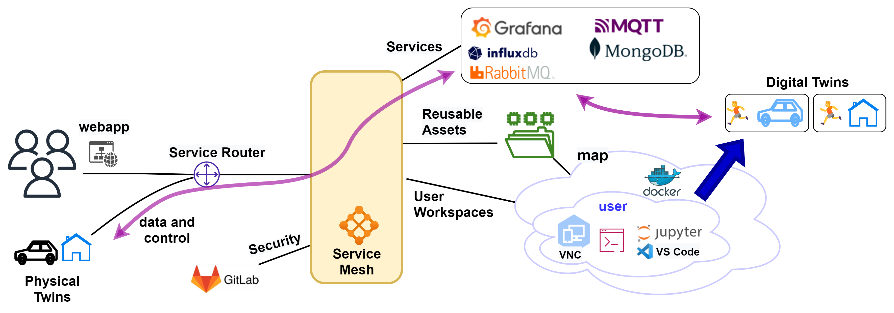

# :clipboard: Current Status

The DTaaS software platform is currently under development.
Crucial system components are in place with ongoing development work
focusing on increased automation and feature enhancement.
The figure below shows the current status of the development work.

A C4 representation of the same diagram is also [available](current-status-developer-2.png).

## :lock: User Security

There is a two-level authorization mechanisms in place for the react website
and the Traefik gateway.

The react website component uses Gitlab for user authorization using
OAuth protocol.

### Gateway Authorization

The Traefik gateway has OAuth2 web server authorization provided by
[Traefik-forward-auth](https://github.com/thomseddon/traefik-forward-auth)
microservice. This authorization protects all the microservices
and workspaces running in the backend.

## :technologist: User Workspaces

All users have dedicated dockerized-workspaces. These docker-images are based on
container images published by
[mltooling group](https://github.com/ml-tooling/ml-workspace).

Thus DT experts can develop DTs from existing DT components and
share them with other users. A file server has been setup to act as
a DT asset repository. Each user gets space to store private DT assets and
also gets access to shared DT assets. Users can synchronize their
private DT assets with external git repositories. In addition,
the asset repository transparently gets mapped to user workspaces
within which users can perform DT lifecycle operations.
There is also a [library microservice](../servers/lib/lib-ms.md) which
in the long-run will replace the file server.

Users can run DTs in their workspaces and also permit remote access
to other users. There is already shared access to internal and
external services.
With these two provisions, users can treat live DTs as service components
in their own software systems.

## :electric_plug: Platform Services

There are four external services integrated with the DTaaS software platform.
They are:
[InfluxDB](https://github.com/influxdata/influxdb),
[Grafana](https://github.com/grafana/grafana),
[RabbitMQ](https://github.com/rabbitmq/rabbitmq-server),
[MQTT](https://github.com/eclipse/mosquitto),
and
[MongoDB](https://github.com/mongodb/mongo).

These services can be used by DTs and PTs for communication, storing and
visualization of data. There can also be monitoring services setup
based on these services.

## Development Priorities

The development priorities for the DTaaS software development team are:

* DevOps from React frontend website
* Upgrade software stack of user workspaces
* Increased automation of installation procedures
* [DT Runner](https://github.com/INTO-CPS-Association/DTaaS/tree/feature/distributed-demo/servers/execution/runner)
  (API Interface to DT)
* DT Configuration DSL ín the form of YAML schema

Your contributions are highly welcome.

## References

Font sources: [fileformat](https://www.fileformat.info)
