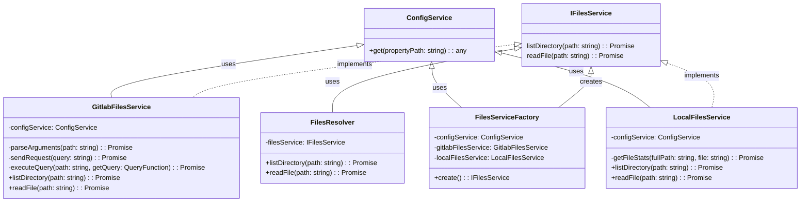

# Library Microservice

[The Library Microservices](https://github.com/INTO-CPS-Association/DTaaS/tree/feature/distributed-demo/servers/lib#readme) - fulfil the core requirements of the system. The microservices are complementary and composable. 

The service mesh enables discovery of microservices, load balancing and authentication functionalities. There are microservices for catering to author, store, explore, configure, execute and scenario analysis requirements.

## Lib-MS Architecture

### Class Architecture

### Sequence Architecture

