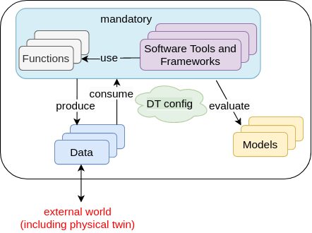

# Create a Digital Twin

The first step in digital twin creation is to use the available
assets in your workspace. If you have assets / files
in your computer that need to be available in the DTaaS workspace,
then please follow the instructions provided in
[library assets](../servers/lib/assets.md).

There are dependencies among the library assets. These dependencies are shown below.



A digital twin can only be created by linking the assets
in a meaningful way. This relationship can be expressed using a mathematical equation:

$$
D_t: \{ D{^*},M^{*},(FT)^{+} \}C_{dt}
$$

where D denotes data, M denotes models, F denotes functions,
T denotes tools, $C_{dt}$ denotes DT configuration and $D_t$
is a symbolic notation for a digital twin itself. The
$\{ D{^*},M^{*},(FT)^{+} \}C_{dt}$ expression denotes
composition of DT from D,M,T and F assets. The $*$
indicates zero or one more instances of an asset and
$+$ indicates one or more instances of an asset.

The DT configuration specifies the relevant assets to use,
the potential parameters to be set for these assets.
If a DT needs to use RabbitMQ, InfluxDB like services
supported by the platform, the DT configuration needs
to have access credentials for these services.

This kind of generic DT definition is based on the DT
examples seen in the wild. You are at liberty to deviate
from this definition of DT. The only requirement is the
ability to run the DT from either commandline or desktop.

!!! tip
    If you are stepping into the world of Digital Twins,
    you might not have distinct digital twin assets.
    You are likely to have one directory of everything
    in which you run your digital twin.
    In such a case we recommend that you upload this monolithic
    digital twin into **digital twin/your_digital_twin_name** directory.

## Example

The [Examples](https://github.com/INTO-CPS-Association/DTaaS-examples)
repository contains a co-simulation setup for mass spring damper.
The complete details on this example are available on
[github](https://github.com/INTO-CPS-Association/example-mass_spring_damper).

This example illustrates the potential of using co-simulation for digital twins.

The file system contents for this example are:

```text
workspace/
  data/
    mass-spring-damper
        input/
        output/

  digital twins/
    mass-spring-damper/
      cosim.json
      time.json
      lifecycle/
        analyze
        clean
        evolve
        execute
        save
        terminate
      README.md

  functions/
  models/
    MassSpringDamper1.fmu
    MassSpringDamper2.fmu

  tools/

  common/
    data/
    functions/
    models/
    tools/
        maestro-2.3.0-jar-with-dependencies.jar
```

The `workspace/data/mass-spring-damper/` contains
`input` and `output` data for the mass-spring-damper digital twin.

The two FMU models needed for this digital twin are in `models/` directory.

The co-simulation digital twin needs Maestro co-simulation orchestrator.
Since this is a reusable asset for all the co-simulation based DTs, the
tool has been placed in `common/tools/` directory.

The actual digital twin configuration is specified in
`digital twins/mass-spring-damper` directory. The co-simulation
configuration is specified in two json files, namely `cosim.json`
and `time.json`. A small explanation of digital twin for its users
can be placed in `digital twins/mass-spring-damper/README.md`.

The launch program for this digital twin
is in `digital twins/mass-spring-damper/lifecycle/execute`.
This launch program runs the co-simulation digital twin.
The co-simulation runs till completion and then ends.
The programs in `digital twins/mass-spring-damper/lifecycle`
are responsible for lifecycle management of this digital twin.
The [lifecycle page](lifecycle.md) provides more explanation on these programs.

!!! Abstract "Execution of a Digital Twin"
    A frequent question arises on the run time characteristics of a digital twin.
    The natural intuition is to say that a digital twin must operate as long as
    its physical twin is in operation.
    **If a digital twin runs for a finite time and then ends, can it be called a digital twin?**
    **The answer is a resounding YES**.
    The Industry 4.0 usecases seen among SMEs have digital twins
    that run for a finite time.
    These digital twins are often run at the discretion of the user.

**You can run this digital twin by **

1. Go to Workbench tools page of the DTaaS website
   and open VNC Desktop. This opens a new tab in your browser
1. A page with VNC Desktop and a connect button comes up.
   Click on Connect.
   You are now connected to the Linux Desktop of your workspace.
1. Open a Terminal (black rectangular icon in the top left region of your tab)
   and type the following commands.
1. Download the [example files](https://github.com/INTO-CPS-Association/DTaaS-examples/archive/refs/heads/main.zip)

   ```
   $wget https://github.com/INTO-CPS-Association/DTaaS-examples/archive/refs/heads/main.zip
   $unzip main.zip
   ```

1. Open a file browser and copy the files from this uncompressed
   folder into your workspace folder (`/workspace`).
   Make sure that the file placement matches the one given above.
1. Go to the digital twin directory and run

   ```
   $cd /workspace/digital twins/mass-spring-damper
   $lifecycle/execute
   ```

   The last command executes the mass-spring-damper
   digital twin and stores the co-simulation output
   in `data/mass-spring-damper/output`.