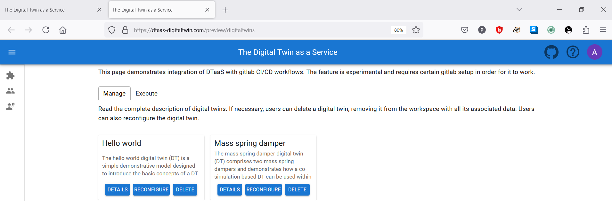
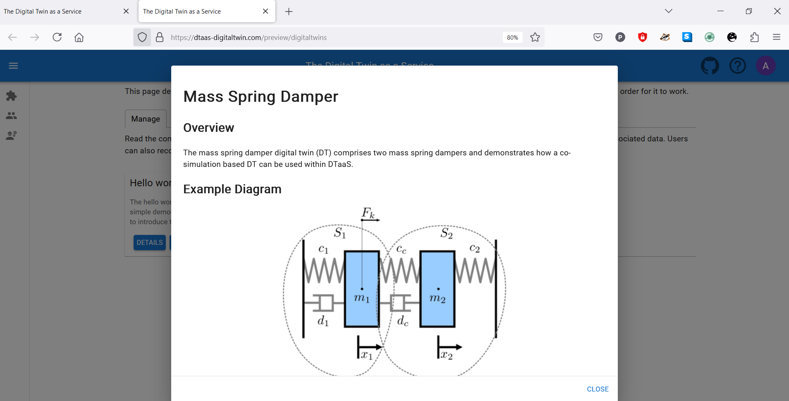
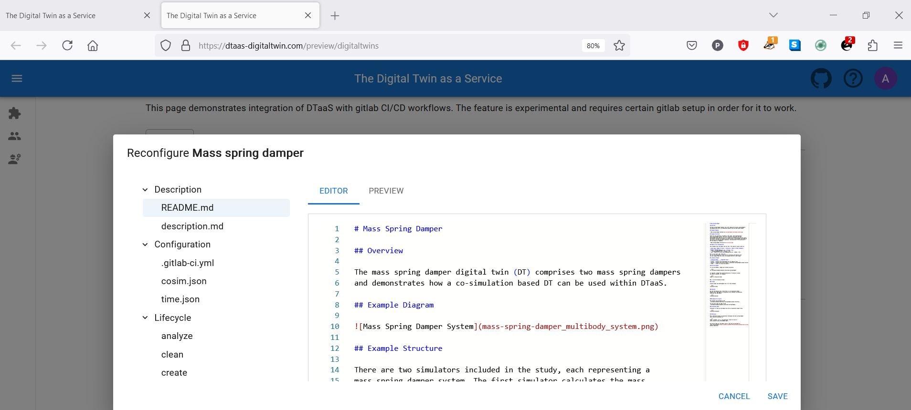
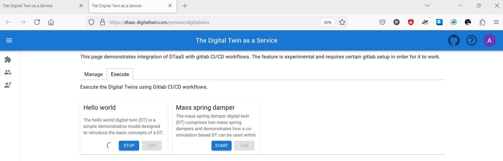
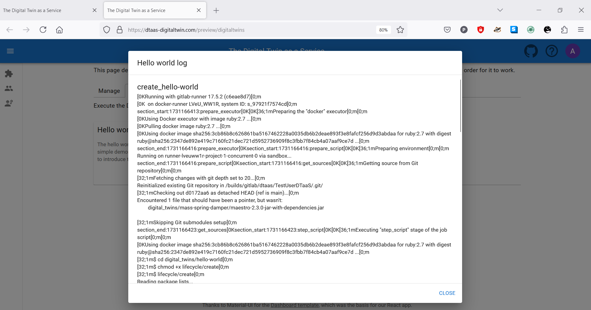

# Digital Twins and DevOps

[DevOps](https://en.wikipedia.org/wiki/DevOps) has been
a well established software development practice.
We are bringing out an experimental feature of integration DevOps
in the DTaaS.

<!-- markdownlint-disable MD046 -->
<!-- prettier-ignore -->
!!! warning
    This feature is under documented. Please expect some instability
    in this release. However, we are working to mature the feature
    and improve the documentation.
<!-- markdownlint-enable MD046 -->

This feature requires specific installation setup.

1. [Integrated gitlab installation](../../../admin/gitlab/integration.md)
1. A valid gitlab repository for the logged in user. Please see
   an [example repository](https://gitlab.com/dtaas/user1). You can clone
   this repository and customize to your needs.
1. [A linked Gitlab Runner](../../../admin/gitlab/runner.md)
   to the user gitlab repository.

## Manage Tab

The manage tab allows for different operations on a digital twin:

* Checking the details (**Details** button)
* Delete (**Delete** button)
* Modify / Reconfigure (**Reconfigure** button)

A digital twin placed in the DTaaS has a certain recommended
structure. Please see the
[assets pag](../../servers/lib/assets.md) for an explanation
and
[this example](https://github.com/INTO-CPS-Association/DTaaS-examples/tree/main/digital_twins/mass-spring-damper).

The information page shown using the Details button, shows
the README.md information stored inside the digital twin directory.

A reconfigure button opens an editor and shows all the files corresponding
to a digital twin. All of these files can be updated. These files
correspond to three categories.

* **Description**
* **Configuration**
* **Lifecycle**

## Execute Tab

The execute tabs shows the possibility of executing multiple digital twins.
Once an execution of digital twin is complete, you can see the execution
log as well.

