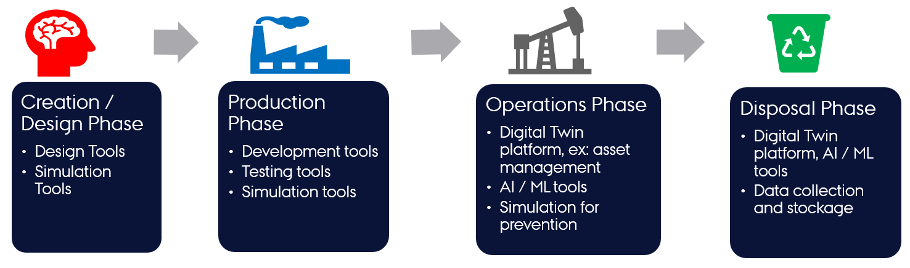

# :recycle: Digital Twin Lifecycle

The physical products in the real world have product lifecycle.
A simplified four-stage product life is illustrated here.

A digital twin tracking the physical products (twins) need
to track and evolve in conjunction with the corresponding
physical twin.

The possible activities undertaken in each lifecycle phases
are illustrated in the figure.



## Lifecycle Phases

The four phase lifecycle has been extended to a lifecycle with
eight phases. The new phase names and the typical activities
undertaken in each phase are outlined in this section.

 A DT lifecycle consists of **explore, create, execute, save, analyse, evolve**
 and **terminate** phases.

| Phase | Main Activities |
|:----|:----|
| **explore** | selection of suitable assets based on the user needs and checking their compatibility for the purposes of creating a DT. |
| **create** | specification of DT configuration. If DT already exists, there is no creation phase at the time of reuse. |
| **execute** | automated / manual execution of a DT based on its configuration. The DT configuration must checked before starting the execution phase. |
| **analyse** | checking the outputs of a DT and making a decision. The outputs can be text files, or visual dashboards. |
| **evolve** | reconfigure DT primarily based on analysis. |
| **save** | involves saving the state of DT to enable future recovery. |
| **terminate** | stop the execution of DT. |

A digital twin faithfully tracking the physical twin lifecycle will have to
support all the phases. It is also possible for digital twin engineers to add
more phases to digital they are developing. Thus it is important for
the DTaaS software platform needs to accommodate needs of different DTs.

A potential linear representation of the tasks undertaken in
a digital twin lifecycle are shown here.


Again this is only a one possible pathway. Users are at liberty to
alter the sequence of steps.

It is possible to map the lifecycle phases identified so far with
the <font color="orange"> **Build-Use-Share**</font> approach
of the DTaaS software platform.


Even though not mandatory, having a matching coding structure makes it easy to
for users to create and manage their DTs within the DTaaS.
It is recommended to have the following structure:

```text
workspace/
  digital_twins/
    digital-twin-1/
      lifecycle/
        analyze
        clean
        evolve
        execute
        save
        terminate
```

A dedicated program exists for each phase of DT lifecycle. Each program
can be as simple as a script that launches other programs or sends messages
to a live digital twin.

## Examples

Here are the example programs / scripts to manage three phases in
the lifecycle of **mass-spring-damper DT**.

```bash title="lifecycle/execute"
#!/bin/bash
mkdir -p /workspace/data/mass-spring-damper/output
#cd ..
java -jar /workspace/common/tools/maestro-2.3.0-jar-with-dependencies.jar \
    import -output /workspace/data/mass-spring-damper/output \
    --dump-intermediate sg1 cosim.json time.json -i -vi FMI2 \
    output-dir>debug.log 2>&1
```

The execute phases uses the DT configuration, FMU models and Maestro tool
to execute the digital twin. The script also stores the output of
cosimulation in `/workspace/data/mass-spring-damper/output`.

It is possible for a DT not to support a specific lifecycle phase.
This intention can be specified with an empty script and a helpful message
if deemed necessary.

```bash title="lifecycle/analyze"
#!/bin/bash
printf "operation is not supported on this digital twin"
```

The lifecycle programs can call other programs in the code base.
In the case of `lifecycle/terminate` program, it is calling another
script to do the necessary job.

```bash title="lifecycle/terminate"
#!/bin/bash
lifecycle/clean
```
