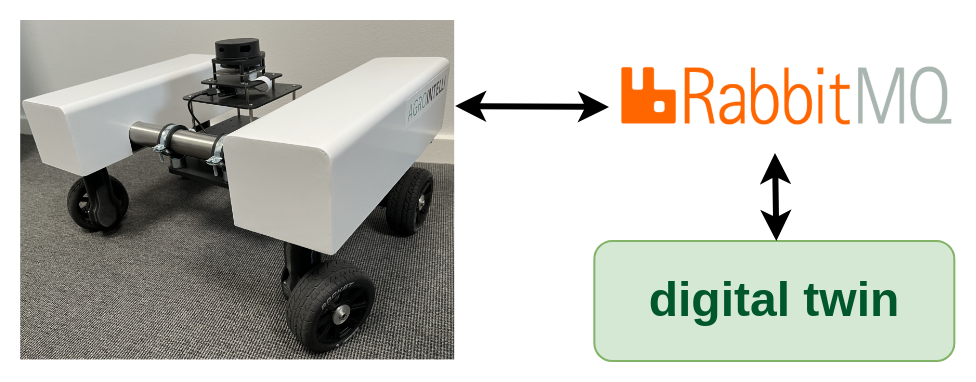
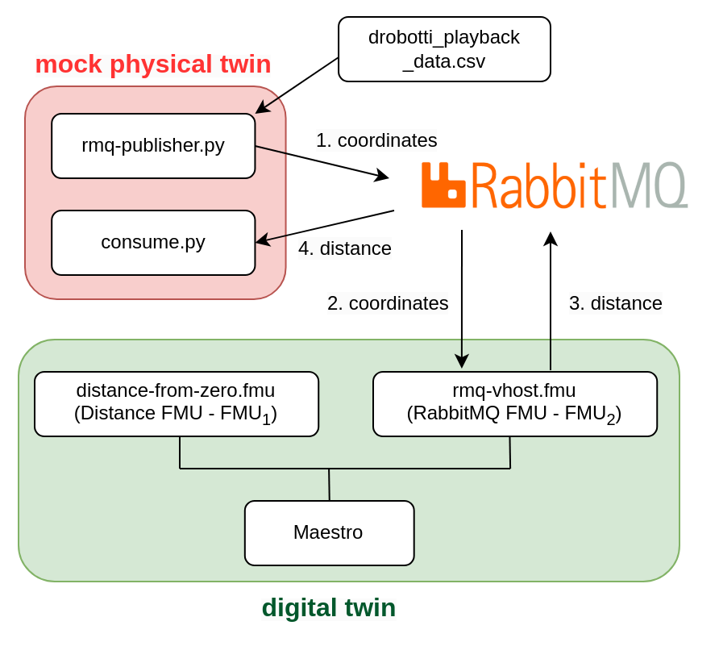

# Desktop Robotti with RabbitMQ

## Overview

This example demonstrates bidirectional communication between
a mock physical twin and a digital twin of a mobile robot (Desktop Robotti).
The communication is enabled by RabbitMQ Broker.



## Example Structure

The mock physical twin of mobile robot is created using two python scripts

1. data/drobotti_rmqfmu/rmq-publisher.py
1. data/drobotti_rmqfmu/consume.py

The mock physical twin sends its physical location in _(x,y)_ coordinates and
expects a cartesian distance $\sqrt(x^2 + y^2)$ calculated from digital twin.



The _rmq-publisher.py_ reads the recorded _(x,y)_ physical coordinates of
mobile robot. The recorded values are stored in a data file.
These _(x,y)_ values are published to RabbitMQ Broker. The published
_(x,y)_ values are consumed by the digital twin.

The _consume.py_ subscribes to RabbitMQ Broker and waits for the calculated
distance value from the digital twin.

The digital twin consists of a FMI-based co-simulation, where Maestro is used
as co-orchestration engine.
In this case, the co-simulation is created by using two FMUs -
RMQ FMU (rabbitmq-vhost.fmu) and distance FMU (distance-from-zero.fmu).
The RMQ FMU receives the _(x,y)_ coordinates from _rmq-publisher.py_ and
sends calculated distance value to _consume.py_. The RMQ FMU uses
RabbitMQ broker for communication with the mock mobile robot, i.e.,
_rmq-publisher.py_ and _consume.py_.
The distance FMU is responsible for calculating the distance between
_(0,0)_ and _(x,y)_. The RMQ FMU and distance FMU exchange values
during co-simulation.

## Digital Twin Configuration

This example uses two models, one tool, one data, and two scripts to create
mock physical twin. The specific assets used are:

| Asset Type | Names of Assets | Visibility | Reuse in Other Examples |
|:---|:---|:---|:---|
| Models | distance-from-zero.fmu | Private | No |
|  | rmq-vhost.fmu | Private | Yes |
| Tool | maestro-2.3.0-jar-with-dependencies.jar | Common | Yes |
| Data | drobotti_playback_data.csv | private | No |
| Mock PT | rmq-publisher.py | Private | No |
|  | consume.py | Private | No |

This DT has many configuration files.
The `coe.json` and `multimodel.json`
are two DT configuration files used for executing the digital twin.
You can change these two files to customize the DT to your needs.

The RabbitMQ access credentials need to be provided in `multimodel.json`.
The `rabbitMQ-credentials.json` provides RabbitMQ access credentials
for mock PT python scripts. Please add your credentials in both these files.

## Lifecycle Phases

| Lifecycle Phase    | Completed Tasks |
| -------- | ------- |
| Create  | Installs Java Development Kit for Maestro tool and pip packages for python scripts |
| Execute | Runs both DT and mock PT |
| Clean   | Clears run logs and outputs |

## Run the example

To run the example, change your present directory.

```bash
cd /workspace/examples/digital_twins/drobotti_rmqfmu
```

If required, change the execute permission of lifecycle scripts
you need to execute, for example:

```bash
chmod +x lifecycle/create
```

Now, run the following scripts:

### Create

Installs Open Java Development Kit 17 in the workspace. Also install
the required python pip packages for _rmq-publisher.py_ and
_consume.py_ scripts.

```bash
lifecycle/create
```

### Execute

Run the python scripts to start mock physical twin.
Also run the the Digital Twin. Since this is a co-simulation based
digital twin, the Maestro co-simulation tool executes co-simulation
using the two FMU models.

```bash
lifecycle/execute
```

#### Examine the results

The results can be found in the
_/workspace/examples/digital\_twins/drobotti\_rmqfmu directory_.

### Terminate phase

Terminate to clean up the debug files and co-simulation output files.

```bash
lifecycle/terminate
```

## References

The [RabbitMQ FMU](https://github.com/INTO-CPS-Association/fmu-rabbitmq)
github repository contains complete documentation and source code of
the rmq-vhost.fmu.

More information about the case study is available in:

```txt
Frasheri, Mirgita, et al. "Addressing time discrepancy between digital
and physical twins." Robotics and Autonomous Systems 161 (2023): 104347.
```
