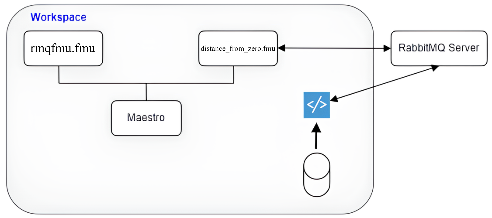

# Desktop Robotti DT

## Overview

This example demonstrates feeding data to the DT using the rabbitMQ FMU (RMQFMU).

The rabbitMQ FMU uses a rabbitmq server to feed live or log data
into a simulation, as well as send data to an external entity
(e.g. Gazebo simulation).

Two types of data are considered, content data, and system health data.
The rabbitMQ steps once it has valid content data.
In case any of its inputs changes between two consecutive timesteps,
the fmu will send only the changed inputs to the entity outside the co-sim. 
System health data are auxilliary,
that is the fmu will publish it's current time-step
(formatted to system time) to a topic, and will consume from a
topic if the 'real' time of the outside entity is published.
Note that the real time data should be coupled with the
simulation time data sent by the rabbitmq FMU
(a more detailed description can be found at
<http:>https://into-cps-rabbitmq-fmu.readthedocs.io/en/latest/user-manual.html#)</http:>.
If the latter information is available the fmu will calculate
whether the co-sim is ahead or behind the external entity.
Note that the simulation will just continue as usual
if this data is not available.


Find the complete documentation for the RMQFMU here:
<http:>https://github.com/INTO-CPS-Association/fmu-rabbitmq</http:>.


## Example Diagram

## Example Structure

In this example, the data consists in the ```xpos``` and ```ypos```.
The DT consists of the RMQFMU and a distance FMU.
The ```xpos``` and ```ypos``` go from the RMQFMU to the distance FMU,
which calculates the distance of the robot based on the received position
from point (0,0), which is then fed to the RMQFMU as input.
Thereafter the distance is send out externally through RMQFMU,
which publishes a message to the rabbitMQ server.



## Configuration of assets

This example uses two models and one tool. The specific assets used are:

| Asset Type | Names of Assets | Visibility | Reuse in Other Examples |
|:---|:---|:---|:---|
| Models | rmqfmu.fmu | Private | Yes |
|  | distance_from_zero.fmu | Private | Yes |
| Servers | RabbitMQ server | Private | No |
| Tool | maestro-2.3.0-jar-with-dependencies.jar | Common | Yes |

## Lifecycle Phases

| Lifecycle Phase    | Completed Tasks |
| -------- | ------- |
| Create  | Installs Python Packages and Java Development Kit for Maestro tool |
| Execute | Produces and stores output in data/drobotti_rmqfmu/output directory|
| Clean   | Clears run logs and outputs |

## Run the example

To run the example, change your present directory.

```bash
cd workspace/examples/digital_twins/drobotti_rmqfmu
```

If required, change the execute permission of lifecycle scripts
you need to execute, for example:

```bash
chmod +x lifecycle/create
```

Now, run the following scripts:

### Create

Installs Open Java Development Kit 17 in the workspace.

```bash
lifecycle/create
```

### Execute

Run the co-simulation. Generate the co-simulation output.csv file
at `data/drobotti_rmqfmu/output/output.csv`.

There are also debug and maestro log files stored in
`data/drobotti_rmqfmu/output` directory.

```bash
lifecycle/execute
```

#### Examine the results

In this example, the DT will run for 10 seconds with a stepsize of 100ms. 
Thereafter it is possible to examine the logs produce in
_/workspace/examples/DTaaS-examples/digital_twins/drobotti_rmqfmu/target_.
The outputs for each FMU, xpos and ypos for the RMQFMU,
and the distance for the distance FMU are recorded
in the _data/drobotti_rmqfmu/output/output.csv_ file.
Other logs can be examined for each FMU and the publisher scripts. 
Note that, the RMQFMU only sends data,
if the current input is different to the previous one.

The results can be found in the
_workspace/examples/data/drobotti_rmqfmu/output_ directory.

You can also view run logs in the
_workspace/examples/digital_twins/drobotti_rmqfmu_.

### Terminate phase

Terminate to clean up the debug files and co-simulation output files.

```bash
lifecycle/terminate
```

## References