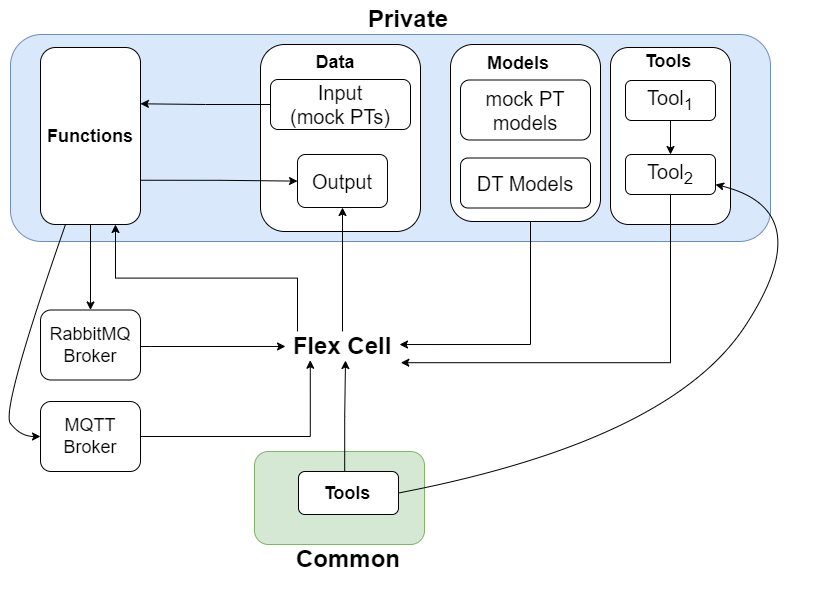

# Flex Cell

## Overview

The flex-cell Digital Twin is a case study
with two industrial robotic arms,
a UR5e and a Kuka LBR iiwa 7,
working in a cooperative setting on a manufacturing cell.

The case study focuses on the robot positioning
in the discrete cartesian space of
the flex-cell working space.
Therefore, it is possible to send (X,Y,Z) commands
to both robots, which refer to the target hole
and height they should move to.

## Example Diagram



## Example Structure

The flex-cell case study is managed using the ```DTManager```,
which is packed as a jar library in the tools,
and run from a java main file.
The ```DTManager``` uses Maestro as a slave for co-simulation,
so it generates the output of the co-simulation and can
interact with the real robots at the same time
(with the proper configuration and setup).
The case study also uses RabbitMQFMU to inject values
into the co-simulation, therefore, there is the
rabbitmqfmu in the models folder as well.
Right now, RabbitMQFMU is only used for injecting
values into the co-simulation, but not the other way around.
The ```DTManager``` is in charge of reading the values
from the co-simulation output and the
current state of the physical twins.


## Configuration of assets

The specific assets used are:

| Asset Type | Names of Assets | Visibility | Reuse in Other Examples |
|:---|:---|:---|:---|
| Models | kukalbriiwa_model.fmu | Private | Yes |
|  | ur5e_model.fmu | Private | Yes |
| Tool | DTManager-0.0.1-Maestro.jar | Common | Yes |

## Lifecycle Phases

| Lifecycle Phase    | Completed Tasks |
| -------- | ------- |
| Create  | Installs Python Packages and Java Development Kit|
| Prepare | Prepares the credentials for connections|
| Execute | Produces and stores output in data/mass-spring-damper/output directory|
| Clean   | Clears run logs and outputs |

## Run the example

To run the example, change your present directory.

```bash
cd workspace/examples/digital_twins/flex-cell
```

If required, change the execute permission of lifecycle scripts
you need to execute, for example:

```bash
chmod +x lifecycle/create
```

Now, run the following scripts:

### Create

Installs Open Java Development Kit 17 in the workspace.

```bash
lifecycle/create
```

### Prepare

Prepares the credentials for connections.

1. Set up the credentials for MQTT and RabbitMQ in the
```/workspace/examples/data/flex-cell/connections.conf```.
Then, run:

```bash
lifecycle/prepare
```

### Execute

Run the co-simulation. Generate the co-simulation output.csv file
at `data/flex-cell/output/output.csv`.

There are also debug and td-manager log files stored in
`data/flex-cell/output` directory.

```bash
lifecycle/execute
```

### Save phase

If required, save the results of the simulation.
Saved experiments can be found in:
```/workspace/examples/data/flex-cell/output/saved_experiments```.

```bash
lifecycle/save
```

### Analyze phase

Process the output of digital twin to produce a plot at:
`/workspace/examples/data/flex-cell/output/`.

```bash
lifecycle/analyze
```

#### Examine the results

Executing this Digital Twin will generate a co-simulation output,
but the results can also be monitored from updating the
```/workspace/examples/tools/flex-cell/FlexCellMain.java```
with a specific set of ```getAttributeValue``` commands,
such as shown in the code.
The main file enables the online execution and comparison
of Digital Twin and Physical Twin at the same time
and at the same abstraction level.

The results can be found in the
_workspace/examples/data/flex-cell/output directory_.

You can also view run logs in the
_workspace/examples/digital_twins/flex-cell_.

### Terminate phase

Terminate to clean up the debug files and co-simulation output files.

```bash
lifecycle/terminate
```

## References

More information about flex cell
case study are available in: