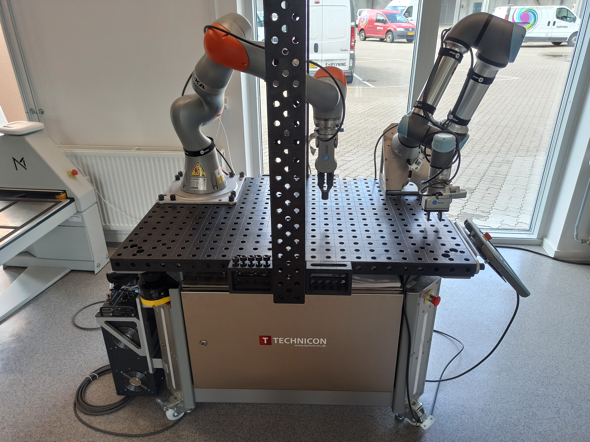
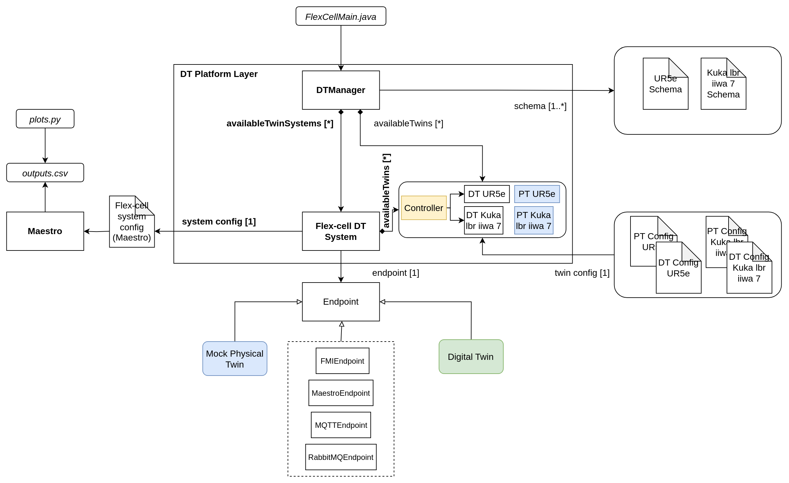

# Flex Cell Digital Twin with Two Industrial Robots

## Overview

The flex-cell Digital Twin is a case study with two industrial robotic arms,
a UR5e and a Kuka LBR iiwa 7, working in a cooperative setting
on a manufacturing cell.



The case study focuses on the robot positioning in
the discrete cartesian space of the flex-cell working space.
Therefore, it is possible to send (X,Y,Z) commands to both robots,
which refer to the target hole and height they want should move to.

The flex-cell case study is managed using the `TwinManager`
(formerly `DTManager`), which is packed as a jar library in the tools,
and run from a java main file.

The `TwinManager` uses Maestro as a slave for co-simulation,
so it generates the output of the co-simulation and can interact with
the real robots at the same time (with the proper configuration and setup).
The mainfile can be changed according to the application scope, i.e.,
the `/workspace/examples/tools/flex-cell/FlexCell.java` can be
manipulated to get a different result.

The `/workspace/examples/models/flex-cell/` folder contains
the `.fmu` files for the kinematic models of the robotic arms,
the `.urdf` files for visualization (including the grippers), and
the `.aasx` files for the schema representation with
Asset Administration Shell.

The case study also uses RabbitMQFMU to inject values into the co-simulation,
therefore, there is the rabbitmqfmu in the models folder as well.
Right now, RabbitMQFMU is only used for injecting values into
the co-simulation, but not the other way around.
The `TwinManager` is in charge of reading the values from
the co-simulation output and the current state of the physical twins.

## Example Structure



## Digital Twin Configuration

This example uses seven models, five tools, six data, two functions,
and one script. The specific assets used are:

| Asset Type | Names of Assets | Visibility | Reuse in Other Examples |
|:---|:---|:---|:---|
| Model | kukalbriiwa_model.fmu | Private | No |
|  | kuka_irw_gripper_rg6.urdf | Private | No |
|  | kuka.aasx | Private | No |
|  | ur5e_model.fmu | Private | No |
|  | ur5e_gripper_2fg7.urdf | Private | No |
|  | ur5e.aasx | Private | No |
|  | rmq-vhost.fmu | Private | Yes |
| Tool | maestro-2.3.0-jar-with-dependencies.jar | Common | Yes |
|  | TwinManagerFramework-0.0.2.jar | Private | Yes |
|  | urinterface | Private | No |
|  | kukalbrinterface | Private | No |
|  | robots_flexcell | Private | No |
|  | FlexCell.java (main script) | Private | No |
| Data | publisher-flexcell-physical.py | Private | No |
|  | ur5e_mqtt_publisher.py | Private | No |
|  | connections.conf | Private | No |
|  | outputs.csv | Private | No |
|  | kukalbriiwa7_actual.csv | Private | No |
|  | ur5e_actual.csv | Private | No |
| Function | plots.py | Private | No |
|  | prepare.py | Private | No |

## Lifecycle Phases

The lifecycles that are covered include:

1. Installation of dependencies in the create phase.
1. Preparing the credentials for connections in the prepare phase.
1. Execution of the experiment in the execution phase.
1. Saving experiments in the save phase.
1. Plotting the results of the co-simulation and the real data coming from
1. the robots in the analyze phase.
1. Terminating the background processes and cleaning up the outputs
   in the termination phase.

| Lifecycle Phase    | Completed Tasks |
| --------- | ------- |
| Create    | Installs Java Development Kit for Maestro tool, Compiles source code of DTManager to create a usable jar package (used as tool) |
| Prepare | Takes the RabbitMQ and MQTT credentials in connections.conf file and configures different assets of DT. |
| Execute   | The DT Manager executes the flex-cell DT and produces output in `data/flex-cell/output` directory |
| Save   | Save the experimental results |
| Analyze | Uses plotting functions to generate plots of co-simulation results |
| Terminate | Terminating the background processes |
| Clean | Cleans up the output data                      |

## Run the example

To run the example, change your present directory.

```bash
cd /workspace/examples/digital twins/flex-cell
```

If required, change the execute permission of lifecycle scripts
you need to execute, for example:

```bash
chmod +x lifecycle/create
```

This example requires Java 11. The **create** script installs Java 11;
however if you have already installed other Java versions, your default _java_
might be pointing to another version. You can check and modify the default
version using the following commands.

```bash
java -version
update-alternatives --config java
```

Now, run the following scripts:

### Create

Installs Open Java Development Kit 11 and pip dependencies.
Also creates `DTManager` tool (DTManager-0.0.1-Maestro.jar) from source code.

```bash
lifecycle/create
```

### Prepare

Configure different assets of DT with these credentials.
The `functions/flex-cell/prepare.py` script is used for this purpose.
The only thing needed to set up the connection is to update the file
`/workspace/examples/data/flex-cell/connections.conf` with
the connection parameters for MQTT and RabbitMQ and then execute
the ```prepare``` script.

```bash
lifecycle/prepare
```

The following files are updated with the configuration information:

1. `/workspace/examples/digital_twins/flex-cell/kuka_actual.conf`
1. `/workspace/examples/digital_twins/flex-cell/ur5e_actual.conf`
1. `/workspace/examples/tools/flex-cell/publisher-flexcell-physical.py`
1. `modelDescription.xml` for the RabbitMQFMU require special credentials
   to connect to the RabbitMQ and the MQTT brokers.

### Execute

Execute the flex-cell digital twin using DTManager. DTManager in-turn runs
the co-simulation using Maestro. Generates the co-simulation output.csv file
at `/workspace/examples/data/flex-cell/output`.

```bash
lifecycle/execute
```

### Save

Each execution of the DT is treated as a single run. The results of
one execution are saved as time-stamped co-simulation output file in
The DT Manager executes the flex-cell digital twin and produces output
in `data/flex-cell/output/saved_experiments` directory.

```bash
lifecycle/execute
```

### Analyze

There are dedicated plotting functions in `functions/flex-cell/plots.py`.
This script plots the co-simulation results against the recorded values
from the two robots.

```bash
lifecycle/analyze
```

### Terminate

Stops the Maestro running in the background. Also stops any other
jvm process started during **execute** phase.

```bash
lifecycle/terminate
```

### Clean

Removes the output generated during execute phase.

```bash
lifecycle/clean
```

## Examining the results

Executing this Digital Twin will generate a co-simulation output,
but the results can also be monitored from updating
the `/workspace/examples/tools/flex-cell/FlexCell.java` with
a specific set of `getAttributeValue` commands, such as shown in the code.
That main file enables the online execution and comparison on Digital Twin
and Physical Twin at the same time and at the same abstraction level.

The output is generated to the
`/workspace/examples/data/flex-cell/output` folder.
In case a specific experiments is to be saved, the `save`
lifecycle script stores the co-simulation results into
the `/workspace/examples/data/flex-cell/output/saved_experiments` folder.

In the default example, the co-simulation is run for 10 seconds in
steps of 0.5 seconds.
This can be modified for a longer period and different step size.
The output stored in `outputs.csv` contains the joint position of
both robotic arms and the current discrete (X,Y,Z) position of
the TCP of the robot.
Additional variables can be added, such as the discrete (X,Y,Z) position
of the other joints.

When connected to the real robots, the tools `urinterface` and
`kukalbrinterface` log their data at a higher sampling rate.

## References

The [RabbitMQ FMU](https://github.com/INTO-CPS-Association/fmu-rabbitmq)
github repository contains complete documentation and source code of
the rmq-vhost.fmu.

More information about the DT Manager and the case study is available in:

1. D. Lehner, S. Gil, P. H. Mikkelsen, P. G. Larsen and M. Wimmer,
   "An Architectural Extension for Digital Twin Platforms to Leverage
   Behavioral Models," 2023 IEEE 19th International Conference on
   Automation Science and Engineering (CASE), Auckland,
   New Zealand, 2023, pp. 1-8, doi: 10.1109/CASE56687.2023.10260417.
1. S. Gil, P. H. Mikkelsen, D. Tola, C. Schou and P. G. Larsen,
   "A Modeling Approach for Composed Digital Twins in Cooperative
   Systems," 2023 IEEE 28th International Conference on Emerging
   Technologies and Factory Automation (ETFA), Sinaia, Romania, 2023,
   pp. 1-8, doi: 10.1109/ETFA54631.2023.10275601.
1. S. Gil, C. Schou, P. H. Mikkelsen, and P. G. Larsen, “Integrating
   Skills into Digital Twins in Cooperative Systems,” in 2024 IEEE/SICE
   International Symposium on System Integration (SII), 2024, pp. 1124–1131,
   doi: 10.1109/SII58957.2024.10417610.
