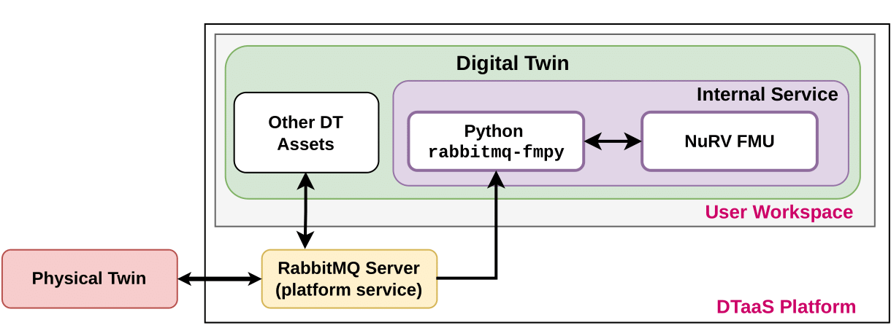

# Incubator Digital Twin with NuRV FMU Monitoring Service

## Overview

This example demonstrates how an FMU can be used as a runtime monitoring
service (in this example NuRV[1]) and connected with the
[Incubator digital twin](../incubator/README.md) to verify
runtime behavior of the Incubator.

## Simulated scenario

This example simulates a scenario where the lid of the Incubator is
removed and later put back on. The Incubator is equipped with
anomaly detection capabilities, which can detect anomalous behavior
(i.e. the removal of the lid). When an anomaly is detected,
the Incubator triggers an energy saving mode where the heater is turned off.

From a monitoring perspective, we wish to verify that within 3 messages of
an anomaly detection, the energy saving mode is turned on.
To verify this behavior, we construct the property:

$G(anomaly \rightarrow (F_{[0,3]}\space energy\_saving))$.

The monitor will output the _unknown_ state as long as the property is
satisfied and will transition to the _false_ state once
a violation is detected.

The simulated scenario progresses as follows:

- _Initialization_: The services are initialized and the Kalman filter
  in the Incubator is given 2 minutes to stabilize. Sometimes,
  the anomaly detection algorithm will detect an anomaly at startup
  even though the lid is still on. It will disappear after approx 15 seconds.
- _After 2 minutes_: The lid is lifted and an anomaly is detected.
  The energy saver is turned on shortly after.
- _After another 30 seconds_: The energy saver is manually disabled
  producing a _false_ verdict.
- _After another 30 seconds_: The lid is put back on and
  the anomaly detection is given time to detect that the lid is back on.
  The monitor is then reset producing an Unknown verdict again.
  The simulation then ends.

## Example structure

A diagram depicting the logical software structure of
the example can be seen below.



The _execute_ script is responsible for starting the NuRV service and
running the Python script that controls the scenario (_execute.py_).

The _execute.py_ script starts the Incubator services and runs
the example scenario. Once the Incubator DT is started, a RabbitMQ client
is created that subscribes to changes in the _anomaly_ and
_energy_saving_ states of the DT, as well as the verdicts produced
by the NuRV service.
Each time an update is received, the full state and verdict is
printed to the console.

## Digital Twin configuration

Before running the example, please configure the _simulation.conf_ file with
your RabbitMQ credentials.

The example uses the following assets:

| Asset Type    | Names of Assets                | Visibility | Reuse in other Examples |
| :------------ | :----------------------------- | :--------- | :---------------------- |
| Tools         | common/tool/NuRV/NuRV          | Common     | Yes                     |
| Other         | common/fmi2_headers            | Common     | Yes                     |
| DT            | common/digital_twins/incubator | Common     | Yes                     |
| Specification | safe-operation.smv             | Private    | No                      |
| Script        | execute.py                     | Private    | No                      |

The _safe-operation.smv_ file contains the default monitored specification
as described in the [Simulated scenario section](#simulated-scenario).
These can be configured as desired.

## Lifecycle phases

The lifecycle phases for this example include:

| Lifecycle phase | Completed tasks                                                                                                                                                                                                |
| --------------- | -------------------------------------------------------------------------------------------------------------------------------------------------------------------------------------------------------------- |
| create          | Downloads the necessary tools and creates a virtual python environment with the necessary dependencies                                                                                                         |
| execute         | Runs a python script that starts up the necessary services as well as the Incubator simulation. Various status messages are printed to the console, including the monitored system states and monitor verdict. |

If required, change the execute permissions of lifecycle scripts you
need to execute. This can be done using the following command.

```bash
chmod +x lifecycle/{script}
```

where {script} is the name of the script, e.g. _create_, _execute_ etc.

## Running the example

To run the example, first run the following command in a terminal:

```bash
cd /workspace/examples/digital_twins/incubator-NuRV-fmu-monitor-service/
```

Then, first execute the _create_ script followed by the _execute_ script
using the following command:

```bash
lifecycle/{script}
```

The _execute_ script will then start outputting system states and
the monitor verdict approx every 3 seconds. The output is printed
as follows.

"__State: {anomaly state} & {energy_saving state}__"

where "_anomaly_" indicates that an anomaly is detected and "!anomaly"
indicates that an anomaly is not currently detected. The same format is
used for the energy_saving state.
NuRV verdicts are printed as follows

"__Verdict from NuRV: {verdict}__".

The monitor verdict can be false or unknown, where the latter indicates
that the monitor does not yet have sufficient information to determine
the satisfaction of the property. The monitor will never produce
a true verdict as the entire trace must be verified to ensure satisfaction
due to the G operator. Thus the unknown state can be viewed as
a tentative true verdict.

An example output trace is provided below:

````log
....
Using LIFECYCLE_PATH: /workspace/examples/digital_twins/incubator-NuRV-fmu-monitor-service/lifecycle
Using INCUBATOR_PATH: /workspace/examples/digital_twins/incubator-NuRV-fmu-monitor-service/lifecycle/../../../common/digital_twins/incubator
Starting NuRV FMU Monitor Service, see output at /tmp/nurv-fmu-service.log
NuRVService.py PID: 13496
Starting incubator
Connected to rabbitmq server.
Running scenario with initial state: lid closed and energy saver on
Setting energy saver mode: enable
Setting G_box to: 0.5763498
State: !anomaly & !energy_saving
State: !anomaly & !energy_saving
Verdict from NuRV: unknown
State: !anomaly & !energy_saving
State: !anomaly & !energy_saving
Verdict from NuRV: unknown
State: !anomaly & !energy_saving
State: !anomaly & !energy_saving
Verdict from NuRV: unknown
State: !anomaly & !energy_saving
State: !anomaly & !energy_saving
Verdict from NuRV: unknown
State: !anomaly & !energy_saving
State: !anomaly & !energy_saving
Verdict from NuRV: unknown
````

## References

1. Information on the NuRV monitor can be found on
   [FBK website](https://es-static.fbk.eu/tools/nurv/).
