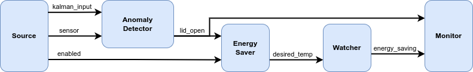
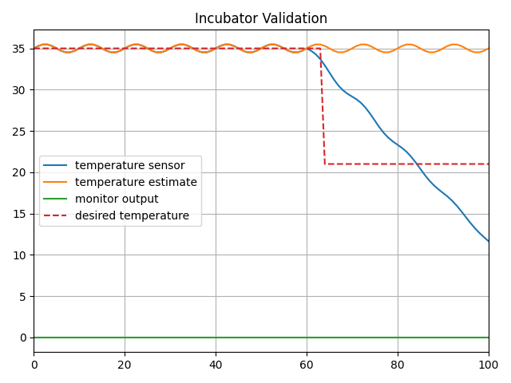

# Incubator Digital Twin validation with NuRV Monitor

## Overview

This example demonstrates how to validate some digital twin components using
FMU monitors (in this example, the monitors are generated with NuRV[1]).

## Simulated scenario

This example validates some components of the [Incubator digital twin](../incubator/README.md),
by performing a simulation in which the commponents are wrapped inside FMUs,
and are then inspected at runtime by some a FMU monitor generated by NuRV.
Please note that the link to [Incubator digital twin](../incubator/README.md)
is only provided to know the details of the incubator physical twin.
The digital twin (DT) presented here is a co-simulation DT of the Incubator.

The input data for the simulation is generated by a purpose-built
FMU component named _source_, which supplies testing data to the _anomaly detector_,
simulating an anomaly occurring at time t=60s. An additional component,
_watcher_, is employed to verify whether the _energy saver_ activates in response
to an anomaly reported by the _anomaly detector_.

The output of the watcher is the passed to the monitor, which ensures that when
an anomaly is detected, the _energy saver_ activates within a maximum of
three simulation cycles.

## Example structure

A diagram depicting the logical software structure of the example can be seen below.



## Digital Twin configuration

The example uses the following assets:

| Asset Type | Names of Assets | Visibility | Reuse in other Examples |
|:---|:---|:---|:---|
| Models | anomaly_detection.fmu | Private | No |
|        | energy_saver.fmu      | Private | No |
|        | Source.fmu            | Private | No |
|        | Watcher.fmu           | Private | No |
| Specification | safe-operation.smv | Private | No |
| Tool | maestro-2.3.0-jar-with-dependencies.jar | Common | Yes |

The _safe-operation.smv_ file contains the default monitored specification as
described in the [Simulated scenario section](#simulated-scenario).

## Lifecycle phases

The lifecycle phases for this example include:

| Lifecycle Phase    | Completed Tasks |
| -------- | ------- |
| Create  | Installs Java Development Kit for Maestro tool<br>Generates and compiles the monitor FMU    |
| Execute | Produces and stores output in data/incubator-NuRV-monitor-validation/output directory|
| Clean   | Clears run logs and outputs |

If required, change the execute permissions of lifecycle scripts you need to execute.
This can be done using the following command

```bash
chmod +x lifecycle/{script}
```

where {script} is the name of the script, e.g. _create_, _execute_ etc.

## Run the example

To run the example, change your present directory.

```bash
cd /workspace/examples/digital_twins/incubator-NuRV-monitor-validation
```

If required, change the execute permission of lifecycle scripts
you need to execute, for example:

```bash
chmod +x lifecycle/create
```

Now, run the following scripts:

### Create

- Installs Open Java Development Kit 17 in the workspace.
- Generates and compiles the monitor FMU from the NuRV specification

```bash
lifecycle/create
```

### Execute

Run the the Digital Twin. Since this is a co-simulation based
digital twin, the Maestro co-simulation tool executes co-simulation
using the FMU models.

```bash
lifecycle/execute
```

### Analyze phase

Process the output of co-simulation to produce a plot at:
`/workspace/examples/data/incubator-NuRV-monitor-validation/output/plots`.

```bash
lifecycle/analyze
```

A sample plot is given here.



In the plot, four color-coded indicators provide a visual representation of
distinct values. The blue line depicts the simulated temperature, while orange
one represents the temperature estimate. A red dashed line indicates the
target temperature set by the energy saver component. The green line shows
the monitor's output verdict. As observed, when there is a disparity
between the estimated and actual temperatures, the energy saver adjusts
the target temperature downward, indicating that the component is working
properly. Thus, the output of the monitor is fixed at `unknown` (`0`),
signifying that the monitoring property is not violated.

#### Examine the results

The results can be found in the
_/workspace/examples/data/incubator-NuRV-monitor-validation/output_ directory
where the logs are also included.

Figures of the output results can be found in the
_/workspace/examples/data/incubator-NuRV-monitor-validation/output_
directory.

### Terminate phase

Terminate to clean up the debug files and co-simulation output files.

```bash
lifecycle/terminate
```

## References

1. More information about NuRV is available [here](https://es-static.fbk.eu/tools/nurv/).
