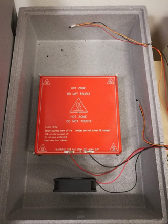
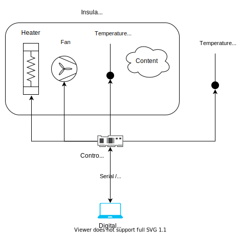
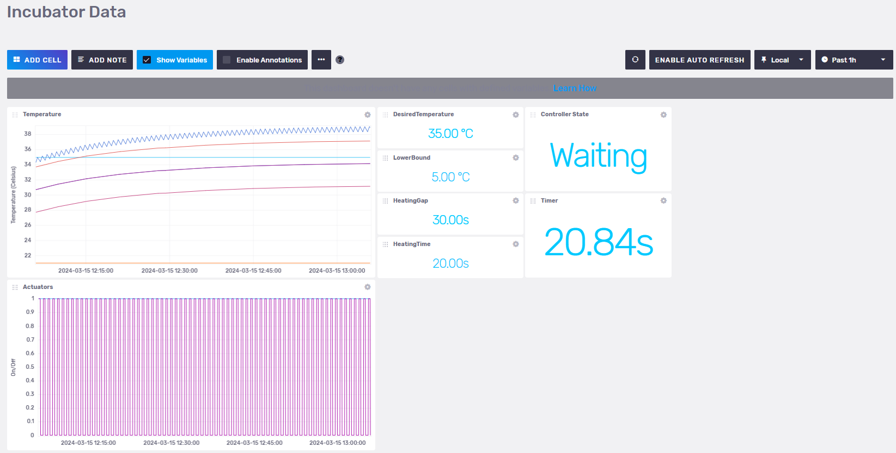

# Incubator Digital Twin

## Overview

This is a case study of an Incubator with the purpose of understanding
the steps and processes involved in developing a digital twin system.
This incubator is an insulated container with the ability to keep a temperature
and heat, but not cool. A picture of the incubator is given below.



The overall purpose of the system is to reach a certain temperature within
a box and keep the temperature regardless of content.
An overview of the system can be seen below:



The system consists of:

* 1x styrofoam box in order to have an insulated container
* 1x heat source to heat up the content within the Styrofoam box.
* 1x fan to distribute the heating within the box
* 2x temperature sensor to monitor the temperature within the box
* 1x temperature Sensor to monitor the temperature outside the box
* 1x controller to actuate the heat source and the fan and read sensory
  information from the temperature sensors, and communicate with
  the digital twin.

The original repository for the example can be found: [Original repository](https://github.com/INTO-CPS-Association/example_digital-twin_incubator/).
This trimmed version of the codebase does not have the following:

* docker support
* tests
* datasets

The original repository contains the complete documentation of
the example, including the full system architecture, instructions for
running with a physical twin, and instructions for running
a 3D visualization of the incubator.

## Digital Twin Structure


This diagrams shows the main components and the interfaces they use to communicate.
All components communicate via the RabbitMQ message exchange,
and the data is stored in a time series database.
The RabbitMQ and InfluxDB are platform services hosted by the DTaaS.

The Incubator digital twin is a pre-packaged digital twin. It can be
used as is or integrated with other digital twins.

The mock physical twin is executed from
`incubator/mock_plant/real_time_model_solver.py` script.

## Digital Twin Configuration

This example uses a plethora of Python scripts to run the digital twin.
By default it is configured to run with a mock physical twin.
Furthermore, it depends on a RabbitMQ and an InfluxDB instances.

There are two configuration files. One is is DT has a single configuration files.
First is `incubator/log.log`; it controls the verbosity of terminal log level
during DT execution.
Second is `simulation.conf` which provides the control and
connection parameters to the DT.

## Examining the results

After starting all services successfully, the controller service will
start producing output that looks like the following:

````log
time           execution_interval  elapsed  heater_on  fan_on   room   box_air_temperature  state
19/11 16:17:59  3.00                0.01     True       False   10.70  19.68                Heating
19/11 16:18:02  3.00                0.03     True       True    10.70  19.57                Heating
19/11 16:18:05  3.00                0.01     True       True    10.70  19.57                Heating
19/11 16:18:08  3.00                0.01     True       True    10.69  19.47                Heating
19/11 16:18:11  3.00                0.01     True       True    10.69  19.41                Heating
````

An InfluxDB dashboard can be setup based on
`incubator/digital_twin/data_access/influxdbserver/dashboards/incubator_data.json`.
If the dashboard on the InfluxDB is setup properly,
the following visualization can be seen:



## References

**NOTE**: Forked from:
[Incubator repository](https://github.com/INTO-CPS-Association/example_digital-twin_incubator/)
with commit ID: 989ccf5909a684ad26a9c3ec16be2390667643aa

To understand what a digital twin is, we recommend you read/watch one
or more of the following resources:

1. Feng, Hao, Cláudio Gomes, Casper Thule, Kenneth Lausdahl,
   Alexandros Iosifidis, and Peter Gorm Larsen. “Introduction to
   Digital Twin Engineering.” In 2021 Annual Modeling and Simulation
   Conference (ANNSIM), 1–12. Fairfax, VA, USA: IEEE, 2021.
   [https://doi.org/10.23919/ANNSIM52504.2021.9552135](https://doi.org/10.23919/ANNSIM52504.2021.9552135).
1. [Video recording of presentation by Claudio Gomes](https://videos.ida.dk/media/Introduction+to+Digital+Twin+Engineering+with+Cl%C3%A1udio+%C3%82ngelo+Gon%C3%A7alves+Gomes%2C+Aarhus+Universitet/1_7r1j05g8/256930613)
