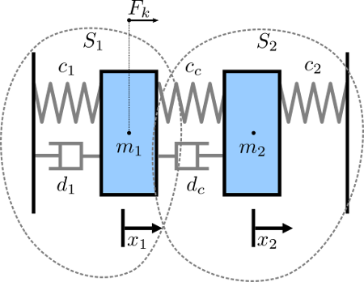
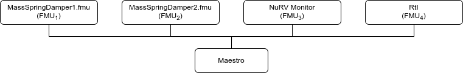
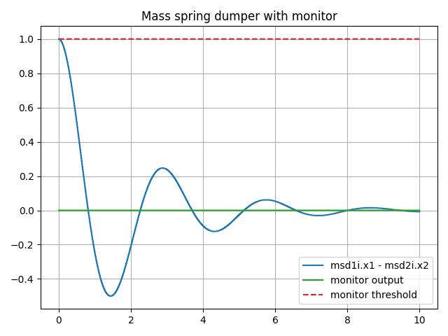

# Mass Spring Damper with NuRV Runtime Monitor

## Overview

This digital twin is derives from te Mass String Damper digital twin.

The mass spring damper digital twin (DT) comprises two mass spring dampers
and demonstrates how a co-simulation based DT can be used within DTaaS.
This version of the example is expanded with a monitor generated by NuRV.
More information about NuRV is available [here](https://es-static.fbk.eu/tools/nurv/).

## Example Diagram



## Example Structure

There are two simulators included in the study, each representing a
mass spring damper system. The first simulator calculates the mass
displacement and speed of $m_1$ for a given force $F_k$ acting on mass $m_1$.
The second simulator calculates force $F_k$ given a displacement and speed of
mass $m_1$. By coupling these simulators, the evolution of the position of
the two masses is computed.

Additionally, a monitor is inserted in the simulation to check at runtime
whether the displacement of the two masses stays below a maximum threshold.



## Digital Twin Configuration

This example uses two models and one tool. The specific assets used are:

| Asset Type | Names of Assets | Visibility | Reuse in Other Examples |
|:---|:---|:---|:---|
| Models | MassSpringDamper1.fmu | Private | Yes |
|        | MassSpringDamper2.fmu | Private | Yes |
|        | m2.fmu | Private | No |
|        | RtI.fmu                   | Private | Yes |
| Specification | m2.smv | Private | No |
| Tool | maestro-2.3.0-jar-with-dependencies.jar | Common | Yes |

The `co-sim.json` and `time.json`
are two DT configuration files used for executing the digital twin.
You can change these two files to customize the DT to your needs.

## Lifecycle Phases

| Lifecycle Phase    | Completed Tasks |
| -------- | ------- |
| Create  | Installs Java Development Kit for Maestro tool<br>Generates and compiles the monitor FMU    |
| Execute | Produces and stores output in data/mass-spring-damper-monitor/output directory|
| Clean   | Clears run logs and outputs |

## Run the example

To run the example, change your present directory.

```bash
cd /workspace/examples/digital_twins/mass-spring-damper-monitor
```

If required, change the execute permission of lifecycle scripts
you need to execute, for example:

```bash
chmod +x lifecycle/create
```

Now, run the following scripts:

### Create

- Installs Open Java Development Kit 17 in the workspace.
- Generates and compiles the monitor FMU from the NuRV specification

```bash
lifecycle/create
```

### Execute

Run the the Digital Twin. Since this is a co-simulation based
digital twin, the Maestro co-simulation tool executes co-simulation
using the two FMU models.

```bash
lifecycle/execute
```

### Analyze phase

Process the output of co-simulation to produce a plot at:
`/workspace/examples/data/mass-spring-damper-monitor/output/plots`.

```bash
lifecycle/analyze
```

A sample plot is given here.



In the plot, three color-coded indicators are used to represent different
values. The blue line shows the distance between the two masses, while the
green indicates the monitor's verdict. A red dashed
line serves as a reference point, marking the distance checked by the
monitor. Since the distance of the masses is always below the threshold, the
output of the monitor is fixed to `unknown` (`0`).

#### Examine the results

The results can be found in the
_/workspace/examples/data/mass-spring-damper-monitor/output directory_.

You can also view run logs in the
_/workspace/examples/digital_twins/mass-spring-damper-monitor_.

### Terminate phase

Terminate to clean up the debug files and co-simulation output files.

```bash
lifecycle/terminate
```

## References

More information about co-simulation techniques and mass spring damper
case study are available in:

```txt
Gomes, Cláudio, et al. "Co-simulation: State of the art."
arXiv preprint arXiv:1702.00686 (2017).
```

The source code for the models used in this DT are available in
[mass spring damper](https://github.com/INTO-CPS-Association/example-mass_spring_damper)
github repository.
