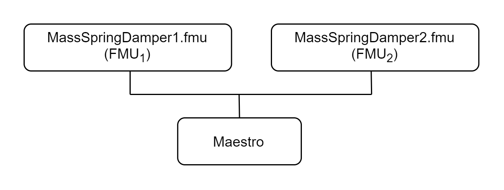

# Mass Spring Damper

## Overview

The mass spring damper digital twin (DT) comprises two mass spring dampers
and demonstrates how a co-simulation based DT can be used within DTaaS.

## Example Diagram


## Example Structure

There are two simulators included in the study, each representing a
mass spring damper system. The first simulator calculates the mass
displacement and speed of $m_1$ for a given force $F_k$ acting on mass $m_1$.
The second simulator calculates force $F_k$ given a displacement and speed of
mass $m_1$. By coupling these simulators, the evolution of the position of
the two masses is computed.



## Digital Twin Configuration

This example uses two models and one tool. The specific assets used are:

| Asset Type | Names of Assets | Visibility | Reuse in Other Examples |
|:---|:---|:---|:---|
| Models | MassSpringDamper1.fmu | Private | Yes |
|  | MassSpringDamper2.fmu | Private | Yes |
| Tool | maestro-2.3.0-jar-with-dependencies.jar | Common | Yes |

The `co-sim.json` and `time.json`
are two DT configuration files used for executing the digital twin.
You can change these two files to customize the DT to your needs.

## Lifecycle Phases

| Lifecycle Phase    | Completed Tasks |
| -------- | ------- |
| Create  | Installs Java Development Kit for Maestro tool    |
| Execute | Produces and stores output in data/mass-spring-damper/output directory|
| Clean   | Clears run logs and outputs |

## Run the example

To run the example, change your present directory.

```bash
cd /workspace/examples/digital_twins/mass-spring-damper
```

If required, change the execute permission of lifecycle scripts
you need to execute, for example:

```bash
chmod +x lifecycle/create
```

Now, run the following scripts:

### Create

Installs Open Java Development Kit 17 in the workspace.

```bash
lifecycle/create
```

### Execute

Run the the Digital Twin. Since this is a co-simulation based
digital twin, the Maestro co-simulation tool executes co-simulation
using the two FMU models.

```bash
lifecycle/execute
```

#### Examine the results

The results can be found in the
_/workspace/examples/data/mass-spring-damper/output directory_.

You can also view run logs in the
_/workspace/examples/digital_twins/mass-spring-damper_.

### Terminate phase

Terminate to clean up the debug files and co-simulation output files.

```bash
lifecycle/terminate
```

## References

More information about co-simulation techniques and mass spring damper
case study are available in:

```txt
Gomes, Cláudio, et al. "Co-simulation: State of the art."
arXiv preprint arXiv:1702.00686 (2017).
```

The source code for the models used in this DT are available in
[mass spring damper](https://github.com/INTO-CPS-Association/example-mass_spring_damper)
github repository.
