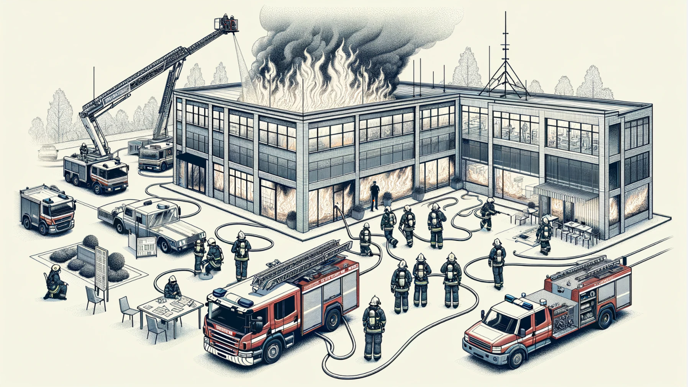
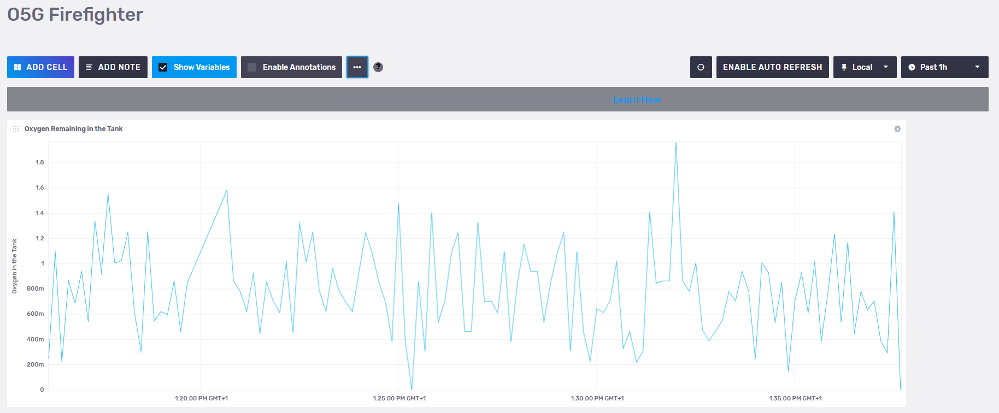

# Firefighter Mission in a Burning Building

In an firefighter mission it is important to monitor the oxygen levels of
each firefighters Self Contained Breating Aparatus (SCBA) in context of
their mission.

## Physical Twin Overview



> Image: Schematic overview of a firefighter mission. Note the mission
> commander on the lower left documenting the air supply pressure levels
> provided by radio communication from the firefighters inside and around
> the burning building. This image was created with the assistance of
> DALL·E.

We assume the following scenario:

* a set of firefighters work to extinguish a burning building
* they each use an SCBA with pressurised oxygen to breath
* a mission commander on the outside coordinates the efforts and
  surveills the oxygen levels

## Digital Twin Overview

In this example a monitor is implemented, that calculates how much time
the firefighers have left, until they need to leave the building.
To that end, the inputs used are:

* 3D-model of the building in which the mission takes place,
* pressure data of a firefighters SCBA and
* firefighters location inside of the building

are used to estimate:

* the shortest way out,
* how much time this will need and
* how much time is left until all oxygen from the SCBA is used up.

The remaining mission time is monitored and the firefighter receive
a warning if it drops under a certain threshold.


This example is an implementation of the the paper
[_Digital Twin for Rescue Missions--a Case Study_](https://ceur-ws.org/Vol-3507/paper4.pdf)
by Leucker et al.

### Quick Check

Before runnnig this example please make sure the following files are at the correct locations:

```txt
/workspace/examples/
   data/o5g/input/
      runTessla.sh
      sensorSimulation.py
      telegraf.conf

   models/
    lab.ifc
    makefmu.mos
      PathOxygenEstimate.mo

  tools/
    graphToPath.py
    ifc_to_graph
    pathToTime.py
    tessla-telegraf-connector/
    tessla-telegraf-connector/
      tessla.jar
      specification.tessla (run-time specification)

   digital_twins/o5g/
      main.py
      config
      lifecycle/ (scripts)
```

### Digital Twin Configuration

All configuration for this example is contained in `digital_twins/o5g/config`.

To use the MQTT-Server, account information needs to be provided.
The topics are set to their default values, which allow the DT to
access the mock physical twins sensor metrics and to send back alerts.

```ini
export O5G_MQTT_SERVER=
export O5G_MQTT_PORT=
export O5G_MQTT_USER=
export O5G_MQTT_PASS=

export O5G_MQTT_TOPIC_SENSOR='vgiot/ue/metric'
export O5G_MQTT_TOPIC_AIR_PREDICTION='vgiot/dt/prediction'
export O5g_MQTT_TOPIC_ALERT='vgiot/dt/alerts'
```

This example uses InfuxDB as a data storage, which will need to be
configured to use your Access data. The following configuration
steps are needed:

* Log into the InfluxDB Web UI
* Obtain **org** name (is below your _username_ in the sidebar)
* Create a data bucket if you don't have one already in
  `Load Data -> Buckets`
* Create an API access token in `Load Data -> API Tokens`,
  Copy and save this token somewhere immediately, you can not access it
  later!

```ini
export O5G_INFLUX_SERVER=
export O5G_INFLUX_PORT=
export O5G_INFLUX_TOKEN=
export O5G_INFLUX_ORG=
export O5G_INFLUX_BUCKET=
```

## Lifecycle Phases

The lifecycles that are covered include:

| Lifecycle Phase    | Completed Tasks |
| --------- | ------- |
| Install    | Installs Open Modelica, Rust, Telegraf and the required pip dependencies |
| Create    | Create FMU from Open Modelica file                 |
| Execute   | Execute the example in the background tmux terminal session                      |
| Terminate | Terminate the tmux terminal session running in the background                                                  |
| Clean | Delete the temporary files                                                 |

## Run the example

### Install

Run the install script by executing

```bash
lifecycle/install
```

This will install all the required dependencies from apt and pip, as well as
Open Modelica, Rust, Telegraf and the required pip dependencies
from their respective repos.

#### Create

Run the create script by executing

```bash
lifecycle/create
```

This will compile the modelica model to an Functional Mockup Unit (FMU)
for the correct platform.

#### Exceute

To run the Digital Twin execute

```bash
lifecycle/execute
```

This will start all the required components in a single tmux session
called `o5g` in the background.
To view the running Digital Twin attatch to this tmux session by executing

```bash
tmux a -t o5g
```

To detatch press `Ctrl-b` followed by `d`.


The _tmux_ session contains 4 components of the digital twin:

| Panel location | Purpose |
|:---|:---|
| Top Left | Sensor simulator generating random location and O2-level data |
| Top Right | Main Digital Twin receives the sensor data and calculates an estimate of how many minutes of air remain |
| Bottom Left | Telegraf to convert between different message formats, also displays all messages between components |
| Bottom Right | TeSSLa monitor raises an alarm, if the remaining time is to low. |

#### Examine the Results

For additional mission awareness, we recommend utilising the Influx data
visualisation. We provide a dashboard configuration in the file
_influx-dashoard.json_. Log in to your Influx Server to import
(usually port 8086). A screenshot of the dashboard is given here.



The data gets stored in
`o5g->prediction->air-remaining->37ae3e4fb3ea->true->vgiot/dt/prediction`
variable of the InfluxDB. In addition to importing dashboard configuration
given above, it is possible to create your custom dashboards using
the stored data.

#### Terminate

To stop the all components and close the _tmux_ session execute

```bash
lifecycle/terminate
```

#### Clean

To remove temoporary files created during execution

```bash
lifecycle/clean
```
