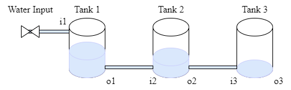

# Three-Tank System Digital Twin

## Overview

The three-tank system is a simple case study allows us to represent a system
that is composed of three individual components that are coupled in
a cascade as follows: The first tank is connected to the input of
the second tank, and the output of the second tank is connected to
the input of the third tank.



This example contains only the simulated components for
demonstration purposes; therefore, there is no configuration for
the connection with the physical system.

The three-tank system case study is managed using the ```DTManager```,
which is packed as a jar library in the tools, and run from a java main file.
The ```DTManager``` uses Maestro as a slave for co-simulation,
so it generates the output of the co-simulation.

The main file can be changed according to the application scope, i.e.,
the ```/workspace/examples/tools/three-tank/TankMain.java```
can be manipulated to get a different result.

The ```/workspace/examples/models/three-tank/``` folder contains
the ```Linear.fmu``` file, which is a non-realistic model for a tank
with input and output and the ```TankSystem.aasx``` file for
the schema representation with Asset Administration Shell.
The three instances use the same ```.fmu``` file and the same schema
due to being of the same object class.
The ```DTManager``` is in charge of reading the values from
the co-simulation output.

## Example Structure


## Digital Twin Configuration

This example uses two models, two tools, one data, and one script.
The specific assets used are:

| Asset Type | Names of Assets | Visibility | Reuse in Other Examples |
|:---|:---|:---|:---|
| Model | Linear.fmu | Private | No |
|  | TankSystem.aasx | Private | No |
| Tool | DTManager-0.0.1-Maestro.jar (wraps Maestro) | Common | Yes |
|  | maestro-2.3.0-jar-with-dependencies.jar (used by DTManager) | Common | Yes |
|  | TankMain.java (main script) | Private | No |
| Data | outputs.csv | Private | No |

This DT has multiple configuration files. The _coe.json_ and
_multimodel.json_ are used by Maestro tool. The _tank1.conf_, _tank2.conf_
and _tank3.conf_ are the config files for three different instances of
one model (Linear.fmu).

## Lifecycle Phases

The lifecycles that are covered include:

| Lifecycle Phase    | Completed Tasks |
| --------- | ------- |
| Create    | Installs Java Development Kit for Maestro tool                                                                    |
| Execute   | The DT Manager executes the three-tank digital twin and produces output in ```data/three-tank/output``` directory |
| Terminate | Terminating the background processes and cleaning up the output                                                   |

## Run the example

To run the example, change your present directory.

```bash
cd /workspace/examples/digital twins/three-tank
```

If required, change the execute permission of lifecycle scripts
you need to execute, for example:

```bash
chmod +x lifecycle/create
```

Now, run the following scripts:

### Create

Installs Open Java Development Kit 11 and pip dependencies.
Also creates ```DTManager``` tool (DTManager-0.0.1-Maestro.jar) from source code.

```bash
lifecycle/create
```

### Execute

Execute the three-tank digital twin using DTManager. DTManager in-turn runs
the co-simulation using Maestro. Generates the co-simulation output.csv file
at `/workspace/examples/data/three-tank/output`.

```bash
lifecycle/execute
```

### Terminate

Stops the Maestro running in the background. Also stops any other
jvm process started during **execute** phase.

```bash
lifecycle/terminate
```

### Clean

Removes the output generated during execute phase.

```bash
lifecycle/terminate
```

## Examining the results

Executing this Digital Twin will generate a co-simulation output,
but the results can also be monitored from updating
the```/workspace/examples/tools/three-tank/TankMain.java``` with
a specific set of ```getAttributeValue``` commands, such as shown in
the code.

That main file enables the online execution of the Digital Twin and
its internal components.

The output of the co-simulation is generated to
the ```/workspace/examples/data/three-tank/output``` folder.

In the default example, the co-simulation is run for 10 seconds in
steps of 0.5 seconds.
This can be modified for a longer period and different step size.
The output stored in ```outputs.csv``` contains the level, in/out flow,
and leak values.

No data from the physical twin are generated/used.

## References

More information about the DT Manager is available at:

```txt
D. Lehner, S. Gil, P. H. Mikkelsen, P. G. Larsen and M. Wimmer,
"An Architectural Extension for Digital Twin Platforms to Leverage
Behavioral Models," 2023 IEEE 19th International Conference on
Automation Science and Engineering (CASE), Auckland, New Zealand,
2023, pp. 1-8, doi: 10.1109/CASE56687.2023.10260417.
```
